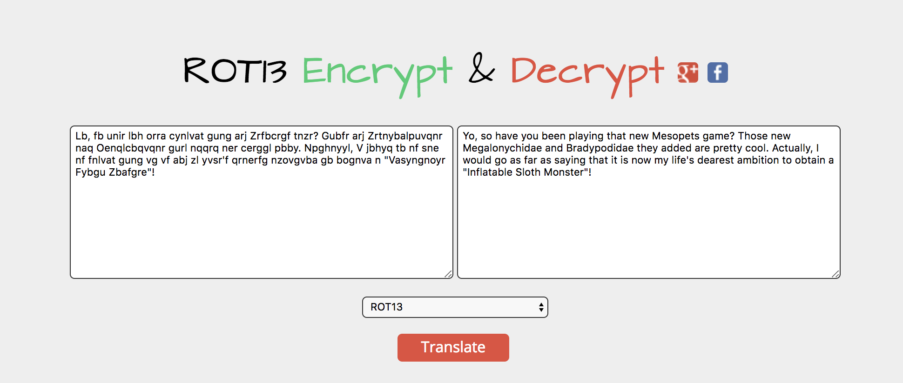

#### Tutorial 2

```
Hey, checkout this super secret message I made, using this cool ROT13
cipher I found online!

Lb, fb unir lbh orra cynlvat gung arj Zrfbcrgf tnzr? Gubfr arj Zrtnybalpuvqnr naq Oenqlcbqvqnr gurl nqqrq ner cerggl pbby. Npghnyyl, V jbhyq tb nf sne nf fnlvat gung vg vf abj zl yvsr'f qrnerfg nzovgvba gb bognva n "Vasyngnoyr Fybgu Zbafgre"!
```

```
Yo, so have you been playing that new Mesopets game? Those new Megalonychidae and Bradypodidae they added are pretty cool. Actually, I would go as far as saying that it is now my life's dearest ambition to obtain a "Inflatable Sloth Monster"!
```

[`Rot13`](http://md5decrypt.net/en/Rot13/)



Flag &rarr; `Inflatable Sloth Monster`