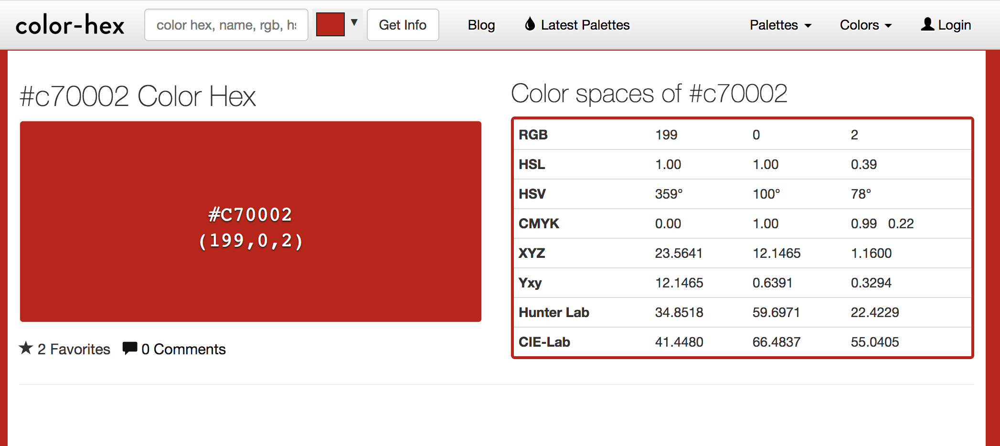

#### Tutorial 3

```sh
➜  ~ curl https://webshell2017.picoctf.com/static/19de212231cdca44105cf871aabc9746/codes.txt
These are a few of my favorite things!

7A3B00
6000C7
67C700
42FFFC
C70002
0003C7
007A78
➜  ~
```

[`color-hex`](http://www.color-hex.com/color/c70002)

