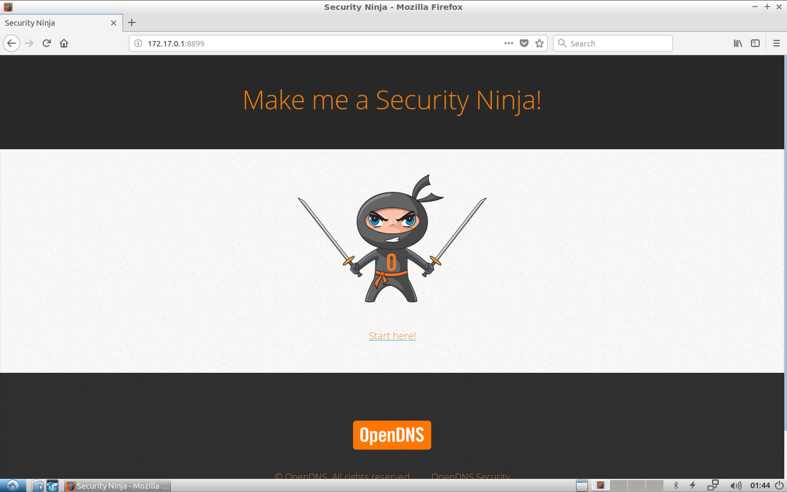

#### 0. Intro

[``Security_Ninjas_AppSec_Training``](https://github.com/opendns/Security_Ninjas_AppSec_Training)

###### Vulnerabilities

- A1 : Injection
- A2 : Broken Authentication and Session Management
- A3 : Cross-Site Scripting (XSS)
- A4 : Insecure Direct Object References
- A5 : Security Misconfiguration
- A6 : Sensitive Data Exposure
- A7 : Missing Function Level Access Control
- A8 : Cross-Site Request Forgery (CSRF)
- A9 : Using Components with Known Vulnerabilities
- A10 : Unvalidated Redirects and Forwards