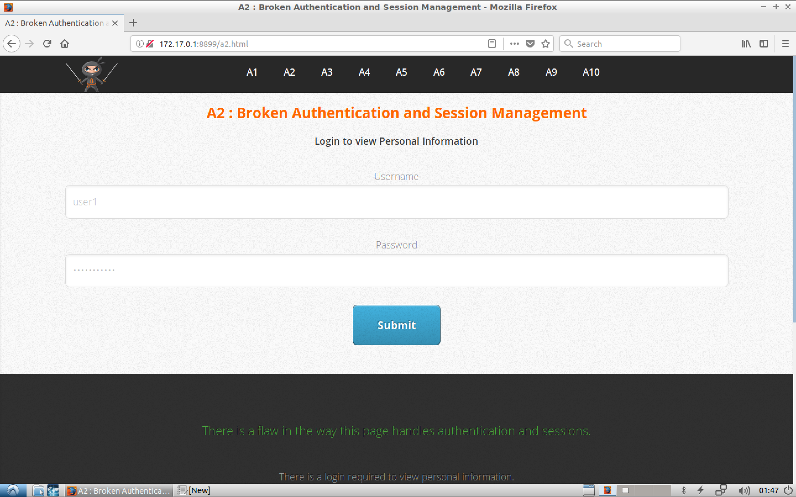
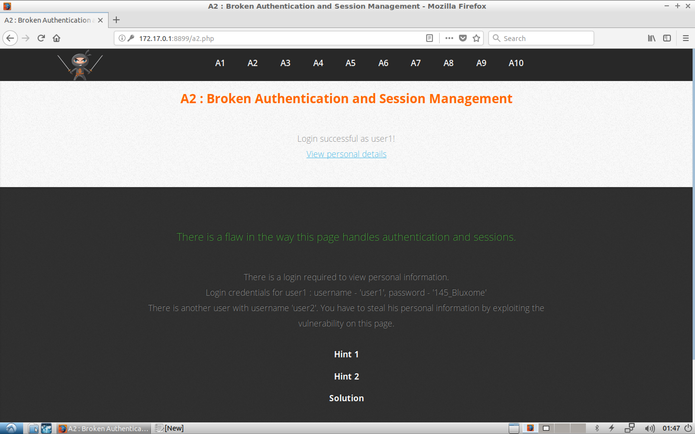
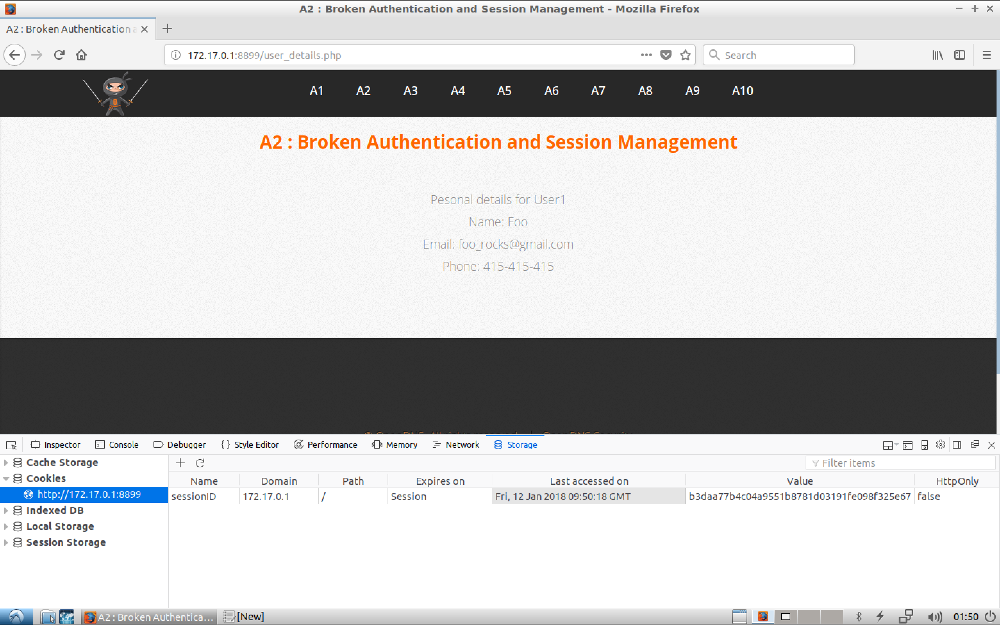
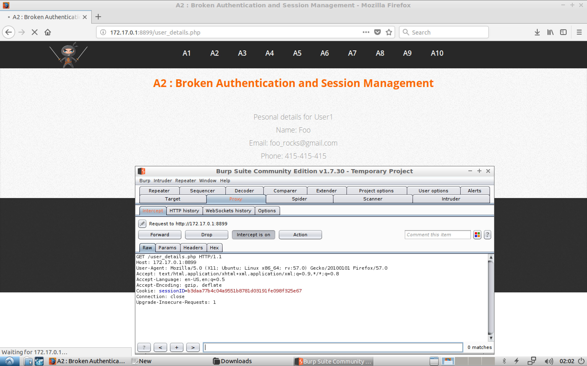
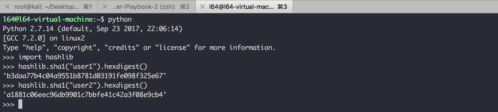
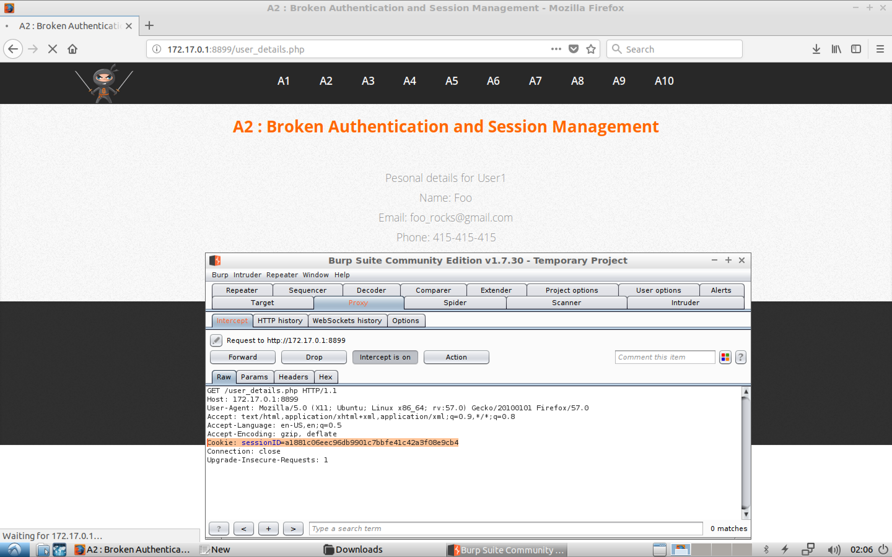
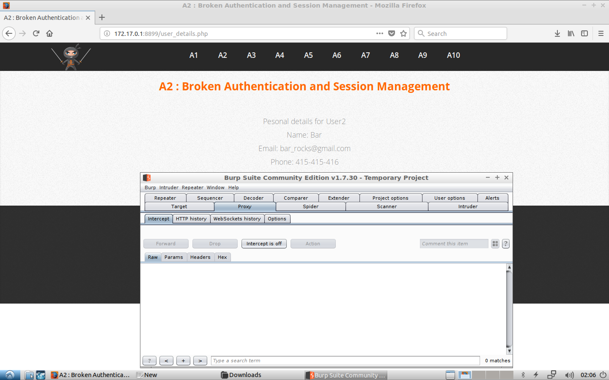

#### A2 : Broken Authentication and Session Management










```sh
l64@l64-virtual-machine:~$ python
Python 2.7.14 (default, Sep 23 2017, 22:06:14)
[GCC 7.2.0] on linux2
Type "help", "copyright", "credits" or "license" for more information.
>>> import hashlib
>>> hashlib.sha1("user1").hexdigest()
'b3daa77b4c04a9551b8781d03191fe098f325e67'
>>> hashlib.sha1("user2").hexdigest()
'a1881c06eec96db9901c7bbfe41c42a3f08e9cb4'
>>>
```





