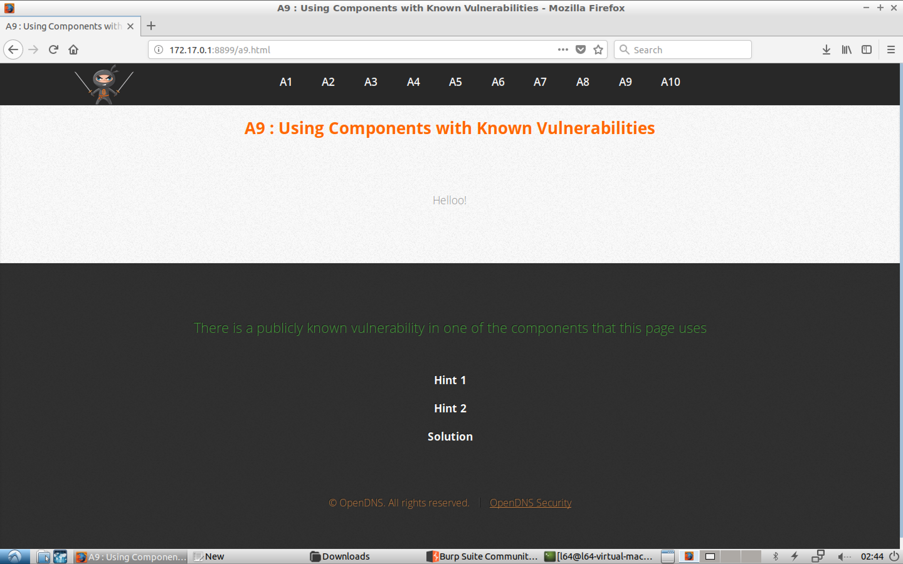
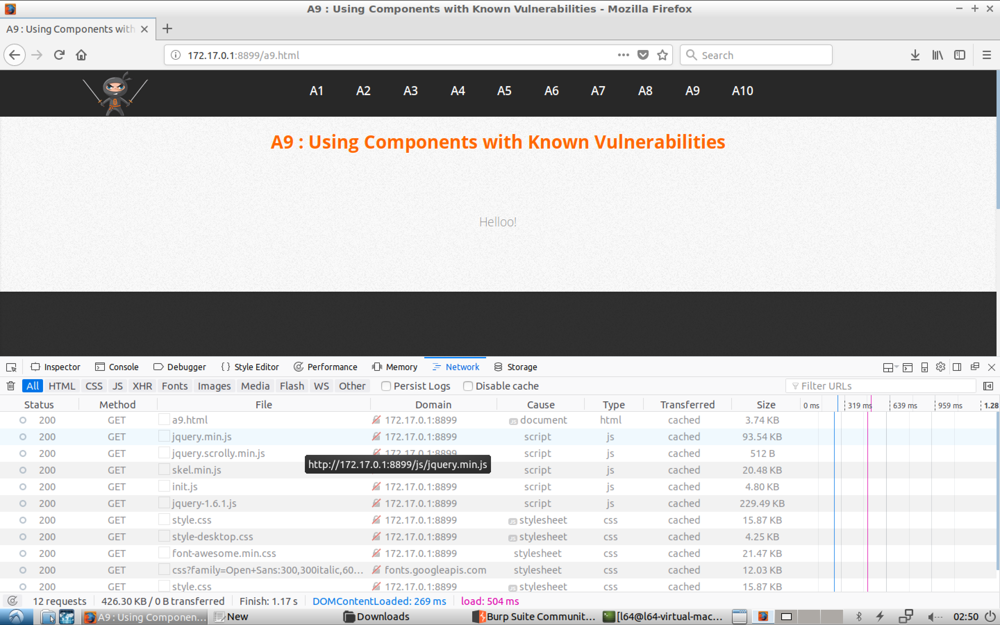
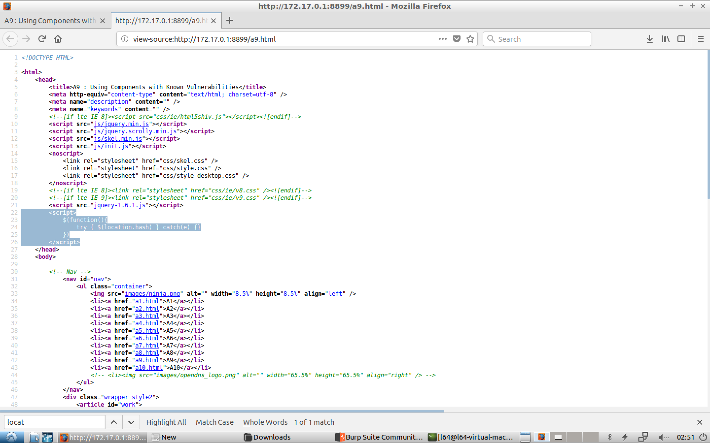
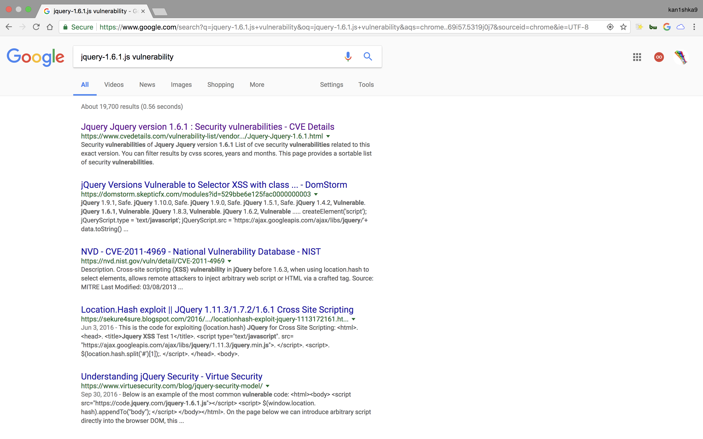
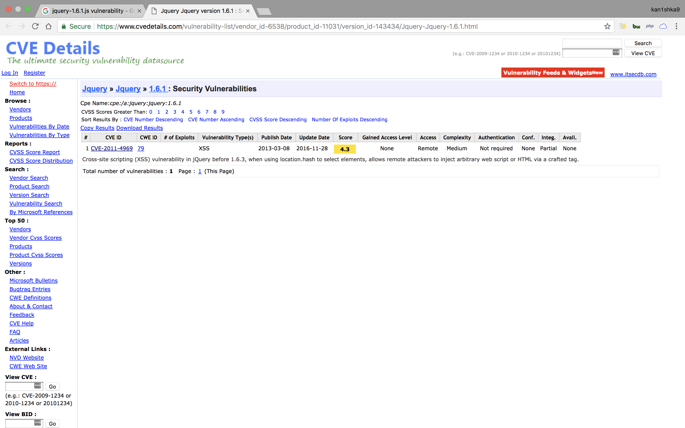
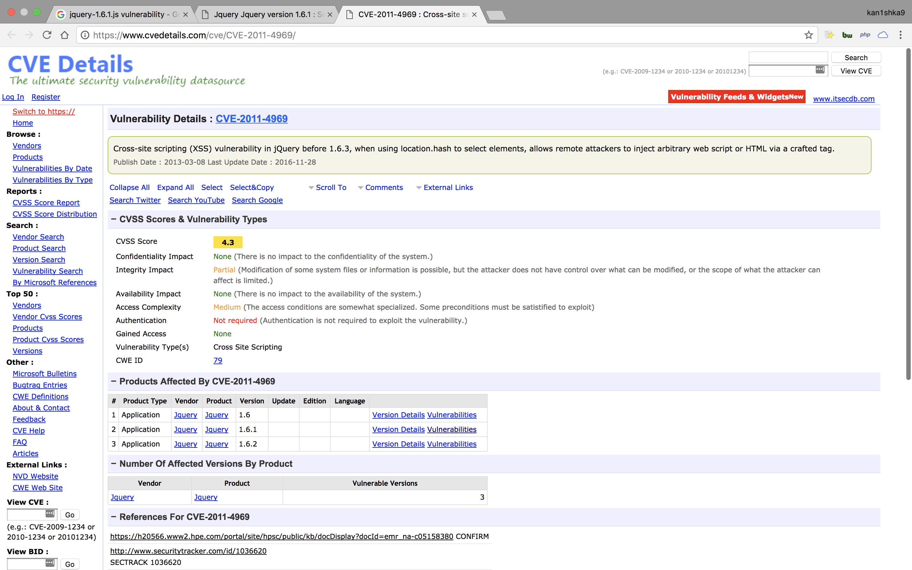
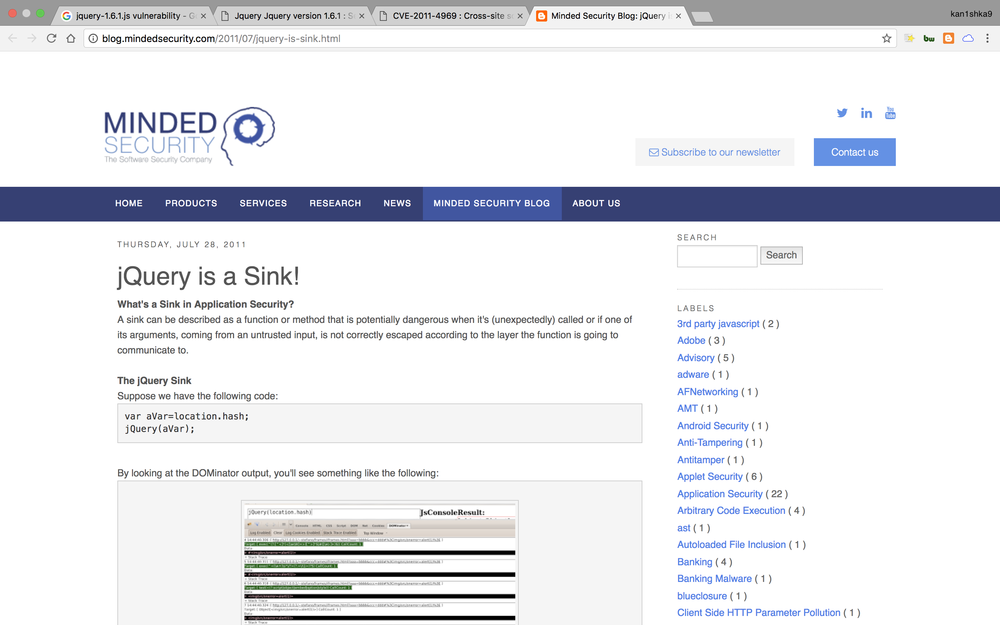
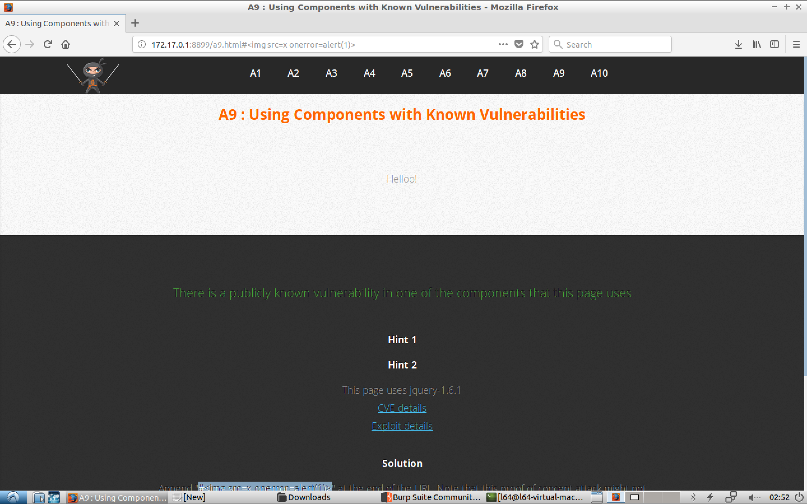

#### A9 : Using Components with Known Vulnerabilities

















- Payload

```
http://172.17.0.1:8899/a9.html#%3Cimg%20src=x%20onerror=alert(1)%3E
```

- Links
	- [CVE-2011-4969](https://www.cvedetails.com/cve/CVE-2011-4969/)
	- [jquery-is-sink](http://blog.mindedsecurity.com/2011/07/jquery-is-sink.html)