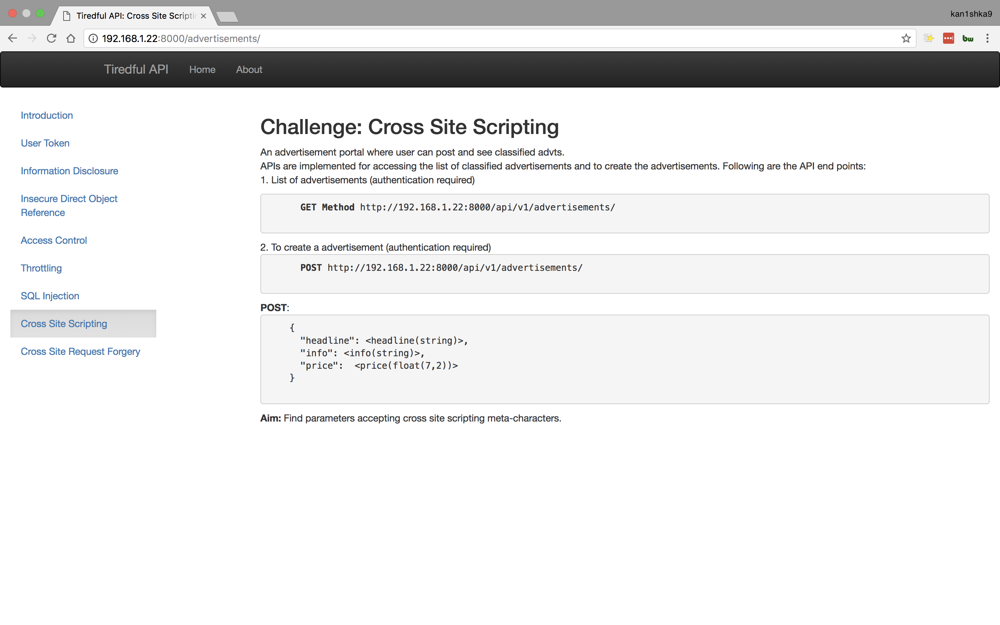
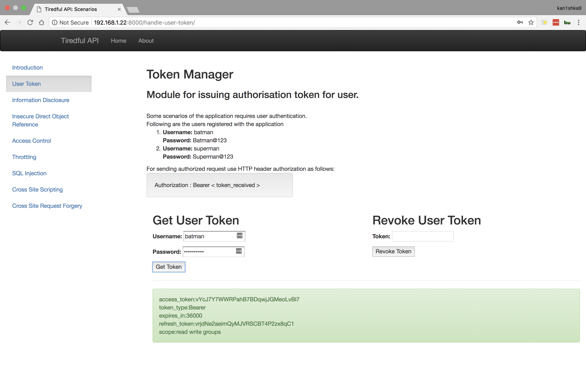
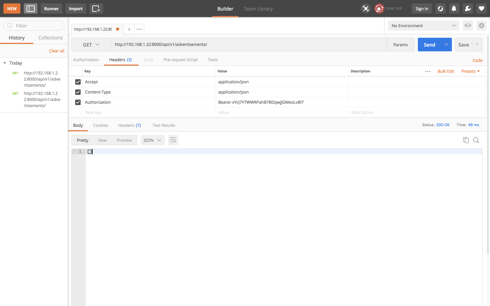
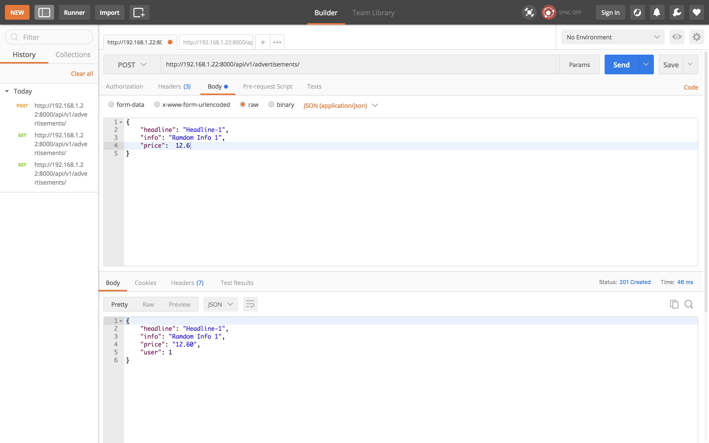
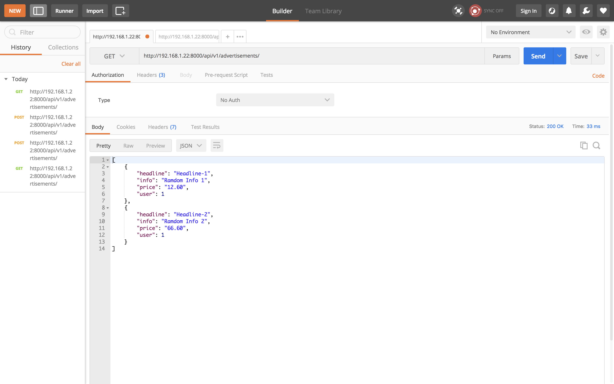
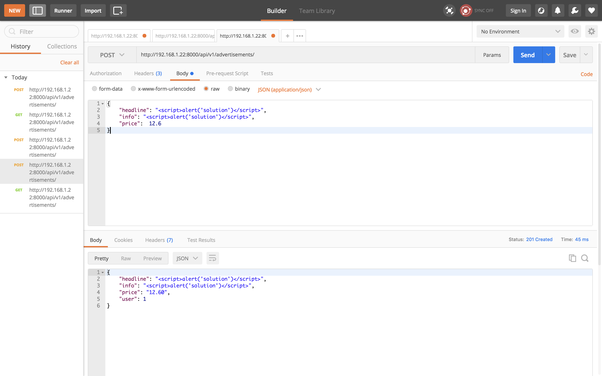

#### Cross Site Scripting

```
http://192.168.1.22:8000/api/v1/advertisements/
```

- Header

```
Key : Content-Type
Value : application/json
```

```
Key : Accept
Value : application/json
```

```
Key : Authorization
Value : Bearer vYcJ7Y7WWRPahB7BDqwjJGMeoLvBl7
```

- POST

```
{
    "headline": "Headline-1",
	"info": "Ramdom Info 1",
    "price":  12.6
}
```

```
{
    "headline": "Headline-2",
	"info": "Ramdom Info 2",
    "price":  66.6
}
```

```
{
    "headline": "<script>alert('solution')</script>",
	"info": "<script>alert('solution')</script>",
    "price":  12.6
}
```












