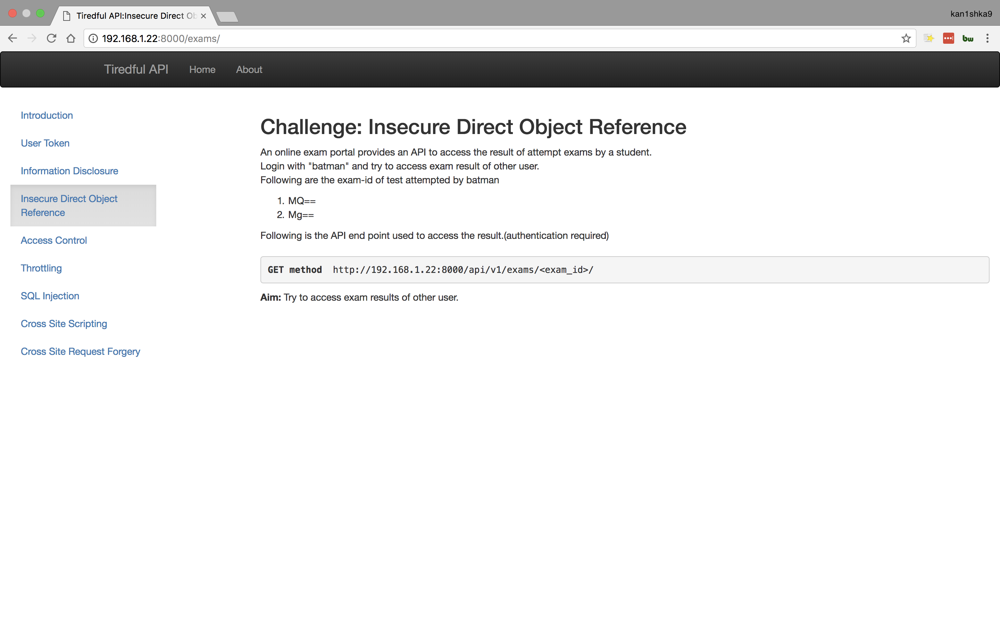
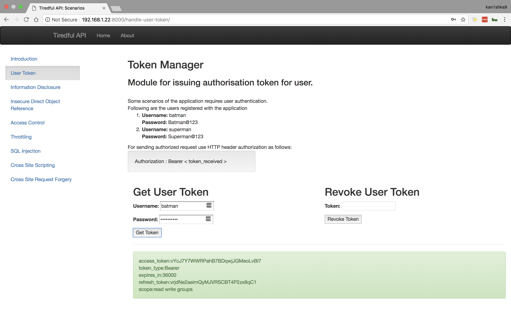
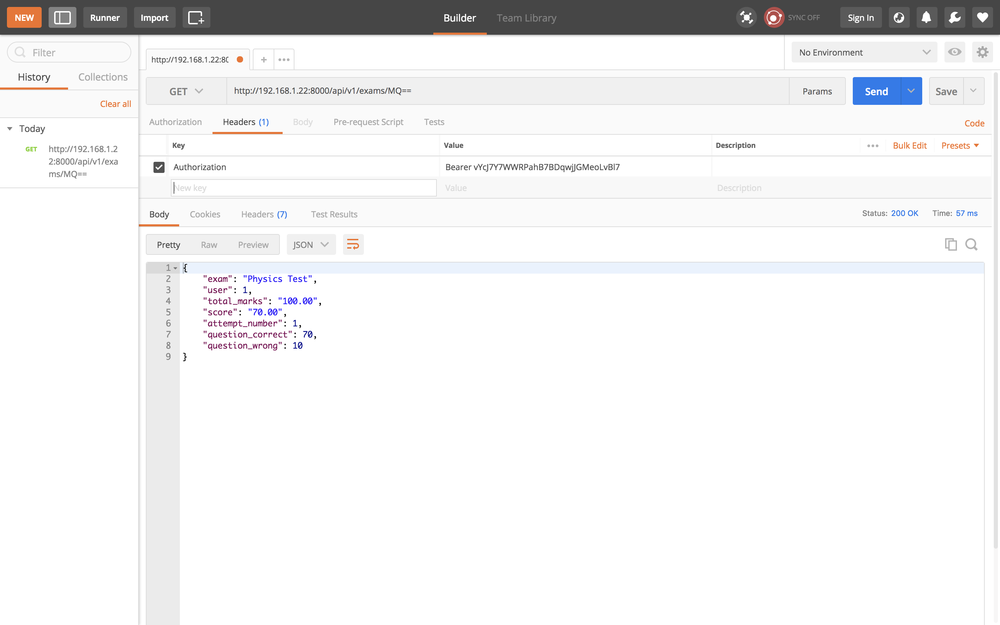
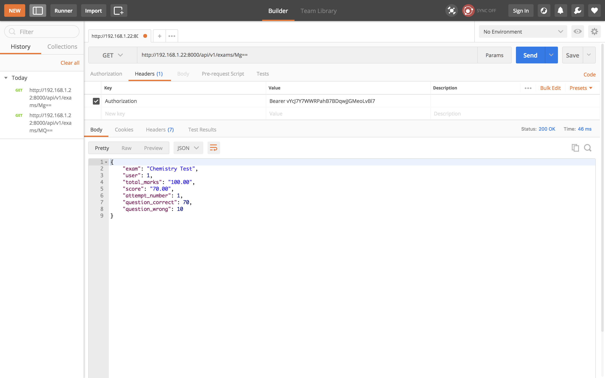
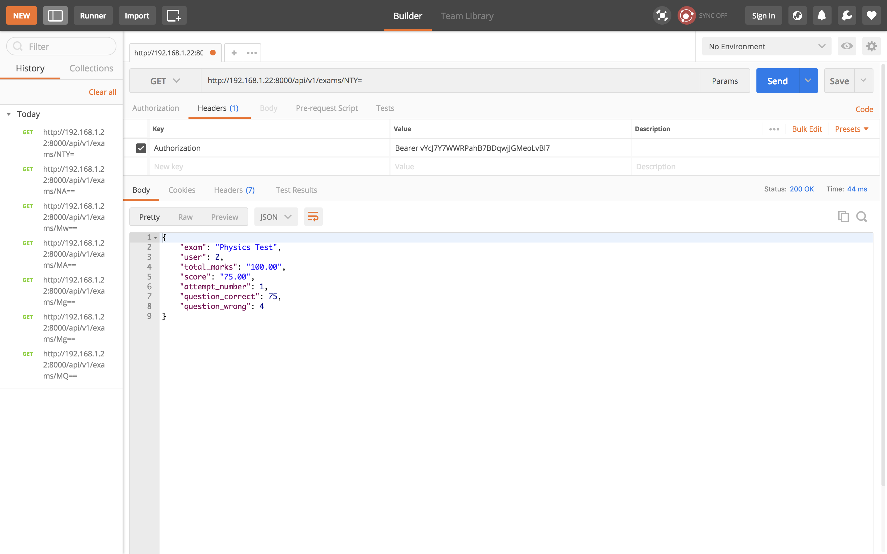
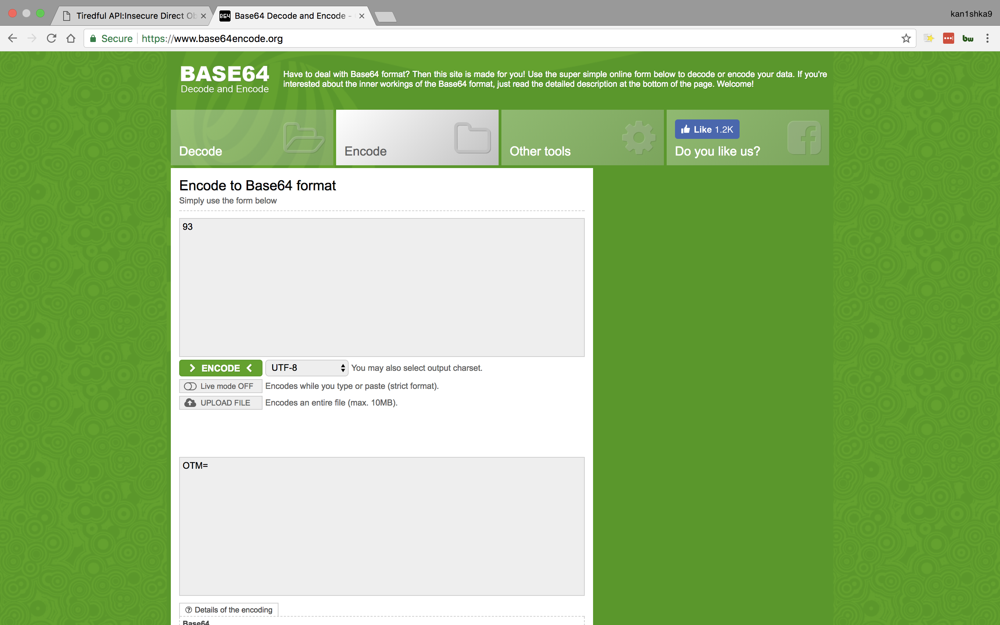
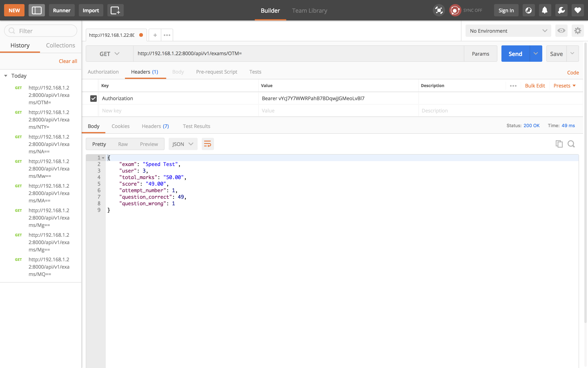

#### Insecure Direct Object Reference

```
http://192.168.1.22:8000/api/v1/exams/MQ==
http://192.168.1.22:8000/api/v1/exams/Mg==
http://192.168.1.22:8000/api/v1/exams/NTY=
http://192.168.1.22:8000/api/v1/exams/OTM=
```

- Header

```
Key : Authorization
Value : Bearer vYcJ7Y7WWRPahB7BDqwjJGMeoLvBl7
```

```
access_token:vYcJ7Y7WWRPahB7BDqwjJGMeoLvBl7
token_type:Bearer
expires_in:36000
refresh_token:vrjdNe2aeimQyMJVRSCBT4P2zx8qC1
scope:read write groups
```














