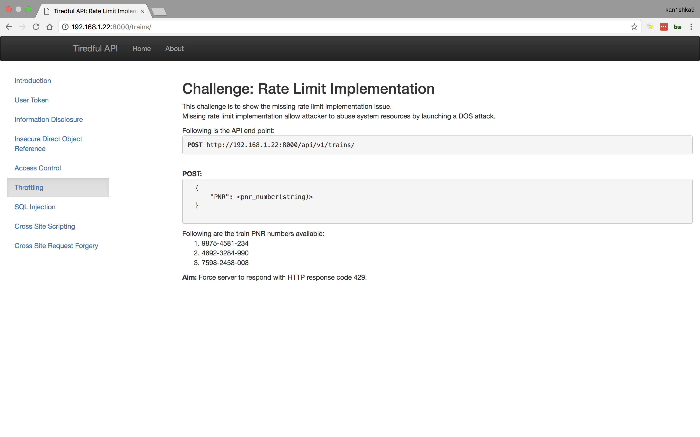
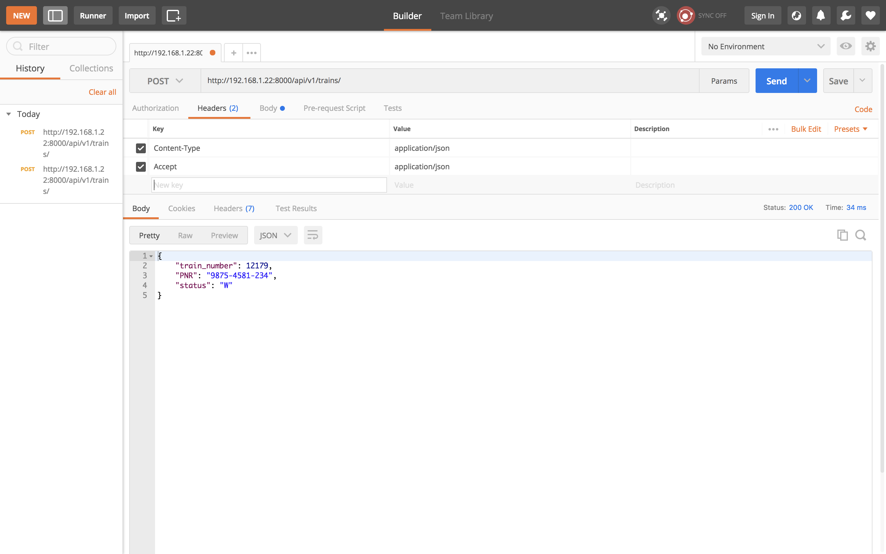
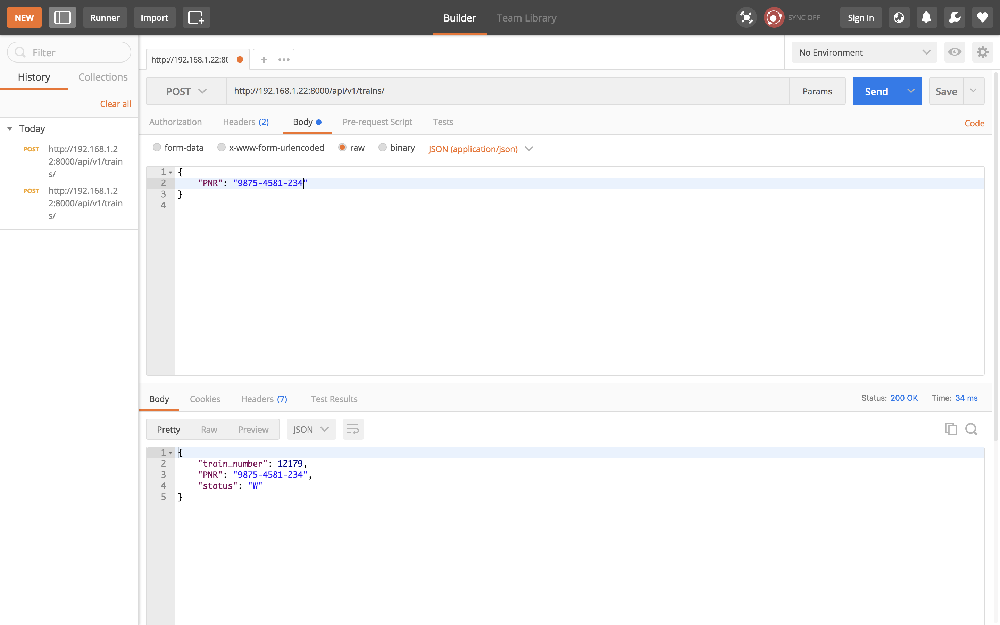
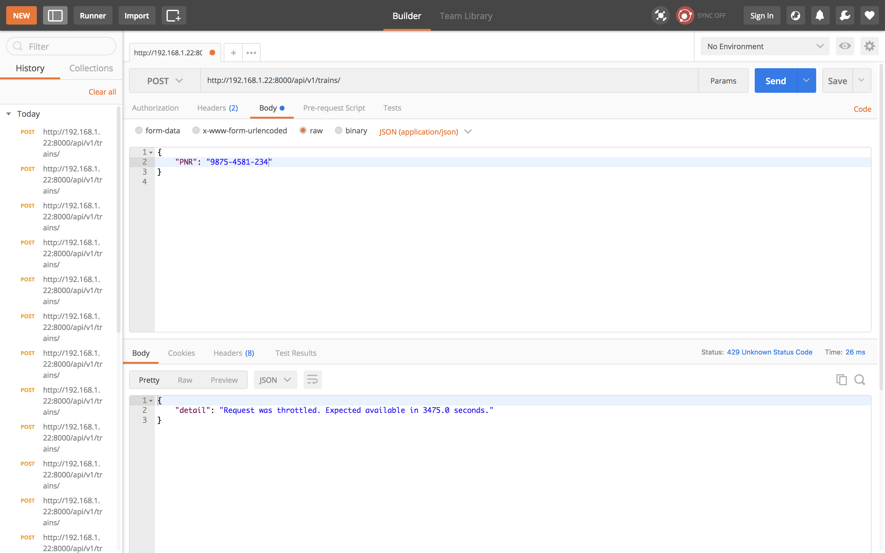
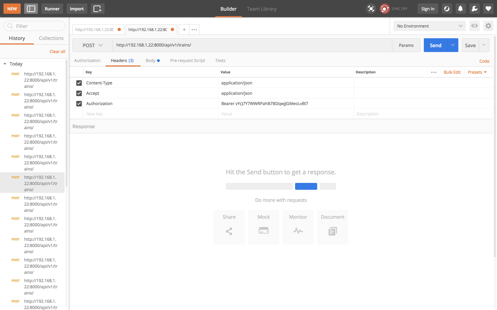
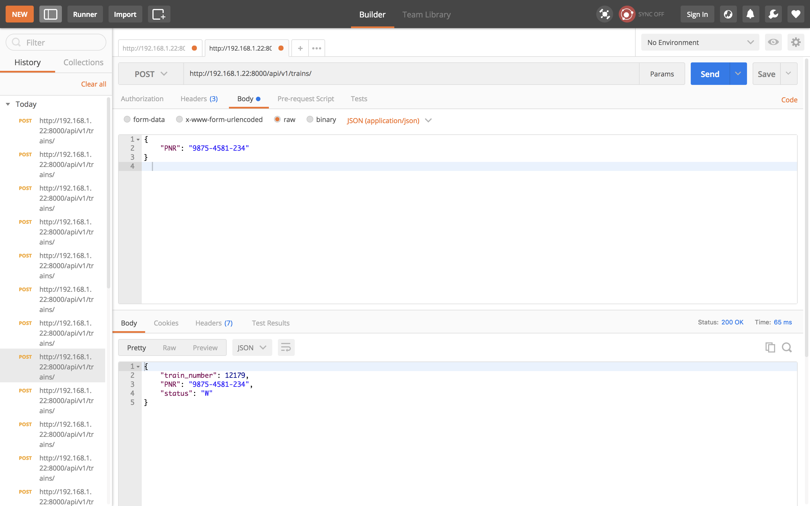
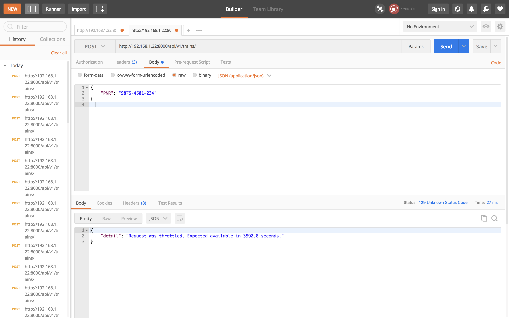

#### Rate Limit Implementation

```
http://192.168.1.22:8000/api/v1/trains/
```

- Header

```
Key : Content-Type
Value : application/json
```

```
Key : Accept
Value : application/json
```

- POST

```
{
	"PNR": "9875-4581-234"
}
```







Issue ``10`` requests to the ``API`` end point with ``anonymous user`` (without ``Authorization header``) 



```
Key : Authorization
Value : Bearer vYcJ7Y7WWRPahB7BDqwjJGMeoLvBl7
```





Issue ``20`` requests with ``authenticated user`` (with ``Authorization header``)



[```HTTP Status 429```](https://httpstatuses.com/429)