#### 1. Malware I

----

[`Sysdig`](https://github.com/draios/sysdig) capture of a malware running on an infected system is provided on the machine. The trace file "trace.scap" is present in the home directory of the root user. You have to use Sysdig command line utility or [`Csysdig`](https://github.com/draios/sysdig/wiki/Csysdig-Overview) to analyze the trace and answer the following questions:

```sh
root@attackdefense:~# ls -l
total 13360
-rw-r--r-- 1 root root 13676608 Jun 19 15:48 trace.scap
root@attackdefense:~# 
```

- A sensitive system file has been posted to a remote HTTP server. Provide the full path of that file.

```sh
root@attackdefense:~# csysdig -r trace.scap 
```


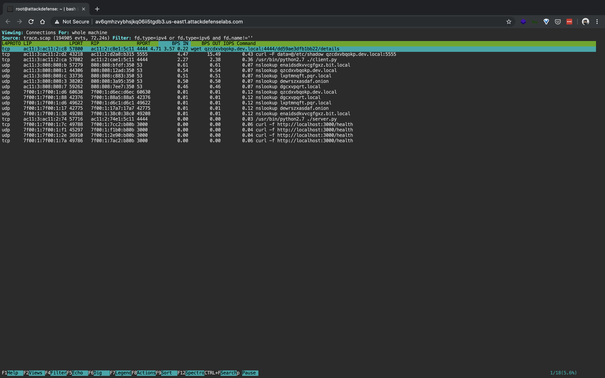

```
/etc/shadow
```

- A service running on the system has added a backdoor user. What is the name of that user?

```sh
root@attackdefense:~# csysdig -r trace.scap 
```


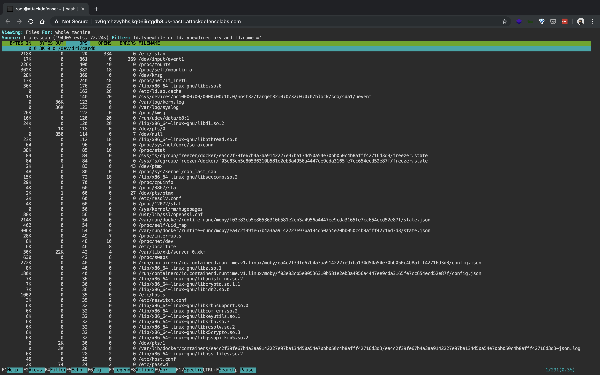

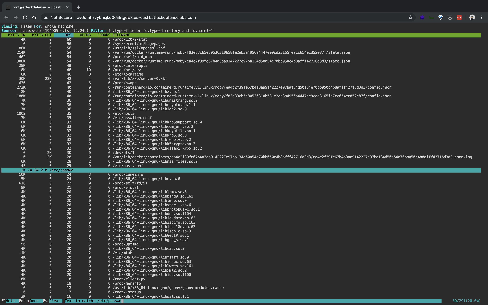

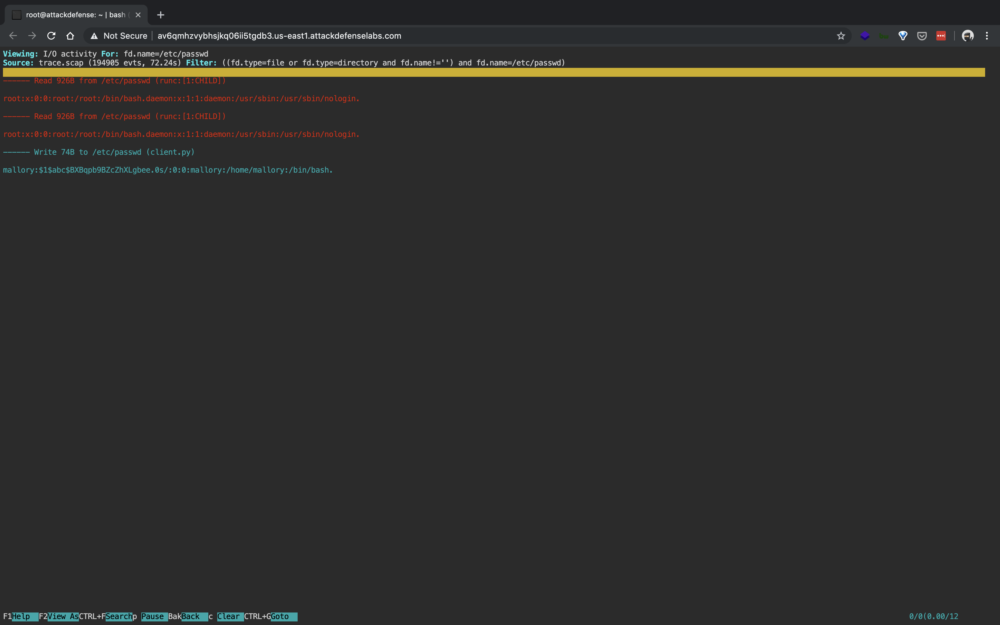

```
mallory
```

- A TCP connection is established with a remote machine. What is the IP address of the remote machine?

```sh
root@attackdefense:~# csysdig -r trace.scap
```


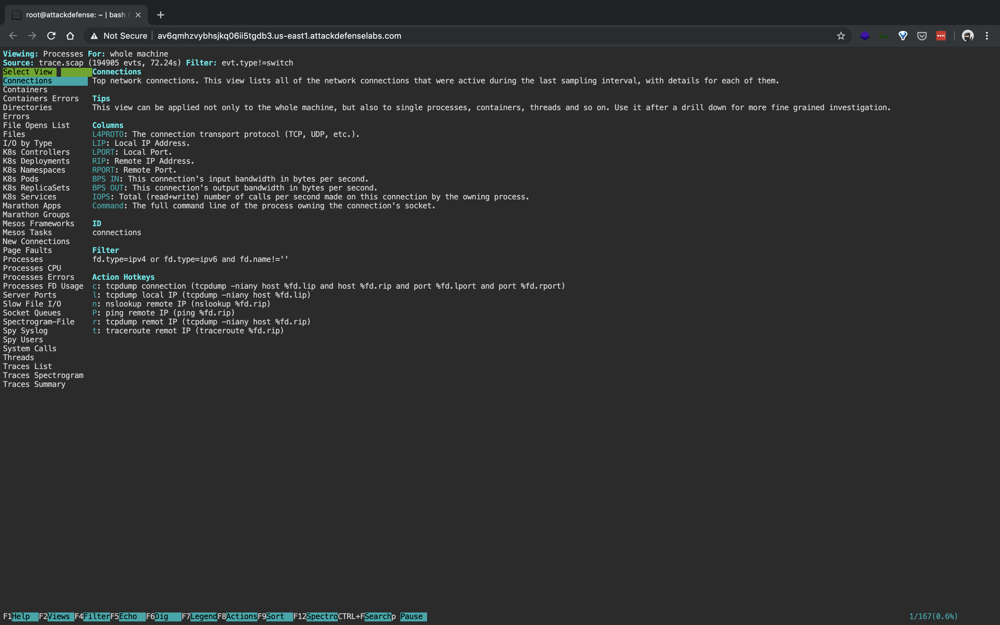

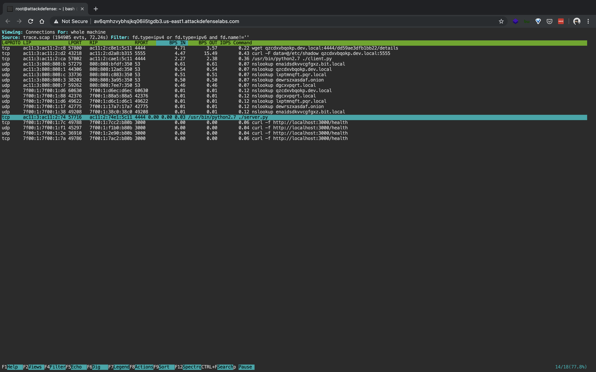

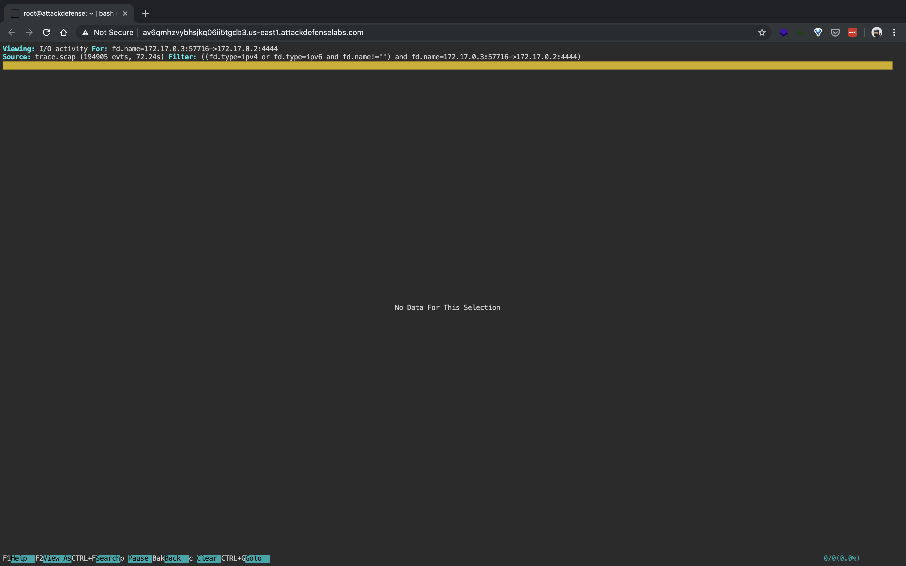

```
172.17.0.2
```

- A suspicious service running on the system may have sent a file to a remote server using TCP connection. Locate the file content and retrieve the flag from it.

```sh
root@attackdefense:~# csysdig -r trace.scap
```

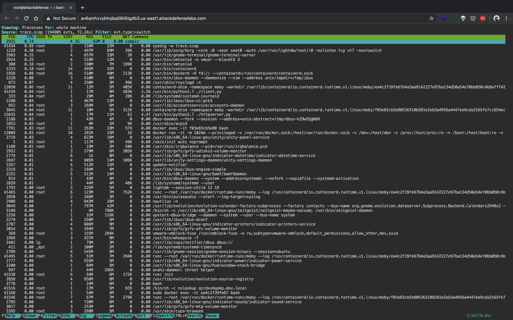

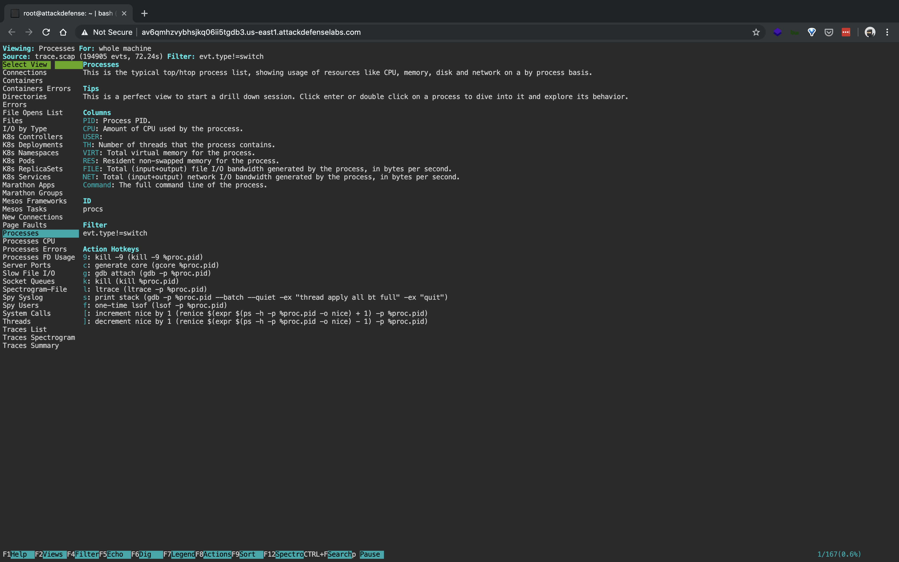

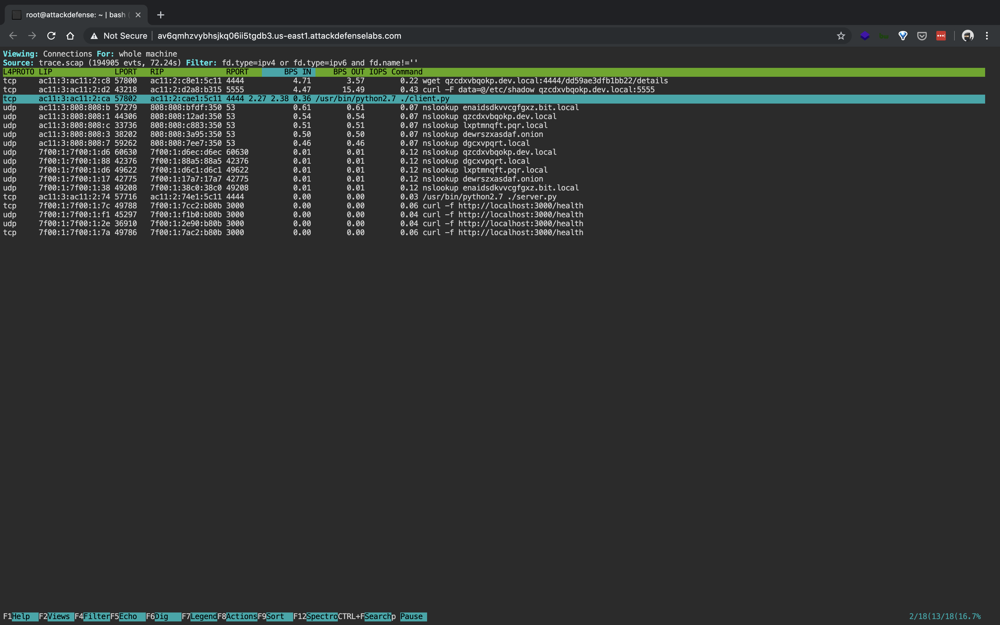

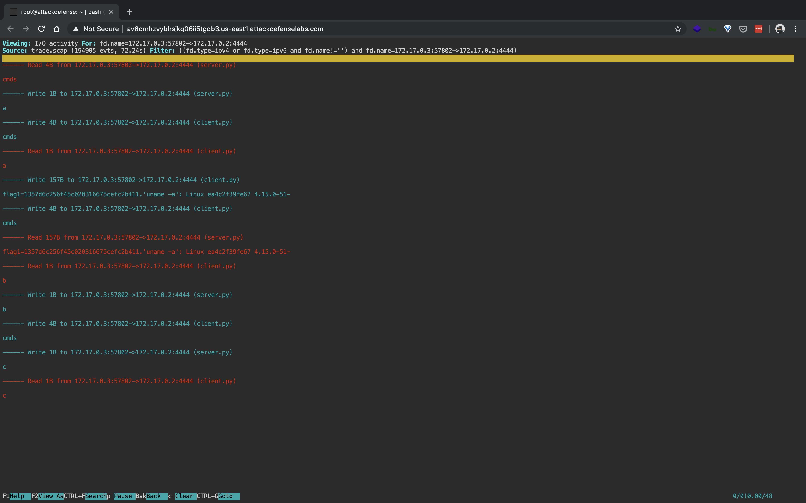

```
1357d6c256f45c020316675cefc2b411
```

- A file was downloaded to the machine from a remote server using a well-known utility. Locate the file content and retrieve the flag from it.

```sh
root@attackdefense:~# csysdig -r trace.scap
```


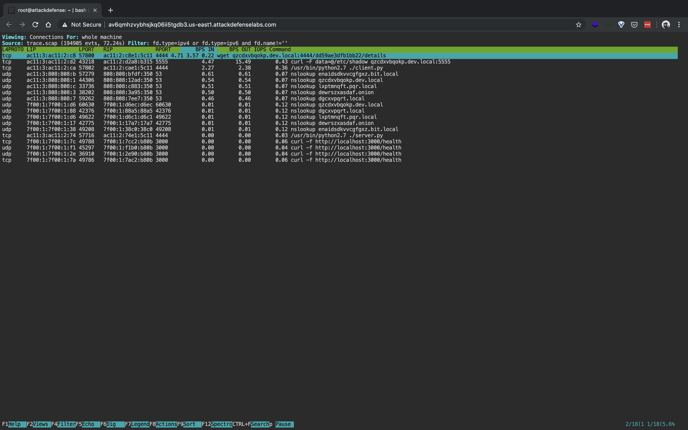

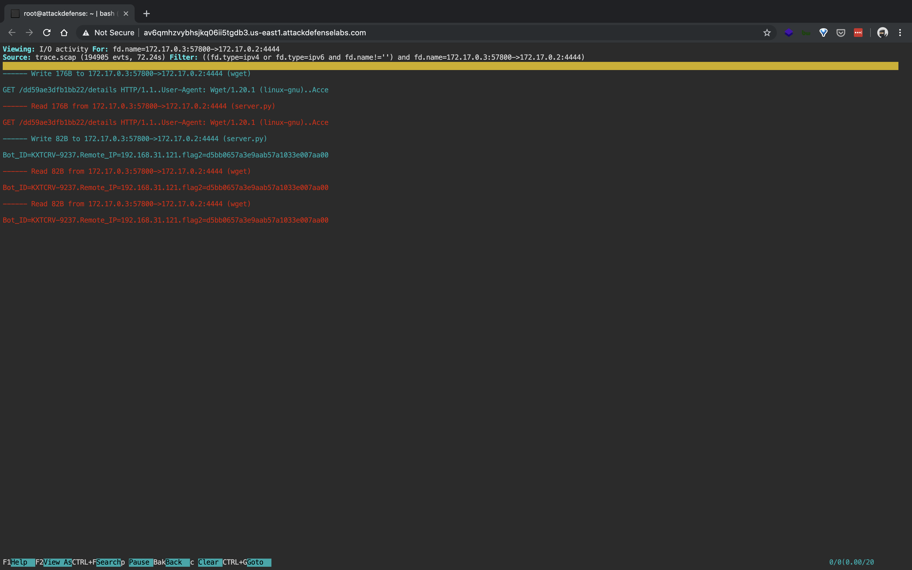

```
d5bb0657a3e9aab57a1033e007aa00
```

- What is the password hash of the backdoor user?

```sh
root@attackdefense:~# csysdig -r trace.scap
```


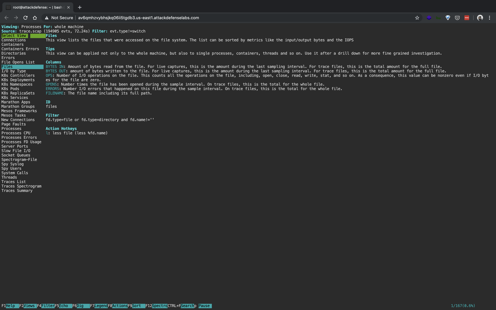


```
BXBqpb9BZcZhXLgbee
```

----

###### References

- [sysdig](https://github.com/draios/sysdig)
- [sysdig user guide](https://github.com/draios/sysdig/wiki/sysdig-user-guide) 

----

EOF