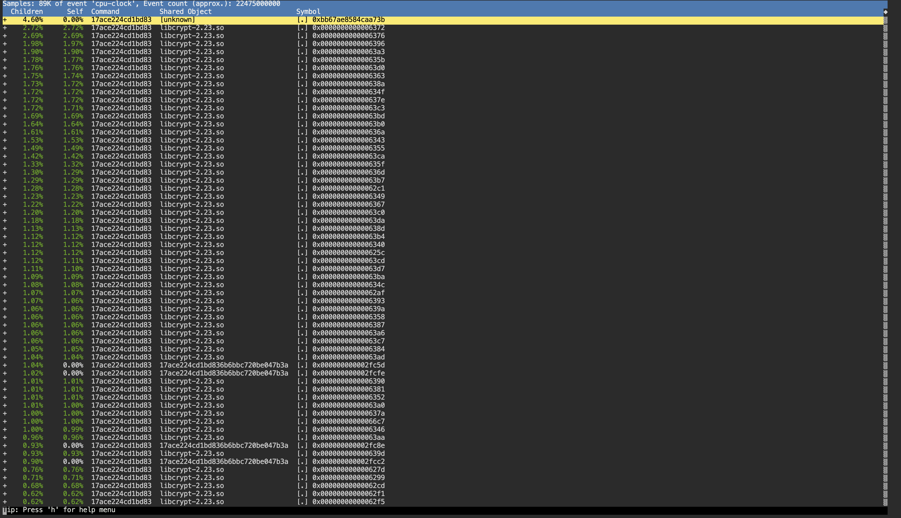
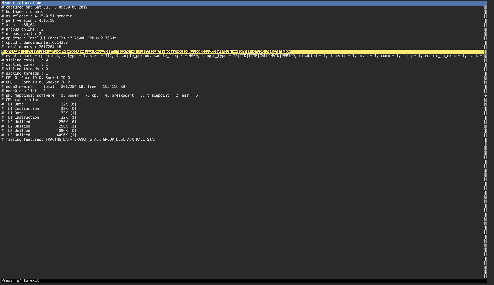

#### 1. Perf: Basics I

----

- Performance monitoring and tracking tools can provide a wealth of information about a running system. In some cases, they can help identify anomalies which could have been caused by a security incident.

----

- In this lab, the server was compromised and the attacker was running a password cracking tool on the same machine. We have provided the tool "perf" and its "capture" file to you. Please analyze the details and answer the following questions:

----

- Provide the full path of the password cracking service.

```sh
root@attackdefense:~# perf report
```





```
/usr/sbin/17ace224cd1bd836b6bbc720be047b3a
```

- The service used a crypto library. What is the name of the shared object (.so file) of that library?

```sh
root@attackdefense:~# perf report
```


```
libcrypt-2.23.so
```

- The service was cracking the contents of a file. Provide the full path of that file.


```
/etc/shadow
```

----

###### Reference

- Perf can be invoked using `perf` command.
- [`Perf documentation`](https://perf.wiki.kernel.org/index.php/Main_Page)

----

EOF