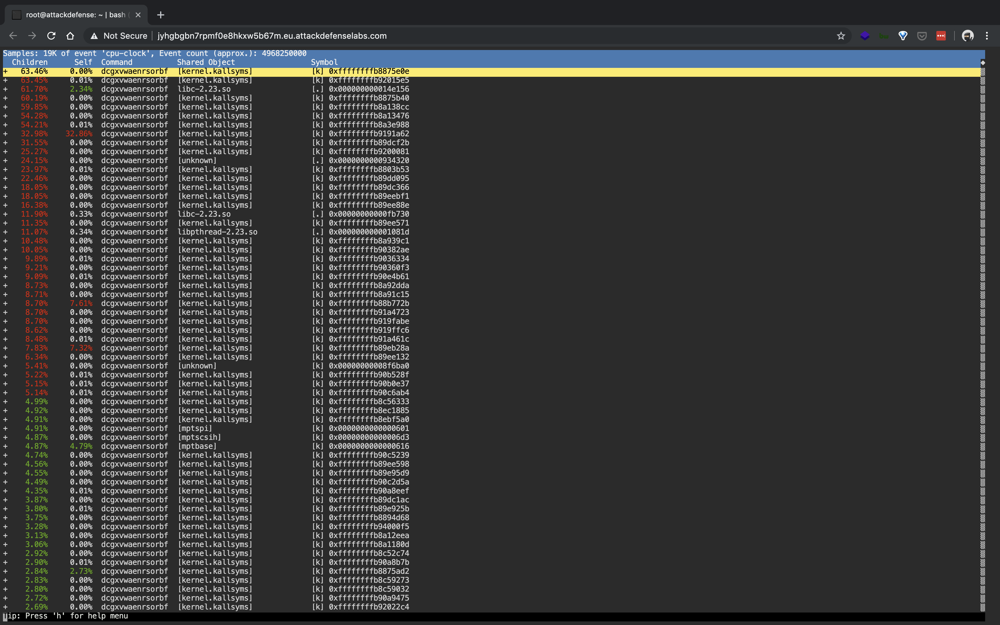
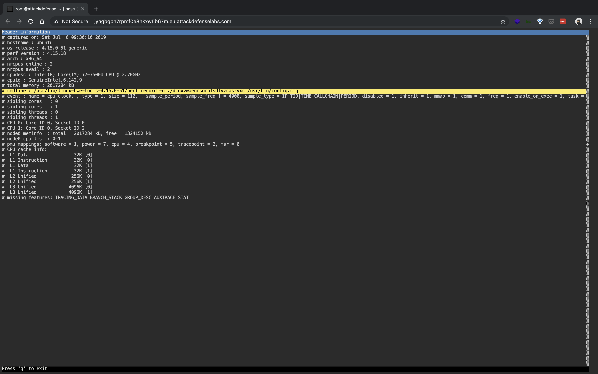

#### 2. Perf: Basics II

----

Performance monitoring and tracking tools can provide a wealth of information about a running system. In some cases, they can help identify anomalies which could have been caused by a security incident.

----

In this lab, the server was compromised and the attacker was running a crypto miner on the same machine. 

----

We have provided the tool "perf" and its "capture" file to you. Please analyze the details and answer the following questions:

- What is the name of the crypto miner service?

```sh
root@attackdefense:~# perf report
```





```
dcgxvwaenrsorbfsdfvzcasrvxc
```

- The mining service used a configuration file to connect to the pool server. Provide the complete path of the configuration file.


```sh
/usr/bin/config.cfg 
```

- Retrieve the plain-text password used by the service to connect to the pool server.

```sh
root@attackdefense:~# cat /usr/bin/config.cfg

#
# RPC login details
#
host=dqdaicaxcmgs.dev.local
port=5555
#port=8332


#
# base64 encoded the username and password
#

rpcuser=bW9uZXJvLW1pbmVy
rpcpass=bjB0czBzM2N1cjNwNHNzdzByZA==


#
# mining details
#

threads=4

# periodic rate for requesting new work, if solution not found
scantime=60


#
# misc.
#

# not really used right now
logdir=/tmp/miner

# set to 1, to enable hashmeter output
hashmeter=0
root@attackdefense:~#
```

```sh
root@attackdefense:~# echo bjB0czBzM2N1cjNwNHNzdzByZA== | base64 -d
n0ts0s3cur3p4ssw0rd
root@attackdefense:~#
``` 

----

###### Reference

- Perf can be invoked using `perf` command.
- [Perf documentation](https://perf.wiki.kernel.org/index.php/Main_Page)

----

EOF