#### CVE-2019-6979

----

- In this exercise, the attacker has admin access already so there is nothing more to be done. However, looks like the admin access does lead to a SXSS attack. So you can try to find this SXSS as purely academic exercise.
- MyBB (previously also known as MyBBoard and MyBulletinBoard) is a free, open source, intuitive, extensible, and incredibly powerful forum software written in PHP. It supports all major forum features like threads, private messages, search profiles, reputations management, warning etc.  
- MyBB User IP History Logs Plugin (1.0.2) is vulnerable to a Stored Cross Site Scripting documented in CVE-2019-6979.
- The following username and passwords may be used to explore the application and/or find a vulnerability which might require authenticated access:

| Username 	| Password 	|
|:--------:	|:--------:	|
|   admin  	| password 	|

- Objective: Your task is to find and exploit this vulnerability.
- CVE is a registered trademark of The MITRE Corporation.

----

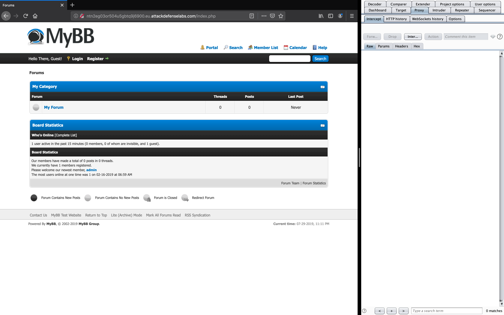

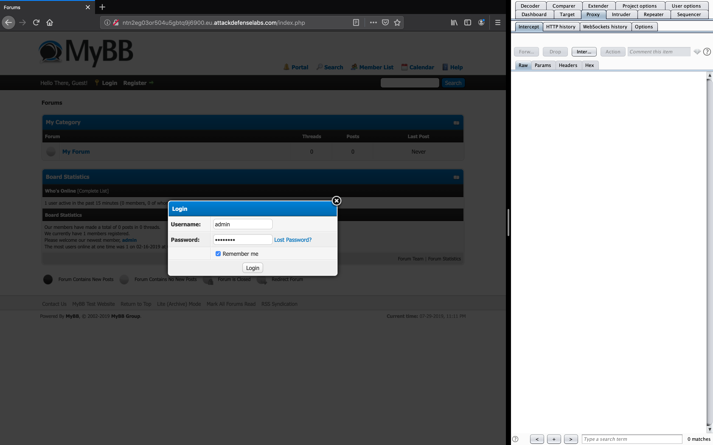

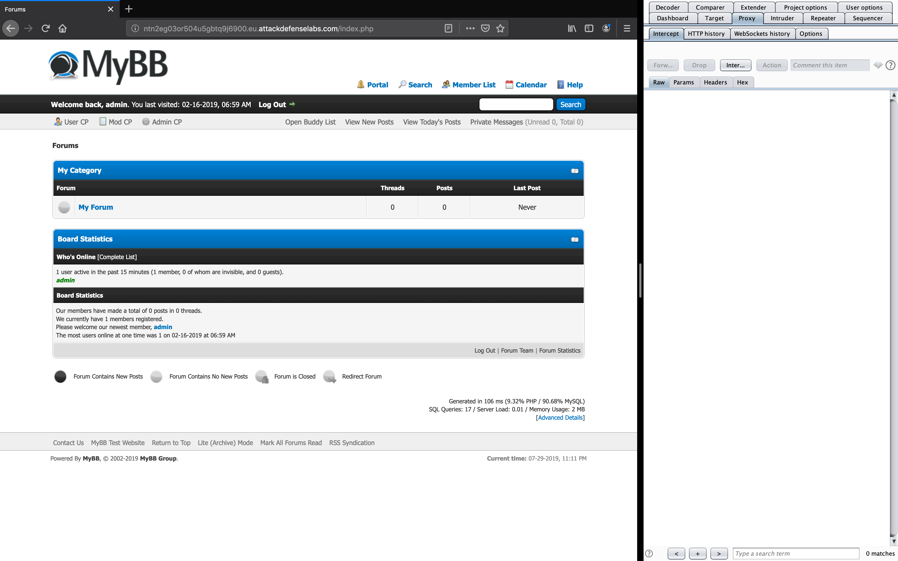

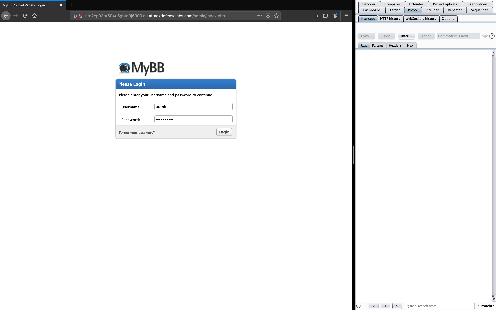

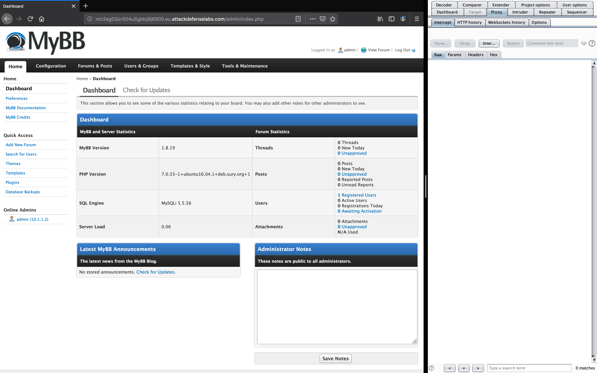

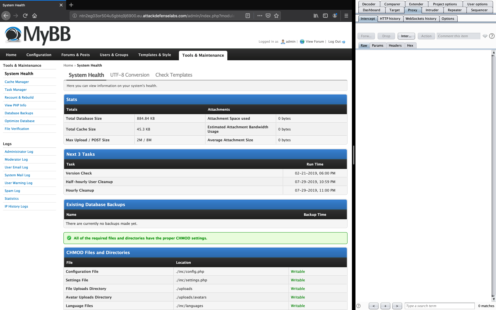

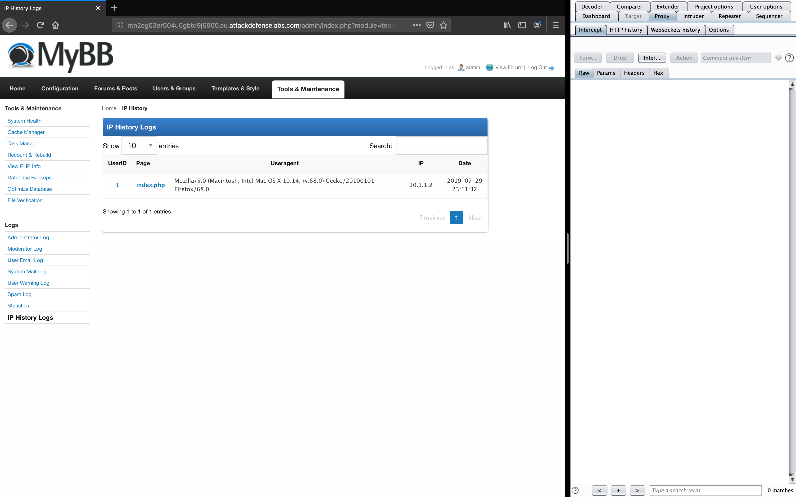

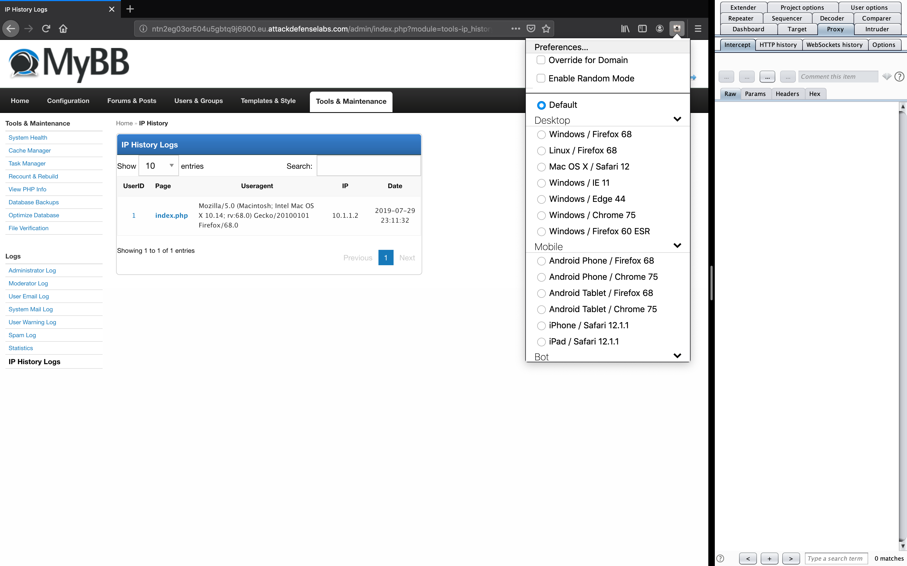

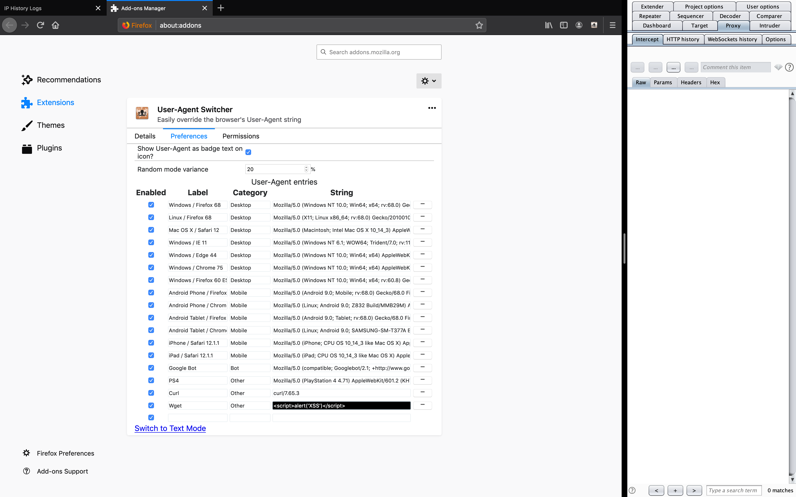

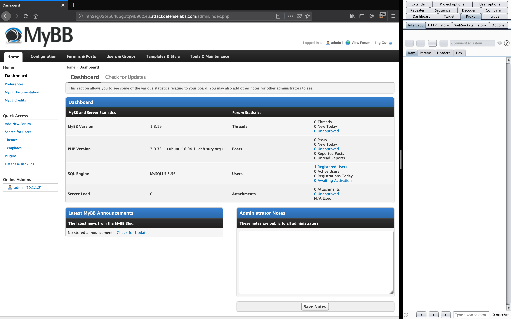

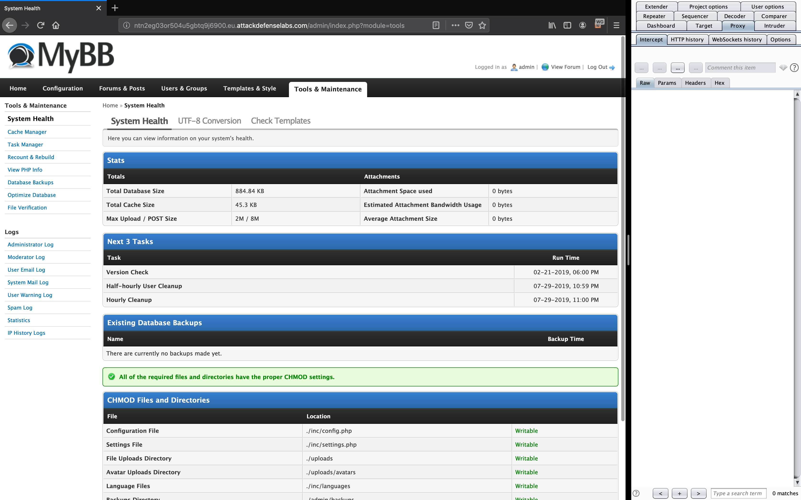

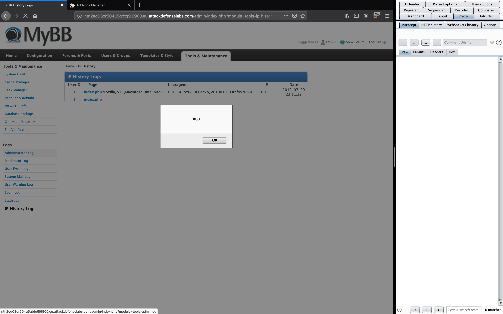

----

EOF