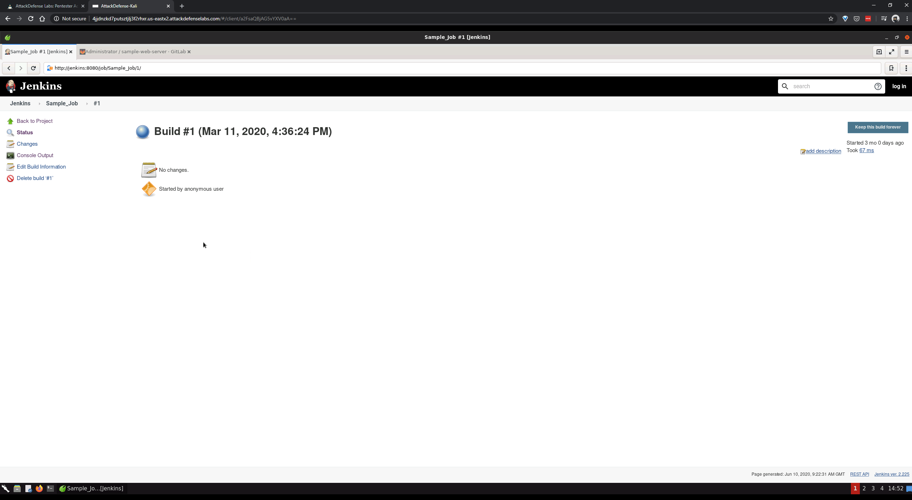

# jenkins-basics

#### Objective: Perform the following activities on the given setup:

- Check the settings/build instructions for project Sample_Job, fire a build and check the build logs
- Create a building project for a sample-web-server project hosted on local Gitlab instance

----

- [Jenkins](http://jenkins:8080/)
- [Gitlab](http://gitlab/root)
- [Project](http://gitlab/root/sample-web-server)
- [shenfeng/tiny-web-server](https://github.com/shenfeng/tiny-web-server)

----

----

#### Lessons learnt

- How to use Jenkins?

----

EOF