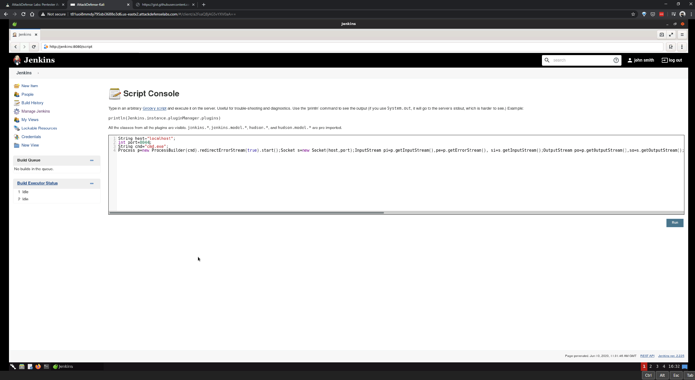

# jenkins-misconfiguration-1

#### Objective: Leverage this vulnerability to get a shell on the Jenkins machine and retrieve the flag!

----

- [frohoff/revsh.groovy](https://gist.github.com/frohoff/fed1ffaab9b9beeb1c76)

----

----

EOF