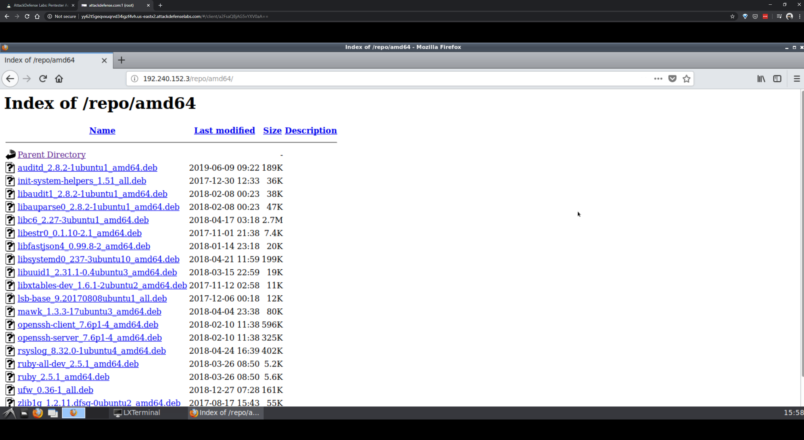
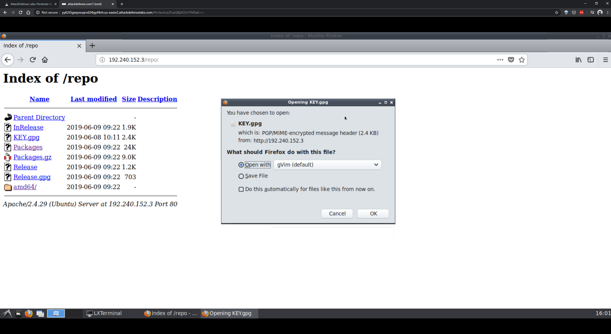

# apt-repo-recon-basics

* Which service is running on the target machine?

```sh
root@attackdefense:~# nmap -sV 192.240.152.3
Starting Nmap 7.70 ( https://nmap.org ) at 2020-06-12 16:25 IST
Nmap scan report for z444m48v5yidoih2whfsrd9x6.temp-network_a-240-152 (192.240.152.3)
Host is up (0.000027s latency).
Not shown: 999 closed ports
PORT   STATE SERVICE VERSION
80/tcp open  http    Apache httpd 2.4.29 ((Ubuntu))
MAC Address: 02:42:C0:F0:98:03 (Unknown)

Service detection performed. Please report any incorrect results at https://nmap.org/submit/ .
Nmap done: 1 IP address (1 host up) scanned in 6.67 seconds
root@attackdefense:~# 
```

* What is the name of the directory in which all repository related files are kept?

```
http://192.240.152.3/repo/
```

* How many packages are present in the repository?

```
http://192.240.152.3/repo/amd64/
```



Total packages &rarr; 19

* What command can be used to configure the attacker Kali machine to use this APT repository?

```sh
root@attackdefense:~# echo "deb http://192.240.152.3/repo/ /" > /etc/apt/sources.list.d/internal.list
root@attackdefense:~# cat /etc/apt/sources.list.d/internal.list
deb http://192.240.152.3/repo/ /
root@attackdefense:~# 
```

* What command can be used to add GPG key of the APT repository to the attacker Kali machine? 



```sh
root@attackdefense:~# wget -q -O - http://192.240.152.3/repo/KEY.gpg | apt-key add -
OK
root@attackdefense:~# 
```

* There is a flag hidden in "auditd" package. Get the package and submit that flag.

```sh
root@attackdefense:~# apt update
Get:1 http://192.240.152.3/repo  InRelease [1956 B]
Get:2 http://192.240.152.3/repo  Packages [9205 B]
Fetched 11.2 kB in 0s (75.0 kB/s)  
Reading package lists... Done
Building dependency tree       
Reading state information... Done
3 packages can be upgraded. Run 'apt list --upgradable' to see them.
root@attackdefense:~# 
```

```sh
root@attackdefense:~# apt clean
```

```sh
root@attackdefense:~# apt install -d auditd
Reading package lists... Done
Building dependency tree       
Reading state information... Done
The following packages were automatically installed and are no longer required:
  libargon2-0 libdns-export1100
Use 'apt autoremove' to remove them.
The following additional packages will be installed:
  libauparse0
Suggested packages:
  audispd-plugins
The following NEW packages will be installed:
  auditd libauparse0
0 upgraded, 2 newly installed, 0 to remove and 3 not upgraded.
Need to get 242 kB of archives.
After this operation, 803 kB of additional disk space will be used.
Do you want to continue? [Y/n] 
Get:1 http://192.240.152.3/repo  libauparse0 1:2.8.2-1ubuntu1 [48.6 kB]
Get:2 http://192.240.152.3/repo  auditd 1:2.8.2-1ubuntu1 [194 kB]
Fetched 242 kB in 0s (0 B/s)    
Download complete and in download only mode
root@attackdefense:~# 
```

```sh
root@attackdefense:~# ls -l /var/cache/apt/archives/
total 244
-rw-r--r-- 1 root root 193768 Jun  9  2019 auditd_1%3a2.8.2-1ubuntu1_amd64.deb
-rw-r--r-- 1 root root  48608 Feb  8  2018 libauparse0_1%3a2.8.2-1ubuntu1_amd64.deb
-rw-r----- 1 root root      0 Jan 11  2018 lock
drwx------ 1 _apt root   4096 Jun 12 16:16 partial
root@attackdefense:~# 
```

```sh
root@attackdefense:~# cd /var/cache/apt/archives/
root@attackdefense:/var/cache/apt/archives# ls -l
total 244
-rw-r--r-- 1 root root 193768 Jun  9  2019 auditd_1%3a2.8.2-1ubuntu1_amd64.deb
-rw-r--r-- 1 root root  48608 Feb  8  2018 libauparse0_1%3a2.8.2-1ubuntu1_amd64.deb
-rw-r----- 1 root root      0 Jan 11  2018 lock
drwx------ 1 _apt root   4096 Jun 12 16:16 partial
root@attackdefense:/var/cache/apt/archives# 
```

```sh
root@attackdefense:/var/cache/apt/archives# mkdir extracted
```

```sh
root@attackdefense:/var/cache/apt/archives# dpkg-deb -R auditd_1%3a2.8.2-1ubuntu1_amd64.deb extracted/
```

```sh
root@attackdefense:/var/cache/apt/archives# cd extracted/
root@attackdefense:/var/cache/apt/archives/extracted# ls -l
total 24
drwxr-xr-x 2 root root 4096 Feb  8  2018 DEBIAN
drwxr-xr-x 6 root root 4096 Jun  9  2019 etc
drwxr-xr-x 3 root root 4096 Feb  8  2018 lib
drwxr-xr-x 2 root root 4096 Jun  9  2019 sbin
drwxr-xr-x 4 root root 4096 Feb  8  2018 usr
drwxr-xr-x 3 root root 4096 Feb  8  2018 var
root@attackdefense:/var/cache/apt/archives/extracted# 
```

```sh
root@attackdefense:/var/cache/apt/archives/extracted# find . -name "*flag*"
./sbin/flag.txt
root@attackdefense:/var/cache/apt/archives/extracted# 
```

```sh
root@attackdefense:/var/cache/apt/archives/extracted# cat ./sbin/flag.txt 
cb0893450787ebc2f621ffc323b7affb
root@attackdefense:/var/cache/apt/archives/extracted# 
```

----

EOF