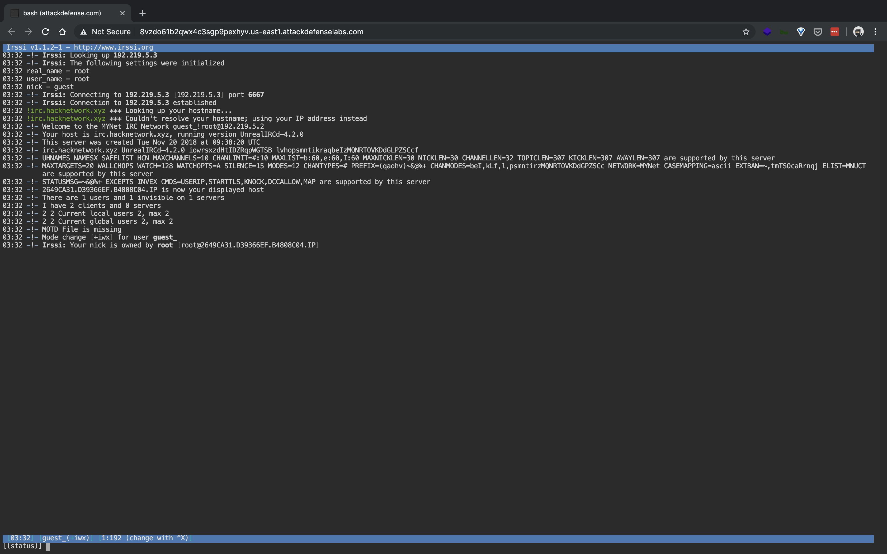
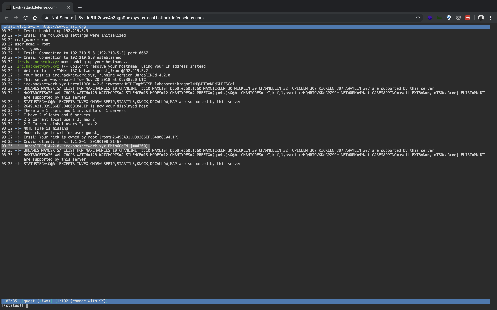
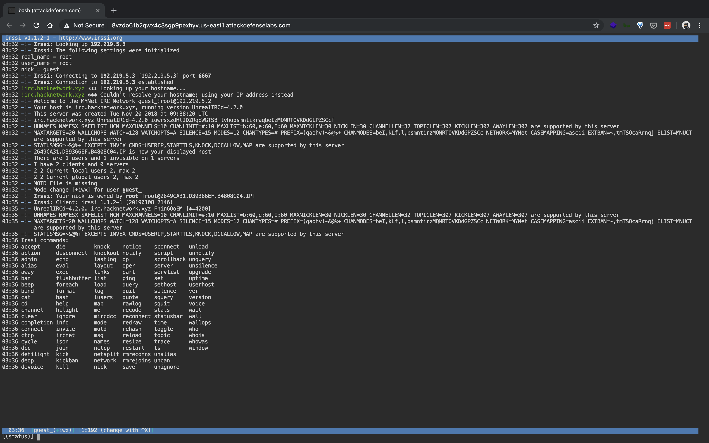
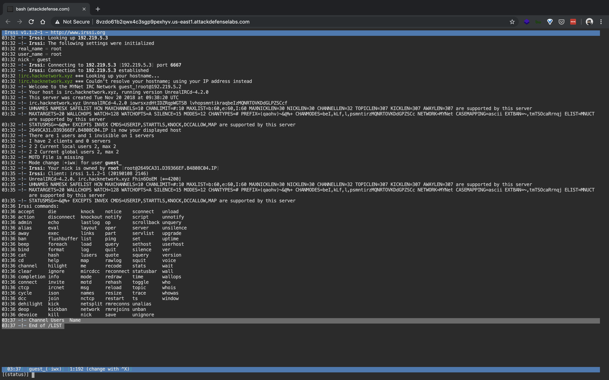
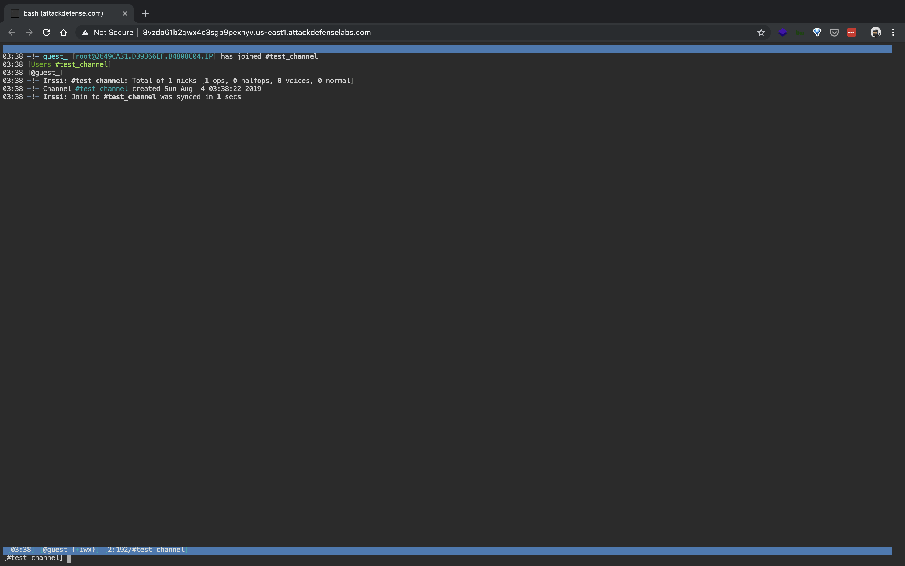
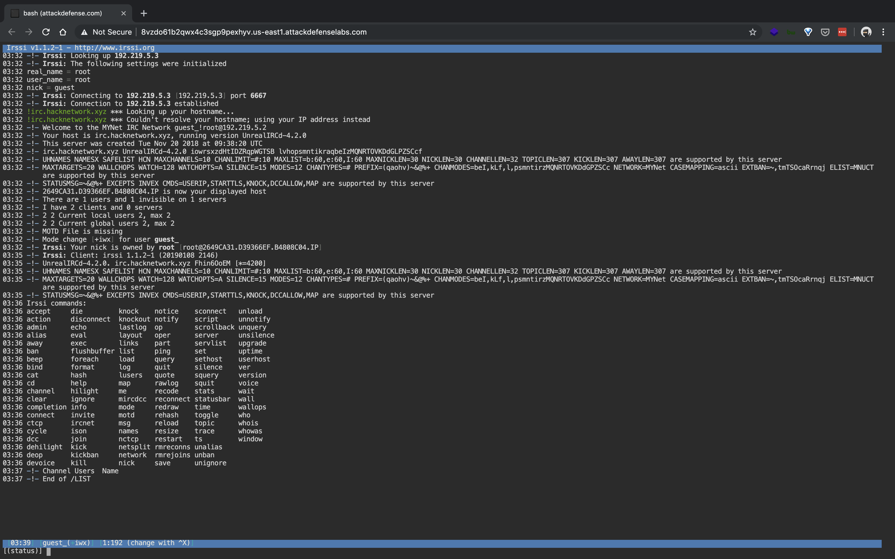
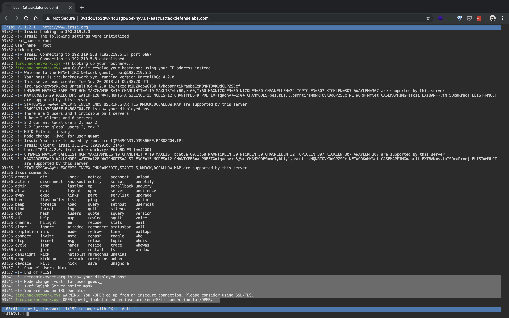

#### 1. Unrealircd Recon: Basics

----

In this challenge we will look at the basics of Unrealircd IRC server reconnaissance.

----

```sh
root@attackdefense:~# ip addr
1: lo: <LOOPBACK,UP,LOWER_UP> mtu 65536 qdisc noqueue state UNKNOWN group default qlen 1000
    link/loopback 00:00:00:00:00:00 brd 00:00:00:00:00:00
    inet 127.0.0.1/8 scope host lo
       valid_lft forever preferred_lft forever
1045: eth0@if1046: <BROADCAST,MULTICAST,UP,LOWER_UP> mtu 1500 qdisc noqueue state UP group default
    link/ether 02:42:0a:01:01:03 brd ff:ff:ff:ff:ff:ff link-netnsid 0
    inet 10.1.1.3/24 brd 10.1.1.255 scope global eth0
       valid_lft forever preferred_lft forever
1048: eth1@if1049: <BROADCAST,MULTICAST,UP,LOWER_UP> mtu 1500 qdisc noqueue state UP group default
    link/ether 02:42:c0:db:05:02 brd ff:ff:ff:ff:ff:ff link-netnsid 0
    inet 192.219.5.2/24 brd 192.219.5.255 scope global eth1
       valid_lft forever preferred_lft forever
root@attackdefense:~#
```

```sh
root@attackdefense:~# nmap -sC -sV 192.219.5.3
Starting Nmap 7.70 ( https://nmap.org ) at 2019-08-04 03:18 UTC
Nmap scan report for ehsedzpmpxdkcoilx1zw9joc7.temp-network_a-219-5 (192.219.5.3)
Host is up (0.000013s latency).
Not shown: 999 closed ports
PORT     STATE SERVICE VERSION
6667/tcp open  irc
| irc-info:
|   users: 1
|   servers: 1
|   lusers: 1
|   lservers: 0
|   server: irc.hacknetwork.xyz
|   version: UnrealIRCd-4.2.0. irc.hacknetwork.xyz
|   source ident: nmap
|   source host: 2649CA31.D39366EF.B4808C04.IP
|_  error: Closing Link: upyhuqfve[192.219.5.2] (Quit: upyhuqfve)
MAC Address: 02:42:C0:DB:05:03 (Unknown)
Service Info: Host: irc.hacknetwork.xyz

Service detection performed. Please report any incorrect results at https://nmap.org/submit/ .
Nmap done: 1 IP address (1 host up) scanned in 0.73 seconds
root@attackdefense:~#
```

----

```sh
root@attackdefense:~# nc 192.219.5.3 6667
:irc.hacknetwork.xyz NOTICE * :*** Looking up your hostname...
:irc.hacknetwork.xyz NOTICE * :*** Couldn't resolve your hostname; using your IP address instead
^C
root@attackdefense:~#
```

----

```sh
root@attackdefense:~# cd tools/
root@attackdefense:~/tools# ls -l
total 36
drwxr-xr-x 2 root root 4096 Dec  3  2018 Delorean
drwxr-xr-x 3 root root 4096 Nov 25  2018 JohnTheRipper
drwxr-xr-x 2 root root 4096 Nov 25  2018 firepwd
drwxr-xr-x 2 root root 4096 Nov 25  2018 ircsnapshot
drwxr-xr-x 2 root root 4096 Dec  6  2018 known_hosts-hashcat
drwxr-xr-x 2 root root 4096 Nov 25  2018 reGeorg
drwxr-xr-x 1 root root 4096 Feb 19 02:58 scripts
drwxr-xr-x 1 root root 4096 Feb 26 11:35 srtp-decrypt
drwxr-xr-x 2 root root 4096 Nov 25  2018 steganography
root@attackdefense:~/tools# 
```

```sh
root@attackdefense:~/tools# ./ircsnapshot/ircsnapshot.py 192.219.5.3
Namespace(channels=None, help=False, listdelay=None, nick='WSicnANqMq', no_list=False, output='.', password=None, port='6667', proxy=None, real='OjmCulejkF', server='192.219.5.3', ssl=False, throttle=1.0, user='xomqePkNNm')
[2019-08-04 03:21:46,019] Logger initiated
[2019-08-04 03:21:46,019] {"real": "OjmCulejkF", "nick": "WSicnANqMq", "config": {"proxyport": 9050, "real": "OjmCulejkF", "listDelay": null, "nolist": false, "ssl": false, "throttleLevel": 1.0, "user": "xomqePkNNm", "pass": null, "server": "192.219.5.3", "outputdir": ".", "channelstocheck": null, "proxyhost": null, "port": "6667", "nick": "WSicnANqMq"}, "user": "xomqePkNNm"}
[2019-08-04 03:21:46,028] USER xomqePkNNm 127.0.0.1 192.219.5.3 :OjmCulejkF
[2019-08-04 03:21:46,028] NICK WSicnANqMq
[2019-08-04 03:21:46,029] :irc.hacknetwork.xyz NOTICE * :*** Looking up your hostname...
[2019-08-04 03:21:46,029] :irc.hacknetwork.xyz NOTICE * :*** Couldn't resolve your hostname; using your IP address instead
[2019-08-04 03:21:46,072] PING :5024E890
[2019-08-04 03:21:46,072] PONG :5024E890
[2019-08-04 03:21:46,074] :irc.hacknetwork.xyz 001 WSicnANqMq :Welcome to the MYNet IRC Network WSicnANqMq!xomqePkNNm@192.219.5.2
[2019-08-04 03:21:46,074] :irc.hacknetwork.xyz 002 WSicnANqMq :Your host is irc.hacknetwork.xyz, running version UnrealIRCd-4.2.0
[2019-08-04 03:21:46,074] :irc.hacknetwork.xyz 003 WSicnANqMq :This server was created Tue Nov 20 2018 at 09:38:20 UTC
[2019-08-04 03:21:46,074] :irc.hacknetwork.xyz 004 WSicnANqMq irc.hacknetwork.xyz UnrealIRCd-4.2.0 iowrsxzdHtIDZRqpWGTSB lvhopsmntikraqbeIzMQNRTOVKDdGLPZSCcf
[2019-08-04 03:21:46,074] :irc.hacknetwork.xyz 005 WSicnANqMq UHNAMES NAMESX SAFELIST HCN MAXCHANNELS=10 CHANLIMIT=#:10 MAXLIST=b:60,e:60,I:60 MAXNICKLEN=30 NICKLEN=30 CHANNELLEN=32 TOPICLEN=307 KICKLEN=307 AWAYLEN=307 :are supported by this server
10
[2019-08-04 03:21:46,074] :irc.hacknetwork.xyz 005 WSicnANqMq MAXTARGETS=20 WALLCHOPS WATCH=128 WATCHOPTS=A SILENCE=15 MODES=12 CHANTYPES=# PREFIX=(qaohv)~&@%+ CHANMODES=beI,kLf,l,psmntirzMQNRTOVKDdGPZSCc NETWORK=MYNet CASEMAPPING=ascii EXTBAN=~,tmTSOcaRrnqj ELIST=MNUCT :are supported by this server
[2019-08-04 03:21:46,074] :irc.hacknetwork.xyz 005 WSicnANqMq STATUSMSG=~&@%+ EXCEPTS INVEX CMDS=USERIP,STARTTLS,KNOCK,DCCALLOW,MAP :are supported by this server
[2019-08-04 03:21:46,074] :irc.hacknetwork.xyz 396 WSicnANqMq 2649CA31.D39366EF.B4808C04.IP :is now your displayed host
[2019-08-04 03:21:46,074] :irc.hacknetwork.xyz 251 WSicnANqMq :There are 1 users and 0 invisible on 1 servers
[2019-08-04 03:21:46,074] :irc.hacknetwork.xyz 255 WSicnANqMq :I have 1 clients and 0 servers
[2019-08-04 03:21:46,074] :irc.hacknetwork.xyz 265 WSicnANqMq 1 1 :Current local users 1, max 1
[2019-08-04 03:21:46,075] :irc.hacknetwork.xyz 266 WSicnANqMq 1 1 :Current global users 1, max 1
[2019-08-04 03:21:46,075] :irc.hacknetwork.xyz 422 WSicnANqMq :MOTD File is missing
[2019-08-04 03:21:46,075] LIST
[2019-08-04 03:21:46,075] LINKS
[2019-08-04 03:21:46,075] NAMES
[2019-08-04 03:21:46,075] :WSicnANqMq MODE WSicnANqMq :+iwx
[2019-08-04 03:21:46,075] :irc.hacknetwork.xyz 321 WSicnANqMq Channel :Users  Name
[2019-08-04 03:21:46,075] :irc.hacknetwork.xyz 323 WSicnANqMq :End of /LIST
[2019-08-04 03:21:46,075] :irc.hacknetwork.xyz 364 WSicnANqMq irc.hacknetwork.xyz irc.hacknetwork.xyz :0 Sample IRC Server for target practice
[2019-08-04 03:21:46,116] :irc.hacknetwork.xyz 365 WSicnANqMq * :End of /LINKS list.
[2019-08-04 03:21:46,116] :irc.hacknetwork.xyz 366 WSicnANqMq * :End of /NAMES list.
[2019-08-04 03:21:46,116] join * not found in is_processing
[2019-08-04 03:21:46,116] []
[2019-08-04 03:21:46,116] PART *
[2019-08-04 03:21:46,117] :irc.hacknetwork.xyz 403 WSicnANqMq * :No such channel
[2019-08-04 03:21:47,359] QUIT :
[2019-08-04 03:21:47,361] ERROR :Closing Link: WSicnANqMq[192.219.5.2] (Quit: WSicnANqMq)
[2019-08-04 03:21:47,361] Disconnected
root@attackdefense:~/tools#
```

----

```sh
root@attackdefense:~# irssi -c 192.219.5.3 -n guest
```















----

###### Questions

- What is the host name of the IRC server running on the target machine? Also grab the banner.

```
# nc 192.219.5.3 6667
irc.hacknetwork.xyz
:irc.hacknetwork.xyz NOTICE * :*** Looking up your hostname...
```

----

- Scan the target server with “ircsnapshot” tool and find out the server software name with version.

```
# ./ircsnapshot/ircsnapshot.py 192.219.5.3
UnrealIRCd-4.2.0
```

----

- Connect to IRC server using irssi client and answer the following questions:

```
# irssi -c 192.219.5.3 -n guest
```

- What is the version of the IRC server?

```
/VERSION
4.2.0
```
- What command can list all available/supported commands?

```
/HELP
```

- What command can list channels?

```
/LIST -YES
```

- What command is used to switch/join a channel?

```
/JOIN #channel_name
/JOIN #test_channel
```

- What command is used to leave  a channel?

```
/LEAVE or /PART
```

- What command is used to switch to operator mode? Operator username is bobs and password is test@123321?

```
/OPER bobs test@123321
```

----

###### References:

- [UnrealIRCd](https://www.unrealircd.org/)
- [Irssi](https://irssi.org/)
- [Ircsnapshot](https://github.com/bwall/ircsnapshot)

----

EOF