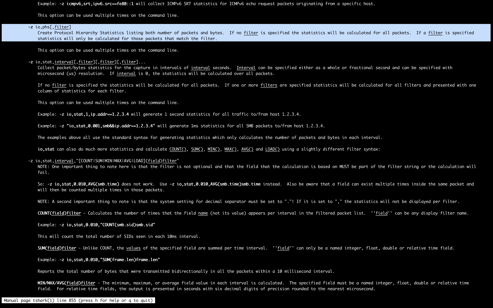

#### Getting Started: Tshark

```sh
student@attackdefense:~$ tshark -h
TShark (Wireshark) 2.6.1 (Git v2.6.1 packaged as 2.6.1-0ubuntu2~16.04.0)
Dump and analyze network traffic.
See https://www.wireshark.org for more information.

Usage: tshark [options] ...

Capture interface:
  -i <interface>           name or idx of interface (def: first non-loopback)
  -f <capture filter>      packet filter in libpcap filter syntax
  -s <snaplen>             packet snapshot length (def: appropriate maximum)
  -p                       don't capture in promiscuous mode
  -I                       capture in monitor mode, if available
  -B <buffer size>         size of kernel buffer (def: 2MB)
  -y <link type>           link layer type (def: first appropriate)
  --time-stamp-type <type> timestamp method for interface
  -D                       print list of interfaces and exit
  -L                       print list of link-layer types of iface and exit
  --list-time-stamp-types  print list of timestamp types for iface and exit

Capture stop conditions:
  -c <packet count>        stop after n packets (def: infinite)
  -a <autostop cond.> ...  duration:NUM - stop after NUM seconds
                           filesize:NUM - stop this file after NUM KB
                              files:NUM - stop after NUM files
Capture output:
  -b <ringbuffer opt.> ... duration:NUM - switch to next file after NUM secs
                           interval:NUM - create time intervals of NUM secs
                           filesize:NUM - switch to next file after NUM KB
                              files:NUM - ringbuffer: replace after NUM files
Input file:
  -r <infile>              set the filename to read from (- to read from stdin)

Processing:
  -2                       perform a two-pass analysis
  -M <packet count>        perform session auto reset
  -R <read filter>         packet Read filter in Wireshark display filter syntax
                           (requires -2)
  -Y <display filter>      packet displaY filter in Wireshark display filter
                           syntax
  -n                       disable all name resolutions (def: all enabled)
  -N <name resolve flags>  enable specific name resolution(s): "mnNtCd"
  -d <layer_type>==<selector>,<decode_as_protocol> ...
                           "Decode As", see the man page for details
                           Example: tcp.port==8888,http
  -H <hosts file>          read a list of entries from a hosts file, which will
                           then be written to a capture file. (Implies -W n)
  --enable-protocol <proto_name>
                           enable dissection of proto_name
  --disable-protocol <proto_name>
                           disable dissection of proto_name
  --enable-heuristic <short_name>
                           enable dissection of heuristic protocol
  --disable-heuristic <short_name>
                           disable dissection of heuristic protocol
Output:
  -w <outfile|->           write packets to a pcap-format file named "outfile"
                           (or to the standard output for "-")
  -C <config profile>      start with specified configuration profile
  -F <output file type>    set the output file type, default is pcapng
                           an empty "-F" option will list the file types
  -V                       add output of packet tree        (Packet Details)
  -O <protocols>           Only show packet details of these protocols, comma
                           separated
  -P                       print packet summary even when writing to a file
  -S <separator>           the line separator to print between packets
  -x                       add output of hex and ASCII dump (Packet Bytes)
  -T pdml|ps|psml|json|jsonraw|ek|tabs|text|fields|?
                           format of text output (def: text)
  -j <protocolfilter>      protocols layers filter if -T ek|pdml|json selected
                           (e.g. "ip ip.flags text", filter does not expand child
                           nodes, unless child is specified also in the filter)
  -J <protocolfilter>      top level protocol filter if -T ek|pdml|json selected
                           (e.g. "http tcp", filter which expands all child nodes)
  -e <field>               field to print if -Tfields selected (e.g. tcp.port,
                           _ws.col.Info)
                           this option can be repeated to print multiple fields
  -E<fieldsoption>=<value> set options for output when -Tfields selected:
     bom=y|n               print a UTF-8 BOM
     header=y|n            switch headers on and off
     separator=/t|/s|<char> select tab, space, printable character as separator
     occurrence=f|l|a      print first, last or all occurrences of each field
     aggregator=,|/s|<char> select comma, space, printable character as
                           aggregator
     quote=d|s|n           select double, single, no quotes for values
  -t a|ad|d|dd|e|r|u|ud|?  output format of time stamps (def: r: rel. to first)
  -u s|hms                 output format of seconds (def: s: seconds)
  -l                       flush standard output after each packet
  -q                       be more quiet on stdout (e.g. when using statistics)
  -Q                       only log true errors to stderr (quieter than -q)
  -g                       enable group read access on the output file(s)
  -W n                     Save extra information in the file, if supported.
                           n = write network address resolution information
  -X <key>:<value>         eXtension options, see the man page for details
  -U tap_name              PDUs export mode, see the man page for details
  -z <statistics>          various statistics, see the man page for details
  --capture-comment <comment>
                           add a capture comment to the newly created
                           output file (only for pcapng)
  --export-objects <protocol>,<destdir> save exported objects for a protocol to
                           a directory named "destdir"
  --color                  color output text similarly to the Wireshark GUI,
                           requires a terminal with 24-bit color support
                           Also supplies color attributes to pdml and psml formats
                           (Note that attributes are nonstandard)
  --no-duplicate-keys      If -T json is specified, merge duplicate keys in an object
                           into a single key with as value a json array containing all
                           values
Miscellaneous:
  -h                       display this help and exit
  -v                       display version info and exit
  -o <name>:<value> ...    override preference setting
  -K <keytab>              keytab file to use for kerberos decryption
  -G [report]              dump one of several available reports and exit
                           default report="fields"
                           use "-G help" for more help

Dumpcap can benefit from an enabled BPF JIT compiler if available.
You might want to enable it by executing:
 "echo 1 > /proc/sys/net/core/bpf_jit_enable"
Note that this can make your system less secure!
student@attackdefense:~$
```

###### Set A

- Which version of Tshark is installed in the lab?

```sh
student@attackdefense:~$ tshark -v
TShark (Wireshark) 2.6.1 (Git v2.6.1 packaged as 2.6.1-0ubuntu2~16.04.0)

Copyright 1998-2018 Gerald Combs <gerald@wireshark.org> and contributors.
License GPLv2+: GNU GPL version 2 or later <http://www.gnu.org/licenses/old-licenses/gpl-2.0.html>
This is free software; see the source for copying conditions. There is NO
warranty; not even for MERCHANTABILITY or FITNESS FOR A PARTICULAR PURPOSE.

Compiled (64-bit) with libpcap, with POSIX capabilities (Linux), with libnl 3,
with GLib 2.48.2, with zlib 1.2.8, with SMI 0.4.8, with c-ares 1.10.0, with Lua
5.2.4, with GnuTLS 3.4.10, with Gcrypt 1.6.5, with MIT Kerberos, with MaxMind DB
resolver, with nghttp2 1.7.1, with LZ4, with Snappy, with libxml2 2.9.3.

Running on Linux 4.15.0-39-generic, with Intel(R) Xeon(R) Gold 6148 CPU @
2.40GHz (with SSE4.2), with 96677 MB of physical memory, with locale C, with
libpcap version 1.7.4, with GnuTLS 3.4.10, with Gcrypt 1.6.5, with zlib 1.2.8,
binary plugins supported (13 loaded).

Built using gcc 5.4.0 20160609.
student@attackdefense:~$
```

Version of Tshark &rarr; `2.6.1`

----

- Find all Tshark supported network interfaces for monitoring

```sh
student@attackdefense:~$ tshark -D
1. eth0
2. any
3. lo (Loopback)
4. nflog
5. nfqueue
6. ciscodump (Cisco remote capture)
7. randpkt (Random packet generator)
8. sshdump (SSH remote capture)
9. udpdump (UDP Listener remote capture)
student@attackdefense:~$
```

----

- What is the Tshark command to sniff on eth0? Why did this command fail? 

```sh
student@attackdefense:~$ tshark -i eth0
Capturing on 'eth0'
tshark: The capture session could not be initiated on interface 'eth0' (You don't have permission to capture on that device).
Please check to make sure you have sufficient permissions, and that you have the proper interface or pipe specified.
0 packets captured
student@attackdefense:~$
```

User `student` does not have enough privileges to monitor the network

###### Set B

- Tshark supports PCAP files. The lab environment has a sample file: `HTTP_traffic.pcap.` How can you read this file in Tshark and display the packet list on the console? 

```sh
student@attackdefense:~$ tshark -r HTTP_traffic.pcap
    1   0.000000 192.168.252.128 → 192.168.252.2 DNS 83 Standard query 0x55cd A g-ecx.images-amazon.com
    2   0.000096 192.168.252.128 → 192.168.252.2 DNS 83 Standard query 0x989e AAAA g-ecx.images-amazon.com
    3   0.001097 192.168.252.128 → 192.168.252.2 DNS 83 Standard query 0xfffd A g-ecx.images-amazon.com
    4   0.035787 192.168.252.2 → 192.168.252.128 DNS 210 Standard query response 0x989e AAAA g-ecx.images-amazon.com CNAME d1ge0kk1l5kms0.cloudfront.net SOA ns-1553.awsdns-02.co.uk
    5   0.106961 192.168.252.2 → 192.168.252.128 DNS 254 Standard query response 0x55cd A g-ecx.images-amazon.com CNAME d1ge0kk1l5kms0.cloudfront.net A 52.84.108.157 A 52.84.108.185 A 52.84.108.225 A 52.84.108.136 A 52.84.108.11 A 52.84.108.71 A 52.84.108.210 A 52.84.108.100
    6   0.132846 192.168.252.2 → 192.168.252.128 DNS 254 Standard query response 0xfffd A g-ecx.images-amazon.com CNAME d1ge0kk1l5kms0.cloudfront.net A 52.84.108.210 A 52.84.108.225 A 52.84.108.71 A 52.84.108.11 A 52.84.108.136 A 52.84.108.157 A 52.84.108.100 A 52.84.108.185
    7   0.133240 192.168.252.128 → 52.84.108.210 TCP 74 39977 → 80 [SYN] Seq=0 Win=29200 Len=0 MSS=1460 SACK_PERM=1 TSval=800828 TSecr=0 WS=1024
    8   0.384492 192.168.252.128 → 52.84.108.210 TCP 74 39978 → 80 [SYN] Seq=0 Win=29200 Len=0 MSS=1460 SACK_PERM=1 TSval=800891 TSecr=0 WS=1024
    9   1.132866 192.168.252.128 → 52.84.108.210 TCP 74 [TCP Retransmission] 39977 → 80 [SYN] Seq=0 Win=29200 Len=0 MSS=1460 SACK_PERM=1 TSval=801078 TSecr=0 WS=1024
   10   1.384243 192.168.252.128 → 52.84.108.210 TCP 74 [TCP Retransmission] 39978 → 80 [SYN] Seq=0 Win=29200 Len=0 MSS=1460 SACK_PERM=1 TSval=801141 TSecr=0 WS=1024
```

----

- How can you find the total number of packets in `HTTP_traffic.pcap`?

```sh
student@attackdefense:~$ tshark -r HTTP_traffic.pcap | wc -l
30418
student@attackdefense:~$
```

Total packets &rarr; `30418`

----

- Tshark command to read the first 100 packets only from `HTTP_traffic.pcap`?

```sh
student@attackdefense:~$ tshark -r HTTP_traffic.pcap -c 100
    1   0.000000 192.168.252.128 ? 192.168.252.2 DNS 83 Standard query 0x55cd A g-ecx.images-amazon.com
    2   0.000096 192.168.252.128 ? 192.168.252.2 DNS 83 Standard query 0x989e AAAA g-ecx.images-amazon.com
    3   0.001097 192.168.252.128 ? 192.168.252.2 DNS 83 Standard query 0xfffd A g-ecx.images-amazon.com
    4   0.035787 192.168.252.2 ? 192.168.252.128 DNS 210 Standard query response 0x989e AAAA g-ecx.images-amazon.com CNAME d1ge0kk1l5kms0.cloudfront.net SOA ns-1553.awsdns-02.co.uk
    5   0.106961 192.168.252.2 ? 192.168.252.128 DNS 254 Standard query response 0x55cd A g-ecx.images-amazon.com CNAME d1ge0kk1l5kms0.cloudfront.net A 52.84.108.157 A 52.84.108.185 A 52.84.108.225 A 52.84.108.136 A 52.84.108.11 A 52.84.108.71 A 52.84.108.210 A 52.84.108.100
    6   0.132846 192.168.252.2 ? 192.168.252.128 DNS 254 Standard query response 0xfffd A g-ecx.images-amazon.com CNAME d1ge0kk1l5kms0.cloudfront.net A 52.84.108.210 A 52.84.108.225 A 52.84.108.71 A 52.84.108.11 A 52.84.108.136 A 52.84.108.157 A 52.84.108.100 A 52.84.108.185
    7   0.133240 192.168.252.128 ? 52.84.108.210 TCP 74 39977 ? 80 [SYN] Seq=0 Win=29200 Len=0 MSS=1460 SACK_PERM=1 TSval=800828 TSecr=0 WS=1024
    8   0.384492 192.168.252.128 ? 52.84.108.210 TCP 74 39978 ? 80 [SYN] Seq=0 Win=29200 Len=0 MSS=1460 SACK_PERM=1 TSval=800891 TSecr=0 WS=1024
    9   1.132866 192.168.252.128 ? 52.84.108.210 TCP 74 [TCP Retransmission] 39977 ? 80 [SYN] Seq=0 Win=29200 Len=0 MSS=1460 SACK_PERM=1 TSval=801078 TSecr=0 WS=1024
   10   1.384243 192.168.252.128 ? 52.84.108.210 TCP 74 [TCP Retransmission] 39978 ? 80 [SYN] Seq=0 Win=29200 Len=0 MSS=1460 SACK_PERM=1 TSval=801141 TSecr=0 WS=1024
   11   3.135991 192.168.252.128 ? 52.84.108.210 TCP 74 [TCP Retransmission] 39977 ? 80 [SYN] Seq=0 Win=29200 Len=0 MSS=1460 SACK_PERM=1 TSval=801579 TSecr=0 WS=1024
   12   3.387995 192.168.252.128 ? 52.84.108.210 TCP 74 [TCP Retransmission] 39978 ? 80 [SYN] Seq=0 Win=29200 Len=0 MSS=1460 SACK_PERM=1 TSval=801642 TSecr=0 WS=1024
   13   3.909256 192.168.252.128 ? 192.168.252.2 DNS 73 Standard query 0xf7ec A www.amazon.in
   14   3.909337 192.168.252.128 ? 192.168.252.2 DNS 73 Standard query 0x7c45 AAAA www.amazon.in
   15   3.909564 192.168.252.128 ? 192.168.252.2 DNS 73 Standard query 0x74af A www.amazon.in
   16   3.912598 192.168.252.128 ? 192.168.252.2 DNS 76 Standard query 0x5a80 A fls-eu.amazon.in
   17   3.912704 192.168.252.128 ? 192.168.252.2 DNS 76 Standard query 0xa105 AAAA fls-eu.amazon.in
   18   3.915383 192.168.252.128 ? 192.168.252.2 DNS 76 Standard query 0xb447 A fls-eu.amazon.in
   19   3.939922 192.168.252.2 ? 192.168.252.128 DNS 89 Standard query response 0xf7ec A www.amazon.in A 178.236.7.18
   20   3.941359 192.168.252.2 ? 192.168.252.128 DNS 157 Standard query response 0x7c45 AAAA www.amazon.in SOA ns-590.awsdns-09.net
   21   3.941809 192.168.252.2 ? 192.168.252.128 DNS 89 Standard query response 0x74af A www.amazon.in A 54.239.32.8
   22   3.941897 192.168.252.128 ? 54.239.32.8  TCP 74 54330 ? 80 [SYN] Seq=0 Win=29200 Len=0 MSS=1460 SACK_PERM=1 TSval=801780 TSecr=0 WS=1024
   23   3.941963 192.168.252.128 ? 54.239.32.8  TCP 74 54331 ? 80 [SYN] Seq=0 Win=29200 Len=0 MSS=1460 SACK_PERM=1 TSval=801780 TSecr=0 WS=1024
   24   3.943812 192.168.252.2 ? 192.168.252.128 DNS 123 Standard query response 0x5a80 A fls-eu.amazon.in CNAME fls-eu.amazon.com A 54.239.38.80
   25   3.945959 192.168.252.2 ? 192.168.252.128 DNS 123 Standard query response 0xb447 A fls-eu.amazon.in CNAME fls-eu.amazon.com A 54.239.39.114
   26   3.946175 192.168.252.128 ? 54.239.39.114 TCP 74 54741 ? 80 [SYN] Seq=0 Win=29200 Len=0 MSS=1460 SACK_PERM=1 TSval=801781 TSecr=0 WS=1024
   27   3.946254 192.168.252.128 ? 54.239.39.114 TCP 74 54742 ? 80 [SYN] Seq=0 Win=29200 Len=0 MSS=1460 SACK_PERM=1 TSval=801781 TSecr=0 WS=1024
   28   4.166774  54.239.32.8 ? 192.168.252.128 TCP 60 80 ? 54330 [SYN, ACK] Seq=0 Ack=1 Win=64240 Len=0 MSS=1460
   29   4.166802 192.168.252.128 ? 54.239.32.8  TCP 54 54330 ? 80 [ACK] Seq=1 Ack=1 Win=29200 Len=0
   30   4.166998 192.168.252.128 ? 54.239.32.8  HTTP 904 GET / HTTP/1.1   31   4.167169  54.239.32.8 ? 192.168.252.128 TCP 60 80 ? 54330 [ACK] Seq=1 Ack=851 Win=64240 Len=0
   32   4.168542  54.239.32.8 ? 192.168.252.128 TCP 60 80 ? 54331 [SYN, ACK] Seq=0 Ack=1 Win=64240 Len=0 MSS=1460   33   4.168569 192.168.252.128 ? 54.239.32.8  TCP 54 54331 ? 80 [ACK] Seq=1 Ack=1 Win=29200 Len=0
   34   4.168597 54.239.39.114 ? 192.168.252.128 TCP 60 80 ? 54742 [SYN, ACK] Seq=0 Ack=1 Win=64240 Len=0 MSS=1460
   35   4.168620 192.168.252.128 ? 54.239.39.114 TCP 54 54742 ? 80 [ACK] Seq=1 Ack=1 Win=29200 Len=0
   36   4.168656 54.239.39.114 ? 192.168.252.128 TCP 60 80 ? 54741 [SYN, ACK] Seq=0 Ack=1 Win=64240 Len=0 MSS=1460
   37   4.168662 192.168.252.128 ? 54.239.39.114 TCP 54 54741 ? 80 [ACK] Seq=1 Ack=1 Win=29200 Len=0
   38   4.168852 192.168.252.128 ? 54.239.39.114 HTTP 1150 POST /1/batch/1/OE/ HTTP/1.1  (text/plain)
   39   4.169048 192.168.252.128 ? 54.239.39.114 TCP 74 54743 ? 80 [SYN] Seq=0 Win=29200 Len=0 MSS=1460 SACK_PERM=1 TSval=801837 TSecr=0 WS=1024
   40   4.169208 54.239.39.114 ? 192.168.252.128 TCP 60 80 ? 54741 [ACK] Seq=1 Ack=1097 Win=64240 Len=0
   41   4.169315 192.168.252.128 ? 52.84.108.210 TCP 74 39984 ? 80 [SYN] Seq=0 Win=29200 Len=0 MSS=1460 SACK_PERM=1 TSval=801837 TSecr=0 WS=1024
   42   4.336517 192.168.252.2 ? 192.168.252.128 DNS 155 Standard query response 0xa105 AAAA fls-eu.amazon.in CNAME fls-eu.amazon.com SOA ns-945.amazon.com
   43   4.388944 54.239.39.114 ? 192.168.252.128 TCP 60 80 ? 54743 [SYN, ACK] Seq=0 Ack=1 Win=64240 Len=0 MSS=1460
   44   4.388980 192.168.252.128 ? 54.239.39.114 TCP 54 54743 ? 80 [ACK] Seq=1 Ack=1 Win=29200 Len=0
   45   4.421135 192.168.252.128 ? 52.84.108.210 TCP 74 39985 ? 80 [SYN] Seq=0 Win=29200 Len=0 MSS=1460 SACK_PERM=1 TSval=801900 TSecr=0 WS=1024
   46   4.472330 54.239.39.114 ? 192.168.252.128 HTTP 431 HTTP/1.1 204 No Content
   47   4.472349 192.168.252.128 ? 54.239.39.114 TCP 54 54741 ? 80 [ACK] Seq=1097 Ack=378 Win=30016 Len=0
   48   4.490321  54.239.32.8 ? 192.168.252.128 TCP 4663 HTTP/1.1 200 OK  [TCP segment of a reassembled PDU]
   49   4.490354 192.168.252.128 ? 54.239.32.8  TCP 54 54330 ? 80 [ACK] Seq=851 Ack=4610 Win=37960 Len=0
   50   4.551267  54.239.32.8 ? 192.168.252.128 TCP 3229 HTTP/1.1 200 OK  [TCP segment of a reassembled PDU]
   51   4.551285 192.168.252.128 ? 54.239.32.8  TCP 54 54330 ? 80 [ACK] Seq=851 Ack=7785 Win=43800 Len=0
   52   4.552744  54.239.32.8 ? 192.168.252.128 TCP 1514 HTTP/1.1 200 OK  [TCP segment of a reassembled PDU]
   53   4.552770 192.168.252.128 ? 54.239.32.8  TCP 54 54330 ? 80 [ACK] Seq=851 Ack=9245 Win=46720 Len=0
   54   4.552805  54.239.32.8 ? 192.168.252.128 TCP 60 HTTP/1.1 200 OK  [TCP segment of a reassembled PDU]
   55   4.552815 192.168.252.128 ? 54.239.32.8  TCP 54 54330 ? 80 [ACK] Seq=851 Ack=9247 Win=46720 Len=0
   56   4.553563 192.168.252.128 ? 192.168.252.2 DNS 83 Standard query 0x7448 A z-ecx.images-amazon.com
   57   4.553620 192.168.252.128 ? 192.168.252.2 DNS 83 Standard query 0xa056 AAAA z-ecx.images-amazon.com
   58   4.554186 192.168.252.128 ? 192.168.252.2 DNS 83 Standard query 0x0b6c A z-ecx.images-amazon.com
   59   4.570213 192.168.252.128 ? 192.168.252.2 DNS 81 Standard query 0xd95b A ecx.images-amazon.com
   60   4.570304 192.168.252.128 ? 192.168.252.2 DNS 81 Standard query 0xc37a AAAA ecx.images-amazon.com
   61   4.570600 192.168.252.128 ? 192.168.252.2 DNS 81 Standard query 0xbe4f A completion.amazon.com
   62   4.570687 192.168.252.128 ? 192.168.252.2 DNS 81 Standard query 0x7aa3 AAAA completion.amazon.com
   63   4.584886 192.168.252.2 ? 192.168.252.128 DNS 210 Standard query response 0xa056 AAAA z-ecx.images-amazon.com CNAME d1ge0kk1l5kms0.cloudfront.net SOA ns-1553.awsdns-02.co.uk
   64   4.605913 192.168.252.2 ? 192.168.252.128 DNS 208 Standard query response 0xc37a AAAA ecx.images-amazon.com CNAME d1ge0kk1l5kms0.cloudfront.net SOA ns-1553.awsdns-02.co.uk
   65   4.607760 192.168.252.2 ? 192.168.252.128 DNS 97 Standard query response 0xbe4f A completion.amazon.com A 54.239.26.91
   66   4.658283 192.168.252.2 ? 192.168.252.128 DNS 254 Standard query response 0x0b6c A z-ecx.images-amazon.com CNAME d1ge0kk1l5kms0.cloudfront.net A 52.84.108.71 A 52.84.108.185 A 52.84.108.225 A 52.84.108.210 A 52.84.108.100 A 52.84.108.157 A 52.84.108.11 A 52.84.108.136
   67   4.658653 192.168.252.128 ? 192.168.252.2 DNS 76 Standard query 0x7f27 A fls-eu.amazon.fr
   68   4.658773 192.168.252.128 ? 192.168.252.2 DNS 76 Standard query 0xadef AAAA fls-eu.amazon.fr
   69   4.658941 192.168.252.128 ? 52.84.108.71 TCP 74 60366 ? 80 [SYN] Seq=0 Win=29200 Len=0 MSS=1460 SACK_PERM=1 TSval=801959 TSecr=0 WS=1024
   70   4.659195 192.168.252.128 ? 52.84.108.71 TCP 74 60367 ? 80 [SYN] Seq=0 Win=29200 Len=0 MSS=1460 SACK_PERM=1 TSval=801959 TSecr=0 WS=1024
   71   4.659325 192.168.252.128 ? 52.84.108.71 TCP 74 60368 ? 80 [SYN] Seq=0 Win=29200 Len=0 MSS=1460 SACK_PERM=1 TSval=801959 TSecr=0 WS=1024
   72   4.659522 192.168.252.128 ? 52.84.108.71 TCP 74 60369 ? 80 [SYN] Seq=0 Win=29200 Len=0 MSS=1460 SACK_PERM=1 TSval=801959 TSecr=0 WS=1024
   73   4.669101 192.168.252.2 ? 192.168.252.128 DNS 129 Standard query response 0x7aa3 AAAA completion.amazon.com SOA ns-921.amazon.com
   74   4.669654 192.168.252.128 ? 192.168.252.2 DNS 89 Standard query 0x85f8 A d1y6jrbzotnyjg.cloudfront.net
   75   4.669714 192.168.252.128 ? 192.168.252.2 DNS 89 Standard query 0xb456 AAAA d1y6jrbzotnyjg.cloudfront.net
   76   4.677433 192.168.252.2 ? 192.168.252.128 DNS 252 Standard query response 0xd95b A ecx.images-amazon.com CNAME d1ge0kk1l5kms0.cloudfront.net A 52.84.108.225 A 52.84.108.100 A 52.84.108.210 A 52.84.108.136 A 52.84.108.185 A 52.84.108.157 A 52.84.108.71 A 52.84.108.11
   77   4.690489 192.168.252.2 ? 192.168.252.128 DNS 123 Standard query response 0x7f27 A fls-eu.amazon.fr CNAME fls-eu.amazon.com A 54.239.34.168
   78   4.691278 192.168.252.2 ? 192.168.252.128 DNS 155 Standard query response 0xadef AAAA fls-eu.amazon.fr CNAME fls-eu.amazon.com SOA ns-945.amazon.com
   79   4.695821  54.239.32.8 ? 192.168.252.128 TCP 1494 HTTP/1.1 200 OK  [TCP segment of a reassembled PDU]
   80   4.695841 192.168.252.128 ? 54.239.32.8  TCP 54 54330 ? 80 [ACK] Seq=851 Ack=10687 Win=49640 Len=0
   81   4.698891  54.239.32.8 ? 192.168.252.128 TCP 1494 HTTP/1.1 200 OK  [TCP segment of a reassembled PDU]
   82   4.698926 192.168.252.128 ? 54.239.32.8  TCP 54 54330 ? 80 [ACK] Seq=851 Ack=12127 Win=53280 Len=0
   83   4.701863  54.239.32.8 ? 192.168.252.128 TCP 4374 HTTP/1.1 200 OK  [TCP segment of a reassembled PDU]
   84   4.701885 192.168.252.128 ? 54.239.32.8  TCP 54 54330 ? 80 [ACK] Seq=851 Ack=16447 Win=61320 Len=0
   85   4.710253 192.168.252.2 ? 192.168.252.128 DNS 170 Standard query response 0xb456 AAAA d1y6jrbzotnyjg.cloudfront.net SOA ns-366.awsdns-45.com
   86   4.710336  54.239.32.8 ? 192.168.252.128 TCP 4374 HTTP/1.1 200 OK  [TCP segment of a reassembled PDU]
   87   4.710348 192.168.252.128 ? 54.239.32.8  TCP 54 54330 ? 80 [ACK] Seq=851 Ack=20767 Win=64240 Len=0
   88   4.715900 52.84.108.71 ? 192.168.252.128 TCP 60 80 ? 60368 [SYN, ACK] Seq=0 Ack=1 Win=64240 Len=0 MSS=1460
   89   4.715935 192.168.252.128 ? 52.84.108.71 TCP 54 60368 ? 80 [ACK] Seq=1 Ack=1 Win=29200 Len=0
   90   4.720022 52.84.108.71 ? 192.168.252.128 TCP 60 80 ? 60367 [SYN, ACK] Seq=0 Ack=1 Win=64240 Len=0 MSS=1460
   91   4.720053 192.168.252.128 ? 52.84.108.71 TCP 54 60367 ? 80 [ACK] Seq=1 Ack=1 Win=29200 Len=0
   92   4.720087 52.84.108.71 ? 192.168.252.128 TCP 60 80 ? 60366 [SYN, ACK] Seq=0 Ack=1 Win=64240 Len=0 MSS=1460
   93   4.720099 192.168.252.128 ? 52.84.108.71 TCP 54 60366 ? 80 [ACK] Seq=1 Ack=1 Win=29200 Len=0
   94   4.720123 192.168.252.2 ? 192.168.252.128 DNS 254 Standard query response 0x7448 A z-ecx.images-amazon.com CNAME d1ge0kk1l5kms0.cloudfront.net A 52.84.108.225 A 52.84.108.11 A 52.84.108.185 A 52.84.108.100 A 52.84.108.157 A 52.84.108.71 A 52.84.108.136 A 52.84.108.210
   95   4.730055 52.84.108.71 ? 192.168.252.128 TCP 60 80 ? 60369 [SYN, ACK] Seq=0 Ack=1 Win=64240 Len=0 MSS=1460
   96   4.730090 192.168.252.128 ? 52.84.108.71 TCP 54 60369 ? 80 [ACK] Seq=1 Ack=1 Win=29200 Len=0
   97   4.762558 192.168.252.2 ? 192.168.252.128 DNS 217 Standard query response 0x85f8 A d1y6jrbzotnyjg.cloudfront.net A 52.84.108.196 A 52.84.108.123 A 52.84.108.110 A 52.84.108.162 A 52.84.108.107 A 52.84.108.217 A 52.84.108.98 A 52.84.108.142
   98   4.770841  54.239.32.8 ? 192.168.252.128 TCP 2934 HTTP/1.1 200 OK  [TCP segment of a reassembled PDU]
   99   4.770859 192.168.252.128 ? 54.239.32.8  TCP 54 54330 ? 80 [ACK] Seq=851 Ack=23647 Win=64240 Len=0
  100   4.770889  54.239.32.8 ? 192.168.252.128 TCP 1494 HTTP/1.1 200 OK  [TCP segment of a reassembled PDU]
student@attackdefense:~$
```

----

- Print the list of protocols in `HTTP_traffic.pcap`



```sh
student@attackdefense:~$ tshark -r HTTP_traffic.pcap -z io,phs -q

===================================================================
Protocol Hierarchy Statistics
Filter:

eth                                      frames:30418 bytes:24643014
  ip                                     frames:30413 bytes:24642732
    udp                                  frames:1882 bytes:228368
      dns                                frames:1882 bytes:228368
    tcp                                  frames:28531 bytes:24414364
      http                               frames:1455 bytes:1705881
        data-text-lines                  frames:189 bytes:362230
          tcp.segments                   frames:102 bytes:259949
        image-jfif                       frames:165 bytes:444708
          tcp.segments                   frames:145 bytes:343160
        image-gif                        frames:75 bytes:44670
          tcp.segments                   frames:6 bytes:7911
        ocsp                             frames:73 bytes:62621
          tcp.segments                   frames:5 bytes:2451
        media                            frames:120 bytes:217932
          tcp.segments                   frames:79 bytes:158145
        png                              frames:61 bytes:113354
          tcp.segments                   frames:30 bytes:62520
        json                             frames:29 bytes:35164
          tcp.segments                   frames:5 bytes:7115
          data-text-lines                frames:3 bytes:1744
            tcp.segments                 frames:1 bytes:917
        tcp.segments                     frames:2 bytes:490
        xml                              frames:3 bytes:3533
        urlencoded-form                  frames:2 bytes:4234
      ssl                                frames:4583 bytes:8154499
        tcp.segments                     frames:1573 bytes:4463000
          ssl                            frames:1395 bytes:4069707
      tcp.segments                       frames:6 bytes:360
        http                             frames:6 bytes:360
          data-text-lines                frames:3 bytes:180
          json                           frames:3 bytes:180
            data-text-lines              frames:3 bytes:180
  arp                                    frames:5 bytes:282
===================================================================
student@attackdefense:~$
```

----

EOF